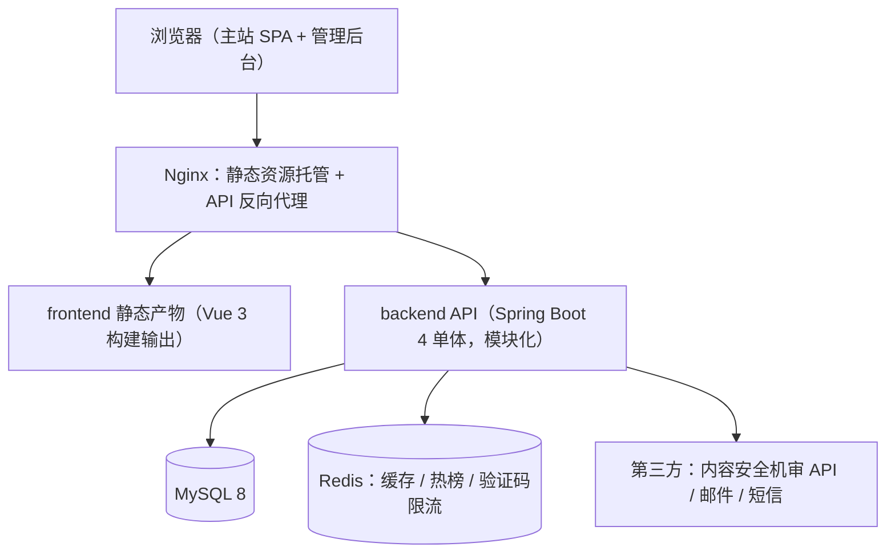
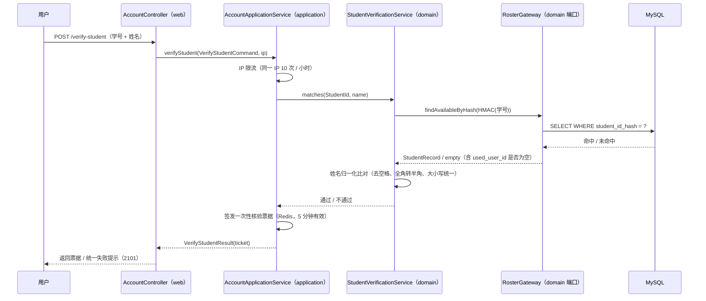

# Campus-Link 技术方案（概要设计 + 详细设计）

| 文档信息 | 内容 |
|---------|------|
| 文档版本 | v0.5（草案） |
| 状态 | 草案 |
| 维护人 | 技术负责人（发起人兼任） |
| 评审状态 | **仅 v0.1 经评审**：有条件通过（发起人简化评审，2026-08-30；UI 稿为遗留行动项，开发并行补齐）。v0.2 技术栈反转由发起人同日决议，自述"设计评审会补充确认"但**实际未召开会议**；**v0.3（JDK 21 + Boot 4.1）与 v0.4（账号上下文 DDD 重构，ADR-012）从未经任何形式评审**，且 v0.4 已落地实现——逐项核对见[设计门纪要](../reviews/gate-3-design.md)、[W-02](../tailoring-waivers.md)；**追认材料已于 2026-09-11 备齐并归档**（[v0.3/v0.4 追认纪要](../reviews/retro-review-design-v03-v04.md)，[CR-018](../change-log.md)），**待发起人签署，签署前 v0.3 / v0.4 仍属未评审** |
| 关联阶段 | 设计（阶段三） |
| 关联文档 | [PRD](../requirements/prd.md) · [项目章程](../initiation/project-charter.md) · [设计门纪要](../reviews/gate-3-design.md) · [v0.3/v0.4 追认纪要](../reviews/retro-review-design-v03-v04.md) · [变更台账](../change-log.md) |
| 最后更新 | 2026-09-11 |

> 版本号以 [docs/README.md](../README.md) 第 2 节为单一登记处，本文交叉引用不写版本号（手册 4.5）。2026-09-11 的编辑性修订（头部元数据与评审状态如实化）设计内容零改动，登记于 [CR-009](../change-log.md)。
>
> ✅ **已知矛盾 D-1 ~ D-7 已于 2026-09-11 全部修正**（逐项见[设计门纪要](../reviews/gate-3-design.md)第 5 节与 [CR-017](../change-log.md)）：§2.4 旧"包命名约定"已替换为 **ADR-012 四层架构**说明（含依赖方向、DIP、跨上下文调用规则）、§3 模块表已把 auth/roster/user 合并为 **`account` 上下文**、§4.3 时序图参与者已改为实际四层组件、§7.3 引用已改指发布检查清单模板、§2.4 目录树排版已重构（拆为两个代码块）、§2.2 标题已去版本号；**D-4**（DDL 路径）由 [CR-014](../change-log.md) 随 Flyway 改造顺带修正。

> **变更记录**
>
> - **v0.5（2026-09-11）**——**修正 D-1 ~ D-7（文档与代码对齐，不改任何设计决策）**，闭环设计门 A3-1（Sprint 2 开工阻断项）与 A3-3，登记于 [CR-017](../change-log.md)：§2.4 旧分包约定 → **ADR-012 四层架构**（含分层职责表、单向依赖、DIP、跨上下文规则、Mapper 位置）+ 目录树拆为 backend / frontend 两块并同步 `sql/`→`db/migration` 与 `scripts/`；§3 模块表 auth/roster/user → 单个 **`account`** 行；§4.3 时序图参与者 → `AccountController` / `AccountApplicationService` / `StudentVerificationService` / `RosterGateway`；§7.3 引用 → 发布检查清单模板；§2.2 标题去版本号。D-4 由 [CR-014](../change-log.md) 顺带修正。
> - **v0.4（2026-09-07）**——二次开发优化：**auth / roster / user 合并重构为 `account` 限界上下文（DDD 四层，ADR-012）**——domain（聚合根 Account + 值对象 EmailAddress/StudentId + 领域服务 + 9 个端口 gateway + 领域事件）/ application（用例编排 + Command）/ infrastructure（仓储、Redis、log/mail 策略等适配器）/ web（契约不变）；落地模式：端口-适配器（DIP）、策略（CodeSender、RosterGateway bypass/DB 条件装配）、工厂方法、观察者（注册事件 AFTER_COMMIT 审计）、防腐层（DO↔聚合转换器）、仓储、门面。`mvn verify` 14/14 全绿（含 4 个新增领域单测），对外 API 契约不变。前端同步优化：Element Plus 按需自动引入（主包 1056KB → 271KB）、boards 常量去重、useCountdown 组合式函数、ApiError 统一错误模型、路由登录守卫。
> - **v0.3（2026-08-31）**——发起人决议技术栈升级：**JDK 17 → 21、Spring Boot 3.2 → 4.1.1**（基于 Spring Framework 7 / Security 7）。适配点：starter 更名 `spring-boot-starter-web` → `spring-boot-starter-webmvc`；MyBatis-Plus 改用官方 `mybatis-plus-spring-boot4-starter` 3.5.17（分页拦截器需配套 `mybatis-plus-jsqlparser` 模块）；springdoc 3.1.0、jjwt 0.13.0、jsoup 1.23.2。`mvn verify` 10/10 全绿，业务代码零改动兼容。
> - **v0.2（2026-08-30）**——发起人决议三项，本方案同步改版：
>   1. **后端技术栈定稿 Spring Boot**（ADR-003 反转）：由 NestJS 反转为 **Spring Boot 3 + Java 17**，ORM 由 Prisma 改为 MyBatis-Plus，数据库由 PostgreSQL 改为 MySQL 8（ADR-009），Markdown 渲染链改为 Java 栈（ADR-005 修订），后端目录结构重写；
>   2. **新增学籍核验模块**（`roster`）：支撑 PRD v1.1 的 F-ACC-004 学生认证（学号 + 姓名比对，已由 P1 提升为 P0），见 4.3 节；
>   3. **部署形态挂起**（ADR-011）：云主机 + ICP 备案 vs 校园内网，推迟至阶段六（发布）启动前决策；开发阶段先本地与局域网跑通。
> - v0.1（2026-08-30）为 NestJS + PostgreSQL 方案，已废弃。
>
> **说明**：本方案覆盖 [PRD](../requirements/prd.md) 基线全部 P0 需求（19 条）的技术实现。ADR-003 / ADR-009 / ADR-010 / ADR-011 已由发起人拍板，其余选型为建议值，以设计评审会决议为准。

## 1. 需求回顾

- **范围**：[PRD](../requirements/prd.md) 第 3.1 节全部 P0 功能——账号（**学籍核验注册** / 登录 / 主页 / 注销）、版块与帖子（6 版块 / 发帖 / 列表 / 楼层回复 / 点赞收藏 / 删除 / 搜索）、问答采纳、通知中心、内容安全（机审 / 举报 / 处置）、运营后台（登录权限 / 处置台 / 工单）。P1 功能不在本期实现；
- **关键范围约束**：**服务对象限定为重庆工程学院计算机专业在校学生**（PRD 第 1 节），因此学籍核验是注册链路的强制环节而非增值功能；
- **关键非功能约束**（PRD 第 4 节）：列表首屏 P90 ≤ 2s；读接口 P95 ≤ 500ms；发布接口 P95 ≤ 800ms（含机审调用）；**Markdown 白名单渲染防存储型 XSS**；容量：注册 ≥ 1 万、帖子 ≥ 10 万、单帖回复 ≥ 1000 楼；桌面 4 浏览器 + 移动端响应式核心链路可用；
- **产品形态**：Web 网站优先（桌面 + 响应式），见[可行性报告](../initiation/feasibility-study.md)第 1 节。

## 2. 总体架构

### 2.1 架构图



### 2.2 技术选型

| 决策点 | 候选 | 结论 | 理由 |
|-------|------|------|------|
| 前端框架 | Vue 3 + Vite / React | **Vue 3 + Vite + Pinia + TypeScript** | 生态成熟、上手快、中文资料丰富；React 无硬伤，作为备选（ADR-002） |
| **后端框架** | NestJS / **Spring Boot 4** | **Spring Boot 4.1 + Java 21（已定稿）** | 团队主技术栈为 Java；2026-08-31 升级到当前主流稳定线（Spring Framework 7 / Security 7），工程化经验可复用（ADR-003） |
| ORM | **MyBatis-Plus** / Spring Data JPA | **MyBatis-Plus 3.5.17（spring-boot4-starter）** | SQL 可控、分页插件完善；Boot 4 用官方 `mybatis-plus-spring-boot4-starter`，分页拦截器需配套 `mybatis-plus-jsqlparser` 模块；复杂列表查询手写 SQL 更直观 |
| 数据库 | **MySQL 8.0** / PostgreSQL | **MySQL 8.0（已定稿）** | 团队熟悉度最高；**内置 ngram 全文解析器支持中文分词**，可满足 MVP 标题 + 标签检索；运维与备份工具链成熟（ADR-009） |
| 缓存 | Redis | Redis 7 | 热榜缓存、列表缓存、验证码与限流计数、定时任务分布式锁 |
| 站内搜索 | DB（MySQL ngram FULLTEXT + 标签）/ MeiliSearch / Elasticsearch | **MVP：MySQL ngram FULLTEXT + 标签精确匹配；P1：MeiliSearch** | 试点规模 DB 够用；中文正文全文检索 P1 引入 MeiliSearch（轻量、开箱中文分词），明确不引入 ES（ADR-004） |
| **Markdown 渲染** | flexmark-java + jsoup / commonmark-java | **flexmark-java 渲染 + jsoup 白名单清洗 + 前端 highlight.js 着色** | 服务端单点渲染防 XSS；代码高亮交给前端，避免在服务端生成大量 `span` 样式类而扩大白名单（ADR-005 修订） |
| 安全框架 | Spring Security + JWT | Spring Security 7 + JJWT 0.13 | 生态标准；自定义过滤器实现 JWT 鉴权与角色校验 |
| 参数校验 | Jakarta Validation | Hibernate Validator | 注解式校验，配合全局异常处理器统一返回 |
| 定时任务 | Spring `@Scheduled` / XXL-Job | `@Scheduled` + Redis 锁 | MVP 单实例部署足够；多实例时 Redis 锁保证不重复执行 |
| 对象存储 | 阿里云 OSS / 腾讯云 COS | **P1 引入；MVP 仅允许 https 图片外链** | PRD MVP 未强制图片上传；引入后需同步扩充白名单域名 |
| 内容机审 | 阿里云内容安全 / 腾讯云天御 | 阿里云（建议） | 文本审核 API 成熟、按量计费；以评审时报价为准 |
| 注册验证码 | 邮件 / 短信 | **邮件优先，短信备用** | 成本低一个量级；PRD 允许邮箱或手机号注册 |

### 2.3 架构风格

**模块化单体（modular monolith）**：目标容量（1 万注册 / 10 万帖）单服务轻松承载，不引入微服务与消息队列的分布式复杂度；模块边界按第 3 节划分，为未来拆分留余地（ADR-001）。

### 2.4 代码仓库结构建议

**backend/**（Spring Boot 4 + Maven）

```
backend/
├── src/main/java/com/campuslink/
│   ├── CampusLinkApplication.java
│   ├── common/                 # 共享内核
│   │   ├── result/             # 统一响应 / 错误码
│   │   ├── exception/          # 全局异常处理
│   │   ├── markdown/           # 渲染服务（唯一出口）
│   │   ├── audit/              # 审计日志切面
│   │   ├── crypto/             # 学号 / 邮箱加解密
│   │   └── redis/              # Redis 键命名空间（RedisKeys）
│   ├── config/                 # Security / Redis / MyBatis / CORS / 配置属性
│   ├── security/               # JWT 过滤器、角色鉴权
│   └── module/                 # 限界上下文，每上下文内部 DDD 四层（ADR-012）
│       ├── account/            # 账号与学籍（已按 DDD 重构）
│       │   ├── domain/         # model(聚合/值对象) + service + gateway(端口) + event + exception
│       │   ├── application/    # 用例编排 + Command
│       │   ├── infrastructure/ # persistence / redis / notify / memory / seed 适配器
│       │   └── web/            # Controller + VO（对前端契约不变）
│       └── board/ post/ reply/ qa/ interaction/ notification/ search/ moderation/
│                               # 后续上下文按同一四层范式演进
├── src/main/resources/
│   ├── application.yml
│   └── db/migration/           # Flyway 迁移 V<n>__<描述>.sql（见该目录 README）
├── src/test/java/              # 单元测试（JUnit 5 + Mockito）
├── scripts/                    # PyMySQL 数据变更脚本 D<序号>__<描述>.py（见 scripts/README）
└── pom.xml
```

**frontend/**（Vue 3 + Vite）

```
frontend/
├── src/
│   ├── views/                  # 首页 / 版块 / 帖子 / 发布 / 搜索 / 主页 / 通知 / 我的 / admin
│   ├── components/             # 帖子渲染、Markdown 编辑器、楼层列表
│   ├── stores/                 # Pinia（auth / notification）
│   ├── router/                 # 路由与登录守卫
│   ├── api/                    # 接口封装（client.ts 统一响应处理）
│   └── utils/                  # highlight.js 初始化
├── index.html
└── vite.config.ts
```

管理后台与主站共用 frontend 构建，按路由区分并以**后端权限校验兜底**（前端显隐仅为体验，不作为安全边界）。

**包结构与依赖方向（ADR-012）**：`module` 下每个**限界上下文**（`account`、`board`、…）内部固定分四层：

| 层 | 放什么 | 可依赖 |
|----|--------|--------|
| `domain` | 聚合根、值对象、领域服务、领域事件、**出站端口（gateway）** | 仅 JDK 与自身，不依赖框架 |
| `application` | 用例编排、Command / 结果模型 | `domain` |
| `infrastructure` | 端口实现（MyBatis-Plus 仓储、Redis、通知等适配器）、`*.mapper` | `application`、`domain` |
| `web` | Controller、请求 / 响应 VO | `application` |

- **依赖方向单向**：`web` / `infrastructure` → `application` → `domain`；**端口定义在 `domain`、实现在 `infrastructure`（DIP）**，领域层不依赖 Spring / MyBatis；
- **跨上下文只允许调用对方的 `application` 服务**，不允许跨上下文直连 `mapper` 或触及对方 `domain` 内部——这是上下文边界可拆分的前提；
- MyBatis-Plus Mapper 统一放各上下文的 `infrastructure/**/mapper` 包（`@MapperScan("com.campuslink.**.mapper")`）；
- 新增上下文（board / post / …）一律按上述四层范式演进（ADR-012 结论）。

> **历史说明**：本节此前的"每个模块按 `controller` / `service` / `mapper` / `entity` / `dto` / `vo` 分包"约定是 ADR-012 之前的旧结构，已被上述四层架构取代（设计门缺陷 **D-1**，修正见 [CR-017](../change-log.md)）。

## 3. 模块设计

| 模块 | 职责 | 依赖 |
|------|------|------|
| **account** | **账号与学籍上下文**（ADR-012 已合并 auth / roster / user）：注册（**学籍核验 + 邮箱验证码**）、登录、JWT 签发与续期、验证码与核验限流；学籍名册导入（管理员）与核验；个人主页、资料编辑、**注销（7 天冷静期 + 匿名化定时任务）** | Redis、DB、crypto |
| board | 固定 6 版块与标签元数据（管理接口 P1） | DB |
| post | 发帖 / 列表 / 详情 / 删除、调用 Markdown 渲染、计数冗余维护 | moderation、Redis |
| reply | 楼层回复（floor_no 分配）、引用回复 | moderation |
| qa | 采纳最佳答案（校验：提问者本人 + 问题帖 + 非自答） | post、reply、notification |
| interaction | 点赞 / 收藏（唯一约束去重、事务内更新冗余计数） | DB |
| notification | 通知生成（回复 / 点赞 / 收藏 / 采纳 / 引用）、未读数、已读 | DB |
| search | 标题 + 标签检索（MySQL ngram FULLTEXT + 标签精确匹配） | DB |
| moderation | 机审对接（发布前同步调用；**服务异常时按开关降级关闭发布入口**） | 第三方 |
| admin | 后台登录与权限（超管 / 运营）、内容处置台、举报工单闭环、名册导入 | post、reply、**account** |
| common | Markdown 渲染服务、统一错误码、审计日志、加解密、**Redis 键命名空间**、健康检查 | — |

> **已落地**：auth / roster / user 已于 2026-09-07 合并为 **`account` 限界上下文**，内部按 `domain / application / infrastructure / web` 四层组织（ADR-012，结构见 §2.4），**对外接口契约不变**；board / post 等后续上下文在各自 Sprint 内按同一四层范式演进。

## 4. 数据模型

### 4.1 核心表

> 命名统一小写下划线；所有表含 `id`（BIGINT 自增）、`created_at`、`updated_at`；**所有时间字段存 UTC**。

| 表 | 关键字段 | 说明 |
|----|---------|------|
| users | id, email / phone（唯一）, nickname, avatar_url, school, major, grade, bio, role（user / ops / superadmin）, status（active / banned / deactivated）, **student_id_enc**（AES-GCM 加密）, **student_id_hash**（HMAC-SHA256，唯一索引）, **verified**（是否通过学籍核验）, anonymized | 学号与邮箱 / 手机均为敏感个人信息，加密存储；注销后 anonymized = true 并清除 student_id_enc |
| **student_roster** | id, student_id_hash（唯一）, name, grade, department, **used_user_id**（已占用则回填）, source_batch（导入批次）, created_at | **名册表：学号以 HMAC 哈希存储，不落明文学号**；由学院 / 辅导员提供后由管理员导入（PRD Q7） |
| boards | id, code（唯一）, name, description, type（question / discussion）, sort | 固定 6 条种子数据 |
| posts | id, board_id, author_id, type, title, **content_md**, **content_html**（发布时渲染落库）, tags, status（published / removed）, is_deleted, reply_count, like_count, favorite_count, is_accepted, accepted_reply_id, hot_score | 计数冗余字段事务内维护 |
| tags / post_tags | tags: id, name, use_count；post_tags: post_id, tag_id | 标签 0~5 个 / 帖 |
| replies | id, post_id, author_id, floor_no, content_md, content_html, quoted_reply_id, like_count, is_accepted, status | floor_no 按 post 内自增 |
| likes | user_id, target_type（post / reply）, target_id | **UNIQUE(user_id, target_type, target_id)** 去重 |
| favorites | user_id, post_id | UNIQUE(user_id, post_id) |
| notifications | id, user_id, type（reply / like / favorite / accept / quote）, actor_id, target_type, target_id, is_read | — |
| reports | id, reporter_id, target_type, target_id, reason, detail, status（pending / processing / closed）, resolution, handler_id | 24h 同对象去重 |
| audit_logs | id, actor_id, action, target_type, target_id, detail | 后台全操作留痕 |

### 4.2 索引设计

- `posts(board_id, status, is_deleted, created_at DESC)` — 版块列表；
- `posts(status, is_deleted, created_at DESC)` — 全站最新；
- `posts(hot_score DESC)` — 热榜；
- **`posts` 标题 ngram FULLTEXT 索引**（`WITH PARSER ngram`，见 ADR-009）— 标题中文模糊搜索；
- `replies(post_id, floor_no)` — 楼层加载；
- `notifications(user_id, is_read, created_at DESC)` — 通知未读数；
- **`student_roster(student_id_hash)` UNIQUE** — 名册去重与核验查询；
- **`users(student_id_hash)` UNIQUE** — 一个学号只能绑定一个账号；
- 完整 DDL 以 **Flyway 版本化迁移**形式维护：`backend/src/main/resources/db/migration/V<n>__<描述>.sql`（起始基线 `V1__init_schema.sql`，`V2__seed_boards.sql` 为内置 6 版块参考数据），应用启动时自动执行并记录于 `flyway_schema_history`；**纯数据增删改**走 `backend/scripts/data/D<序号>__<描述>.py`（PyMySQL）。原 `backend/sql/` 目录已删除（[CR-014](../change-log.md)），历史由 git 承担——该变动同时消除了设计门纪要 **D-4**（"完整 DDL 在 `backend/sql/schema.sql`"与实际文件不符）所记录的路径漂移。

### 4.3 学籍核验设计（PRD F-ACC-004）

**核验流程**



> **分层对应**：`web` 只做协议转换；限流与票据编排在 `application`；比对规则（含姓名归一化）在 `domain` 的领域服务；名册读取经 `domain` 定义的 `RosterGateway` 端口，由 `infrastructure` 的实现落地（开发期 `InMemoryTestRosterGateway`，生产 `RosterGatewayDbImpl`）——即端口-适配器（DIP），见 §2.4。

**关键设计要点**

- **名册不落明文学号**：`student_roster` 只存 `student_id_hash`（HMAC-SHA256，密钥走环境变量 `APP_HASH_KEY`），核验时用同样算法哈希待验学号后查询。姓名因需容错比对而明文存储，但名册表**不对外暴露任何接口**；
- **账号表同理**：`users.student_id_enc` 用 AES-GCM 加密（密钥 `APP_CRYPT_KEY`），`student_id_hash` 加唯一索引保证"一号一账号"；两把密钥分离管理；
- **失败提示不泄露信息**：学号不存在、姓名不匹配、学号已注册三种情况**统一返回"学籍信息校验未通过"**，防止被枚举名册；
- **爆破防护**：同一 IP 每小时最多 10 次核验尝试，超限锁定 1 小时；账号维度另设独立计数；
- **一次性核验票据**：核验通过后签发短期票据（Redis，5 分钟有效），注册时携带，避免核验接口被直接用于批量探测；
- **名册导入**：管理员上传 CSV（学号, 姓名, 年级, 专业）→ 服务端流式解析 → 批量 HMAC 后 `INSERT IGNORE` → 返回成功 / 跳过 / 失败行数；导入操作写 `audit_logs`；
- **名册缺失时的降级**：开发联调阶段提供 `app.roster.bypass=true` 开关，使用内置测试名册；**生产环境该开关必须关闭，并纳入上线检查清单**（流程手册不可裁剪项）。

## 5. 接口契约

- **风格**：REST，前缀 `/api/v1`；OpenAPI 由 springdoc-openapi 自动生成，部署于 `/api/docs`；**已归档快照** [`docs/design/api/openapi.json`](api/openapi.json)（来源 commit、再生成命令、实测请求响应示例见 [api/README.md](api/README.md)，[CR-019](../change-log.md)）——快照只覆盖**已实现**的端点，本节表格是完整规划；
- **鉴权**：`Authorization: Bearer <jwt>`，7 天滑动续期；未登录可读、写操作 401；后台接口额外校验 `role in (ops, superadmin)`；
- **统一响应**：`{ code, message, data, traceId }`；`code = 0` 成功；错误码分段：1xxx 通用、2xxx 账号（**21xx 学籍核验**）、3xxx 版块与帖子、4xxx 权限、5xxx 安全与机审；
- **注册冲突的错误码策略（CR-016）**：唯一键冲突一律返回**业务错误码**，不得落到 `9999` 系统错误——
  - **学号已被占用 → `2101`（"学籍信息校验未通过"）**，与"学号不存在""姓名不匹配"**同码同提示**。三者必须不可区分，否则调用方可据提示差异枚举出"哪些学号在名册中且已被占用"（PRD F-ACC-004 防名册枚举）；
  - **邮箱已被占用 → `2004`（"该邮箱已注册"）**，可明确提示——邮箱不属于名册数据，不构成枚举风险；
  - **入参格式违规 → `1001` + 字段级提示**（如"学号必须为 9 位数字"），与上述"统一提示"区别开：格式错误不泄露任何名册信息，故可明确指出问题字段；
- **分页**：`?pageNum=&pageSize=`（默认 20，最大 100），返回 `{ list, total, pageNum, pageSize }`；
- **时间**：ISO 8601 UTC 传输，展示时区由前端处理。

核心接口示例：

| 接口 | 方法 | 说明 |
|------|------|------|
| `/api/v1/auth/verify-student` | POST | **学籍核验（学号 + 姓名），通过则返回一次性核验票据** |
| `/api/v1/auth/captcha` | POST | 发验证码（限流） |
| `/api/v1/auth/register` / `login` | POST | 注册（携带核验票据）/ 登录 |
| `/api/v1/users/me` | GET | **我的主页（F-ACC-002 最小版，需登录）**；他人主页与资料编辑在后续 Sprint |
| `/api/v1/boards/{code}/posts?pageNum=` | GET | 版块帖子列表（时间序） |
| `/api/v1/posts?sort=latest\|hot&pageNum=` | GET | 全站最新 / 热门 |
| `/api/v1/posts` | POST | 发帖（boardCode, title, contentMd, tags[]） |
| `/api/v1/posts/{id}` | GET / DELETE | 详情 / 删除自己帖子 |
| `/api/v1/posts/{id}/replies` | POST | 楼层回复（含 quotedReplyId） |
| `/api/v1/posts/{id}/accepted-reply` | PUT | 采纳最佳答案 { replyId } |
| `/api/v1/posts/{id}/like` / `favorite` | POST / DELETE | 点赞 / 收藏切换 |
| `/api/v1/notifications?unread=` | GET / PUT | 通知列表 / 全部已读 |
| `/api/v1/search?q=&board=&pageNum=` | GET | 标题 + 标签搜索 |
| `/api/v1/reports` | POST | 举报 |
| `/api/v1/admin/roster/import` | POST | **学籍名册 CSV 导入（superadmin）** |
| `/api/v1/admin/...` | — | 处置台与工单（ops / superadmin） |

## 6. 关键技术决策记录（ADR）

| 编号 | 决策 | 背景 | 备选方案 | 结论与理由 |
|------|------|------|---------|-----------|
| ADR-001 | 模块化单体架构 | 容量目标小、团队小 | 微服务 | 单服务承载足够，避免分布式复杂度；模块边界清晰保留拆分余地 |
| ADR-002 | 前端 Vue 3 + Vite + Pinia，MVP 不做 SSR | SEO 对论坛有长期价值 | Nuxt（SSR）、React | 上手快迭代快；SEO 以 P2 预渲染 / Nuxt 迁移评估，试点期流量主要来自站内与社群 |
| **ADR-003（已定稿）** | **后端 Spring Boot 4.1 + Java 21** | 团队主技术栈与求职方向为 Java | NestJS（TypeScript） | **2026-08-30 决议采用 Spring Boot，2026-08-31 升级至 4.1 + JDK 21（当前主流稳定线，Spring Framework 7）**。接口契约与数据模型不受影响；收益是工程化经验可复用、交付风险最低 |
| ADR-004 | 搜索：MVP 用 MySQL ngram FULLTEXT + 标签匹配 | PRD 只要求标题 + 标签 | Elasticsearch、MeiliSearch | 当前规模 DB 够用；**中文正文全文搜索 P1 引入 MeiliSearch**（轻量、开箱中文分词），明确不引入 ES |
| **ADR-005（v0.2 修订）** | **Markdown：服务端单点渲染，flexmark-java + jsoup 白名单，代码高亮交前端** | XSS 是论坛安全生命线（PRD 第 4 节） | 前端渲染、服务端高亮 | 渲染**只发生在服务端一个执行点**（`common/markdown`），发布时渲染 `content_html` 落库避免请求开销；前端预览调用同一渲染接口；**代码高亮由前端 highlight.js 完成**，服务端只输出 `<pre><code class="language-*">`，避免为 hljs 样式类扩大白名单 |
| ADR-006 | 热门排序：`hot_score = 互动分 × exp(-0.05 × 小时龄)`，定时任务 10 分钟刷新 | PRD 要求简单热门、不个性化 | 点击流加权 | 点赞 / 回复 / 收藏加权求和乘时间衰减；λ 与权重待试点数据调优（PRD Q6） |
| ADR-007 | 通知：30s 轮询未读数 | 实现简单、试点规模足够 | WebSocket 推送 | WebSocket 列 P1；轮询接口轻量（仅未读计数） |
| ADR-008 | 环境：dev / staging / prod 三环境 | 流程手册 4.4 定义四环境 | 独立 test 环境 | **test 并入 staging**（流程手册 5.1 允许裁剪），staging 与生产同构低配，降低成本 |
| **ADR-009（v0.2 新增）** | **数据库 MySQL 8.0** | ADR-003 定稿后需确定数据库 | PostgreSQL 14 | 团队熟悉度最高，运维与备份工具链成熟；**中文检索用内置 ngram FULLTEXT 解析器替代 pg_trgm**；ORM 用 MyBatis-Plus 而非 JPA，便于复杂列表查询与分页 |
| **ADR-010（v0.2 新增）** | **学籍核验：名册预置 + 学号姓名比对** | 服务范围限定重庆工程学院单校，需确认在校身份 | 校园邮箱域名、邀请码、不认证 | 准确性最高且可离线运行，不依赖学校邮箱基础设施；代价是需获取并维护名册（PRD Q7）。名册不落明文学号，仅存 HMAC 哈希；失败提示统一化防名册枚举 |
| **ADR-011（v0.2 新增）** | **部署形态挂起至阶段六决策** | 公网备案 vs 校园内网两难 | 公网域名 + ICP 备案 / 校园内网 | 发起人 2026-08-30 决议：开发阶段先本地与局域网跑通，部署形态在阶段六启动前决策。**风险**：若届时选公网备案，需预留 1~3 周备案窗口（章程 R2） |
| **ADR-012（v0.4 新增）** | **账号上下文 DDD 四层重构（二次开发优化）** | Sprint 1 事务脚本式 Service 难以承载版块 / 问答的复杂规则与领域事件 | 维持事务脚本 / 全面微服务化 | **采用**：`module/account` 四层（domain / application / infrastructure / web）+ 端口-适配器（9 个 domain 端口：仓储、票据、验证码、编解码、限流、令牌、名册等）+ 策略（CodeSender log/mail、RosterGateway bypass/DB 按配置互斥装配）+ 工厂方法（Account.registered）+ 观察者（AccountRegisteredEvent 事务提交后审计）+ 防腐层（DO↔聚合转换器）+ 仓储模式。对外 API 契约不变；其余上下文按此范式渐进演进，不做全面微服务化 |

## 7. 非功能设计

### 7.1 安全设计

- **Markdown 白名单初始清单**（发布前须经测试与安全走查）：允许标签 `p, br, h1-h4, blockquote, pre, code, ul, ol, li, a, img, table/thead/tbody/tr/th/td, strong, em, del, hr`；
  - `a.href` 仅允许 `http(s)` 与相对路径（禁止 `javascript:`）；
  - `img.src` 仅允许 `https` 外链（P1 增站内对象存储域名白名单）；
  - `code.class` 仅允许 `language-*`；
  - **禁止一切 script / iframe / 事件属性 / style 属性**；
  - 清洗使用 jsoup `Safelist` 白名单模式（非黑名单），并配 XSS 用例回归（提测前完成，见第 9 节）；
- **CSP**：`default-src 'self'`，图片域名单列，禁 inline script；
- **敏感信息加密**：email / phone / 学号静态加密（AES-GCM，密钥走环境变量，不入库不入日志）；`student_id_hash` 与 `student_id_enc` 密钥分离；
- **验证码与限流**：Redis 计数——60s 重发限制、单账号 10 条 / 日、**学籍核验 IP 10 次 / 小时**、登录失败次数限制；
- **审计**：后台全操作（含名册导入、内容处置）写 `audit_logs`，由 `common/audit` 切面统一处理；
- **注销执行**：7 天冷静期定时任务 → 匿名化（昵称置"已注销用户"、email / phone / student_id_enc 置空、avatar 清除），其帖子保留但作者信息脱敏；涉及个人信息的帖子正文由处置台人工复核（PRD Q2，法务意见待补）。

### 7.2 性能设计

- 版块列表 Redis 缓存 60s（发布 / 删除时失效）；热榜由定时任务预计算存 Redis；详情页 `content_html` 落库直读，请求时零渲染；
- 计数为冗余字段事务更新，列表页无 COUNT 聚合；
- 首屏 P90 ≤ 2s：静态资源 Nginx 直接托管（后续可上 CDN）+ 接口缓存；
- MyBatis 慢 SQL 日志阈值 200ms，开发期即开启；列表查询禁止 `SELECT *` 与无索引排序。

### 7.3 可用性设计

- **机审降级**：机审服务异常时按配置开关关闭发布入口（fail-closed），运营可在后台切换；不可跳过审核（fail-open）；
- **备份**：MySQL 每日 `mysqldump` 上传对象存储，保留 30 天；发布前手动快照（见[发布检查清单模板](../templates/release-checklist-template.md) §2 第 7 项"数据备份完成"）；
- **监控告警（上线检查门要求）**：MVP 以云主机监控（CPU / 内存 / 磁盘 / 网络）+ Nginx 5xx 告警 + Spring Boot Actuator `/actuator/health` 探活满足流程手册 3.6 出口标准；Prometheus / Grafana 体系列 P1 增强。

## 8. 部署架构（**形态待定，阶段六决策**）

> **决策截止点**：阶段六（发布）启动前，由发起人确定。在此之前开发、联调、测试均在**本地与局域网**进行，不产生云资源成本。

**候选方案（二选一）**

| 方案 | 优点 | 代价 | 适用前提 |
|------|------|------|---------|
| A：公网云主机 + 域名 + ICP 备案 | 校外可访问，体验完整，宿舍 / 家里 / 实习地均可使用 | 需 ICP 备案（1~3 周，个人主体可办）+ 云主机数百元 / 月；须有内容审核机制 | 目标用户主要在校外访问 |
| B：校园内网服务器 | 无备案与云成本，合规压力小 | **仅限校园网内访问**，宿舍与校外访问受限，对学习论坛体验影响大 | 用户访问集中在校园网 |

**与形态无关的固定项**

- **容器化**：Docker Compose 编排 `nginx` / `backend` / `mysql` / `redis`（P1 增 `meilisearch`）；frontend 构建为静态产物由 Nginx 托管。⚠️ **开发期例外**：本机原生 MySQL 8 + Redis 已占用 3306 / 6379，且 8080 被其它项目占用，故**开发期改用本机原生服务、后端默认端口 8088**，`docker-compose.dev.yml` 保留至发布阶段启用（[CR-012](../change-log.md)）。**部署形态本身（ADR-011）不受影响**，仍在阶段六启动前决策；
- **CI/CD**：流水线 = 编译 → 静态检查 → 单元测试 → 构建镜像 → 部署 staging → 手动确认发布 prod；采用 GitHub Actions，工作流位于**根仓库** `.github/workflows/`（`backend-ci.yml` / `frontend-ci.yml`，以 `working-directory` 指向子目录 + `paths` 过滤触发）——✅ 已生效：远程就绪、两个工作流随首次推送**首跑成功**（[CR-011](../change-log.md)）。**静态扫描尚未接入**，故流水线中的"静态检查"环节目前缺失；
- **分支策略**：按流程手册 4.4 节执行（`main` 受保护 + `feature/*`），CI 全绿方可合并。⚠️ 远程虽已就绪，但**分支保护规则与 PR 流程尚未配置**，该策略目前未实际生效；
- **环境**：dev（本地）→ staging（预发，与生产同配置）→ prod（生产），test 并入 staging（ADR-008）；
- **数据库变更管理（[CR-014](../change-log.md)）**：结构变更全部以 **Flyway 版本化迁移**表达（`backend/src/main/resources/db/migration/V<n>__<描述>.sql`），应用启动时自动执行、记录于 `flyway_schema_history`，**各环境执行同一套迁移**，不再依赖容器初始化脚本或人工执行 SQL（`docker-compose.dev.yml` 已移除 `./sql` 挂载）；纯数据增删改走 `backend/scripts/data/D<序号>__<描述>.py`（PyMySQL，默认 dry-run）。唯一的人工引导动作是 `CREATE DATABASE`（JDBC 连接的前提，不属迁移范围）。**回滚约束**：已 apply 的迁移不可修改，社区版无 undo，回滚通过新增前向迁移或人工回滚脚本实现。

## 9. 风险与待确认项

| 事项 | 类型 | 责任人 | 截止 |
|------|------|--------|------|
| Markdown 白名单清单的安全走查与用例覆盖 | 风险 | 技术负责人 + 测试 | 提测前 |
| 机审服务商选型与预算确认 | 待确认 | 产品 + 技术 | 开发启动前 |
| ~~后端框架终稿~~ | — | — | **已定稿（ADR-003，Spring Boot）** |
| UI 设计人力与 UI 稿产出（PRD 5.1 页面清单为输入） | 风险（遗留行动项） | 项目经理 | 开发并行补齐 |
| ~~根仓库（monorepo）的远程托管与 CI 生效~~ | — | — | **✅ 已闭环（2026-09-11，CR-011）**：远程就绪、首次提交推送、两个 workflow 首跑成功；剩 `main` 分支保护与 PR 流程待配置 |
| PRD Q2：注销内容匿名化细则的法务意见 | 待确认 | 产品 | 提测前 |
| PRD Q6：热门排序权重参数 | 待确认 | 技术 | 试点期调优 |
| **PRD Q7：学籍名册获取渠道与更新机制** | **待确认（阻塞）** | **产品（发起人）** | **Sprint 1 开始前** |
| **部署形态决策（ADR-011）与 ICP 备案窗口预留** | **待确认** | **发起人** | **阶段六启动前** |
| 名册旁路开关 `app.roster.bypass` 的生产关闭校验 | 风险 | 发布负责人 | 上线检查清单 |

---

## 评审检查清单（设计评审门）

- [x] 技术选型对比充分，ADR-003（后端框架）已终稿；
- [ ] 数据模型覆盖 PRD 全部 P0 功能，索引设计可支撑列表与搜索指标；
- [ ] 接口契约完整，可支撑前后端并行开发（OpenAPI 就绪）；**进展（2026-09-11，[CR-019](../change-log.md) / 设计门 A3-4）**：springdoc 实时生成（`/api/docs`）+ 快照已归档 [`docs/design/api/`](api/README.md)，含 2 条主链路实测请求响应结构。**仍未达"完整"，故不勾选**：① 只覆盖 Sprint 1 已实现的 6 个端点，§5 表另有 11 行（Sprint 2+）契约未设计；② 快照未声明错误响应与鉴权（**N-1 / N-2**），且畸形请求体实测返回 500 而非 400（**N-3**，P2 缺陷），三项待修；
- [ ] 安全设计覆盖：Markdown 白名单渲染、CSP、验证码限流、敏感信息加密、审计；
- [ ] 学籍核验设计（4.3 节）评审通过，名册获取路径确认；
- [ ] 非功能指标（PRD 第 4 节）均有对应措施（缓存、索引、降级、备份）；
- [x] UI 稿产出与走查安排落实（遗留行动项：开发阶段并行补齐，发起人已接受）；
- [ ] 无未决重大技术风险，遗留项有责任人与截止日期。
