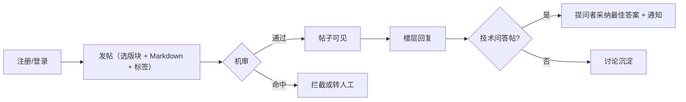
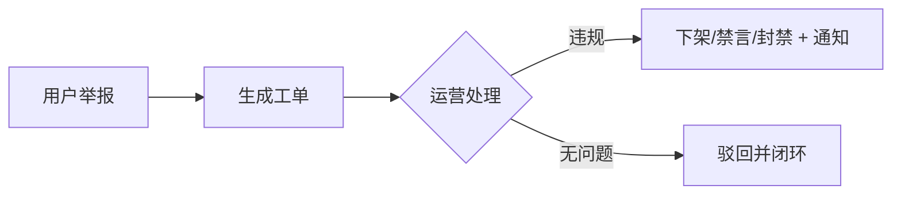

# Campus-Link 产品需求文档（PRD）

| 文档信息 | 内容 |
|---------|------|
| 文档版本 | v1.1（基线） |
| 状态 | 已基线化 |
| 维护人 | 产品负责人（发起人兼任） |
| 评审状态 | **有条件通过并已基线化**（发起人单人简化评审，2026-08-30；**文末四方会审检查清单 9 项全部未勾选**，逐项核对见[需求门纪要](../reviews/gate-2-requirements.md)，程序偏离见 [W-01](../tailoring-waivers.md)）；v1.1 变更为发起人同日决议，未走手册 4.2 变更流程，现补录为 [CR-002 / CR-003](../change-log.md) |
| 关联阶段 | 需求（阶段二） |
| 关联文档 | [BRD](../initiation/brd.md) · [可行性分析](../initiation/feasibility-study.md) · [项目章程](../initiation/project-charter.md) · [技术方案](../design/tech-design.md) · [需求门纪要](../reviews/gate-2-requirements.md) · [变更台账](../change-log.md) |
| 最后更新 | 2026-09-11 |

> 版本号以 [docs/README.md](../README.md) 第 2 节为单一登记处，本文交叉引用不写版本号（手册 4.5）。2026-09-11 为编辑性修订（头部元数据、§4 表头口径、评审状态如实化），**需求内容零改动**，基线版本保持 v1.1，登记于 [CR-009](../change-log.md)。
>
> **基线归档缺口**：变更记录由 v0.2 直接跳至 v1.1，**v1.0 基线从未归档**（手册 3.2 要求"评审通过后冻结版本"），已登记为[变更台账](../change-log.md) L-1。

> **变更记录**
>
> - **v1.1（2026-08-30）**——发起人决议两项范围变更：
>   1. **服务范围锁定为重庆工程学院单校**：原"1~2 所试点高校"收敛为单校，第 1 / 7 节与指标分母同步修订；
>   2. **F-ACC-004 学生认证由 P1 提升为 P0**：范围限定单校后，在校身份校验成为注册链路的强制环节（决议核验方式：学号 + 姓名比对，见 Q5 已关闭），3.1 / 3.2 节同步修订。
> - v0.2（2026-08-30）——随定位调整为"计算机专业学生交流论坛"，需求从社交模型（Feed / 圈子 / 半匿名）重构为论坛模型（版块 / 帖子 / 问答采纳），v0.1 已废弃。
>
> **说明**：本文基于章程 MVP 范围起草。指标值为草案，画像基于 BRD 与公开竞品观察（正式用户调研为遗留项，见第 8 节）。

## 1. 产品概述

- **背景与目标**：Campus-Link 是面向计算机专业大学生的垂直交流论坛（"问有所答、学有同伴、求职有路"）。
- **服务范围（v1.1 锁定）**：**仅限重庆工程学院**，目标用户为该校计算机类专业在校学生。MVP 在该校范围内验证核心假设——7 日留存 ≥ 20% 且技术问答 48h 回复率 ≥ 70%（BRD 第 7 节，指标分母按单校计算机专业学生基数计算）。范围不外扩至其他高校，MVP 后的扩展另行评审。
- **范围约束的产品后果**：注册必须通过**学籍核验**（F-ACC-004），核验不通过者无法注册；非本校学生不提供服务。
- **本期目标用户**：重庆工程学院计算机类专业在校学生（画像见 2.1 节）。
- **名词解释**：
  - **版块**：按主题划分的内容分区，MVP 固定 6 个，不支持用户自建；
  - **楼层回复**：论坛式线性回复结构，每条回复按楼层序号展示，支持引用回复；
  - **最佳答案**：技术问答帖中提问者采纳的回复，置顶并带标识；
  - **北极星指标**：周活跃用户中内容贡献者（发帖或回帖）的比例。

## 2. 用户与场景

### 2.1 用户画像（细化自 BRD 第 2 节）

| 画像 | 特征 | 本期核心诉求 | 对应功能 |
|------|------|-------------|---------|
| A：初学者（小陈，大一） | 入门阶段，报错与环境问题多 | 提问快速获答、找学习路线与资源 | 技术问答、学习资源、搜索 |
| B：进阶者（阿哲，大三） | 备战实习与竞赛 | 面经经验、项目实战、组队信息 | 面经求职、竞赛交流 |
| C：组织者（学长阿凯，研一） | 技术社团 / 实验室学生 | 分享沉淀、建立个人影响力 | 发帖、回复、收藏 |

### 2.2 核心用户故事

- 作为一名大一新生，我想在技术问答版块提问环境配置报错，以便快速得到同学的解答；
- 作为一名准备找实习的大三学生，我想浏览同专业的面经与经验帖，以便有针对性地准备；
- 作为一名竞赛队员，我想在竞赛版块交流真题并寻找队友，以便组队备赛；
- 作为一名学长，我想回答学弟的问题并积累被采纳记录，以便沉淀个人技术影响力；
- 作为一名普通用户，我想收藏优质资源帖并搜索历史帖子，以便复习时快速找回。

## 3. 功能需求

### 3.1 功能列表与优先级

> P0 = MVP 必须；P1 = 重要，可延一个迭代；P2 = 锦上添花。

| 编号 | 功能 | 优先级 | 模块 |
|------|------|:------:|------|
| F-ACC-001 | 注册 / 登录（邮箱或手机号 + 验证码） | P0 | 账号 |
| F-ACC-002 | 个人主页 | P0 | 账号 |
| F-ACC-003 | 账号注销 | P0 | 账号 |
| F-ACC-004 | **学籍核验注册（学号 + 姓名比对，限本校）** | **P0**（v1.1 由 P1 提升） | 账号 |
| F-FORUM-001 | 版块体系（固定 6 版块） | P0 | 版块与帖子 |
| F-FORUM-002 | 发帖（Markdown + 代码高亮 + 标签） | P0 | 版块与帖子 |
| F-FORUM-003 | 帖子列表（版块内 / 全站最新热门） | P0 | 版块与帖子 |
| F-FORUM-004 | 帖子详情与楼层回复 | P0 | 版块与帖子 |
| F-FORUM-005 | 点赞 / 收藏 | P0 | 版块与帖子 |
| F-FORUM-006 | 删除自己的帖子 | P0 | 版块与帖子 |
| F-FORUM-007 | 编辑自己的帖子 | P1 | 版块与帖子 |
| F-FORUM-008 | 站内搜索（标题 + 标签） | P0 | 版块与帖子 |
| F-FORUM-009 | 全文搜索 | P1 | 版块与帖子 |
| F-FORUM-010 | 匿名发帖 | P2 | 版块与帖子 |
| F-QA-001 | 采纳最佳答案 | P0 | 问答 |
| F-SOC-001 | 通知中心 | P0 | 互动 |
| F-SOC-002 | 关注用户 | P1 | 互动 |
| F-SOC-003 | 私信 | P1 | 互动 |
| F-SOC-004 | 拉黑 / 屏蔽 | P1 | 互动 |
| F-SAFE-001 | 内容机审 | P0 | 内容安全 |
| F-SAFE-002 | 举报 | P0 | 内容安全 |
| F-SAFE-003 | 内容处置 | P0 | 内容安全 |
| F-SAFE-004 | 人工巡查队列 | P1 | 内容安全 |
| F-ADMIN-001 | 管理员登录与权限 | P0 | 运营后台 |
| F-ADMIN-002 | 内容处置台 | P0 | 运营后台 |
| F-ADMIN-003 | 举报工单处理 | P0 | 运营后台 |
| F-ADMIN-004 | 版块 / 标签管理 | P1 | 运营后台 |
| F-ADMIN-005 | 数据看板 | P1 | 运营后台 |
| F-TEAM-001 | 组队广场 | P2 | 扩展 |
| F-GAME-001 | 等级与声望 | P2 | 扩展 |

### 3.2 功能详情（P0 逐条给出验收标准）

**F-ACC-001 注册 / 登录**

- 描述：邮箱或手机号 + 验证码注册与登录；**注册前必须先通过学籍核验（F-ACC-004）**；未登录用户可浏览全部公开内容，发布 / 回复 / 点赞 / 收藏 / 通知需登录。
- 验收标准：
  - Given 已通过学籍核验的用户，When 输入正确验证码提交注册，Then 创建账号并进入完善资料引导；
  - Given **未通过学籍核验的用户**，When 提交注册，Then 拒绝并提示"需先完成学籍核验"；
  - Given 已注册账号，When 验证码正确，Then 登录成功；验证码错误或超时（5 分钟），Then 提示且不登录；
  - 验证码 60 秒内不可重发，单账号单日上限 10 条（防爆破）。

**F-ACC-004 学籍核验注册（v1.1 由 P1 提升为 P0）**

- 描述：注册前置环节。用户输入**学号 + 姓名**，与预置的学籍名册比对，核验通过方可注册。名册由学院 / 辅导员 / 班级提供后由管理员导入后台（Q7）。
- 业务规则：
  - 一个学号只能注册一个账号；
  - 姓名比对做归一化处理（去空格、全角转半角、大小写统一）；
  - 学号不存在、姓名不匹配、学号已注册三种情况**统一提示"学籍信息校验未通过"**，不泄露具体原因（防名册枚举）；
  - 同一 IP 每小时最多 10 次核验尝试，超限锁定 1 小时；
  - 前台个人主页展示"已认证"标识（**不展示学号**），供面经求职版块建立可信度。
- 验收标准：

```gherkin
Given 名册中存在学号 2023xxxx 且姓名为"张三"且未被占用
When 用户提交 学号=2023xxxx 姓名=张三
Then 核验通过，返回一次性核验票据，可继续注册

Given 学号存在但姓名不匹配
When 用户提交核验
Then 提示"学籍信息校验未通过"，不说明是学号还是姓名错误

Given 该学号已注册过账号
When 另一用户提交相同学号核验
Then 提示"学籍信息校验未通过"

Given 同一 IP 1 小时内已失败 10 次
When 再次提交核验
Then 拒绝并提示"尝试过于频繁，请稍后再试"
```

  - 数据要求：学号加密存储（AES-GCM），名册表仅存 HMAC 哈希、不落明文学号；导入操作留审计日志（技术方案 4.3 节）。

**F-ACC-002 个人主页**

- 描述：展示昵称、头像、学校 / 专业（选填）、个人签名、发帖与回帖记录、被采纳数、获赞数。
- 验收标准：Given 已登录用户，When 访问他人主页，Then 可见上述公开信息及其发帖回帖时间线；本人主页额外可见"我的收藏"。

**F-ACC-003 账号注销**

- 描述：用户主动注销，合规必需（《个人信息保护法》用户权利）。
- 验收标准：Given 已登录用户，When 发起注销并二次确认，Then 账号进入 7 天冷静期（期间可登录撤销），期满后个人信息删除或匿名化，其帖子与回复匿名化保留（保留社区内容价值，细则见开放问题 Q2）。

**F-FORUM-001 版块体系**

- 描述：固定 6 个版块——**技术问答 / 学习资源 / 面经求职 / 竞赛交流 / 课程交流 / 闲聊灌水**；MVP 不支持用户自建版块。技术问答版块帖子为"提问"类型（关联 F-QA-001），其余版块为"讨论"类型。
- 验收标准：Given 已登录用户，When 打开版块导航，Then 可见 6 个固定版块并进入对应列表页；发帖时必须选择版块。

**F-FORUM-002 发帖**

- 描述：标题（≤ 100 字）+ Markdown 正文（≤ 20000 字，**支持代码块与语法高亮**）+ 标签（0~5 个，如 Java、Redis、考研、ACM）+ 所属版块；发布前经内容机审（F-SAFE-001）。
- 验收标准：

```gherkin
Given 已登录用户
When 在"技术问答"版块发布含代码块的 Markdown 帖子
Then 正文按语法高亮渲染，帖子出现在该版块列表与全站"最新"列表
```

  - 空标题或超长正文提交失败并提示；编辑器提供代码块插入与实时预览。

**F-FORUM-003 帖子列表**

- 描述：两级列表——版块内列表（时间序倒排）与全站首页（"最新" / "热门"双排序；热门为基于点赞回复数与时间衰减的简单权重，不做个性化推荐）。
- 验收标准：Given 已登录用户，When 打开某版块，Then 默认时间序展示 20 条 / 页并支持分页；每条显示标题、版块、标签、作者、回复数、点赞数、[已采纳] 标识（如适用）。

**F-FORUM-004 帖子详情与楼层回复**

- 描述：详情页展示帖子全文（Markdown 渲染）+ 楼层式回复（每楼显示楼层号、回复者、时间、内容，支持引用回复）；回复经机审。
- 验收标准：Given 已登录用户，When 回复帖子，Then 新楼层出现在列表末尾并即时可见；引用回复展示被引用楼层内容摘要。

**F-FORUM-005 点赞 / 收藏**

- 验收标准：Given 已登录用户，When 对帖子或回复点赞，Then 计数 +1 且再次点击取消（去重）；收藏的帖子可在个人主页"我的收藏"查看。

**F-FORUM-006 删除自己的帖子**

- 验收标准：Given 作者本人，When 删除帖子，Then 前台所有位置不可见并提示"帖子已删除"，计数回收；删除操作留后台审计日志。

**F-FORUM-008 站内搜索**

- 描述：按关键词搜索**标题与标签**（MVP 用数据库全文 / 前缀匹配实现，可行性报告第 1 节）；结果按相关度 + 时间排序。
- 验收标准：

```gherkin
Given 已登录用户且存在标题含"Redis"的帖子
When 搜索"Redis"
Then 结果列表包含该帖子，并可按版块 / 时间筛选
```

  - 无结果时展示空态与"去提问"引导。

**F-QA-001 采纳最佳答案**

- 描述：仅技术问答版块的提问帖，**提问者**可将一条回复标记为"最佳答案"；最佳答案置顶展示并带标识。
- 验收标准：

```gherkin
Given 提问者本人且帖子已有回复
When 将某条回复标记为最佳答案
Then 该回复置顶展示并带"已采纳"标识，回复者收到通知，帖子列表显示 [已采纳]
```

  - 可更换采纳（后一次覆盖前一次）；提问者不能采纳自己的回复。

**F-SOC-001 通知中心**

- 描述：站内通知——帖子被回复 / 被点赞 / 被收藏、回复被采纳、回复被引用；未读数角标，全部已读操作。
- 验收标准：Given 用户 A 回复了用户 B 的帖子，When 通知产生，Then B 的通知列表实时可见未读角标；点击通知跳转对应楼层。

**F-SAFE-001 内容机审**

- 描述：所有 UGC（帖子、回复）发布时接入第三方内容安全服务；命中风险 → 拦截或转人工。
- 验收标准：Given 含违规内容的发布请求，When 提交，Then 发布失败并提示通用违规原因；服务异常时发布入口降级关闭（可用性优先于内容风险）。

**F-SAFE-002 举报**

- 描述：帖子 / 回复 / 用户均可举报，理由分类（违法违规、骚扰广告、侵权、低质灌水、其他）+ 可选补充说明。
- 验收标准：Given 已登录用户，When 提交举报，Then 生成工单（F-ADMIN-003），被举报内容对举报人即时不可见；重复举报同一对象 24h 内去重。

**F-SAFE-003 内容处置**

- 描述：管理员可对内容下架 / 删除，对用户警告 / 禁言 / 封禁；全部处置留审计日志。
- 验收标准：Given 管理员处置一条帖子，Then 前台即时不可见且作者收到通知；封禁用户即时登出且无法登录。

**F-ADMIN-001 管理员登录与权限**

- 描述：Web 管理后台；角色最小集：超级管理员（权限管理 + 处置）、运营（审核 + 工单处理）。
- 验收标准：Given 无后台账号，When 访问后台，Then 拒绝；Given 运营角色，When 访问权限管理页，Then 无权限。

**F-ADMIN-002 内容处置台**

- 验收标准：Given 管理员，When 按关键词 / 用户 / 时间搜索内容，Then 可查看详情并执行处置动作（与 F-SAFE-003 联动）。

**F-ADMIN-003 举报工单处理**

- 验收标准：Given 新举报工单，When 运营处理，Then 可执行"处置 / 驳回"并填写结论，工单状态闭环（待处理 → 处理中 → 已闭环）。

**P1 功能摘要**（需求评审会确认范围后补详设）：F-FORUM-007 编辑帖子、F-FORUM-009 全文搜索（正文检索，引入 MeiliSearch）、F-SOC-002 关注用户、F-SOC-003 私信、F-SOC-004 拉黑、F-SAFE-004 人工巡查队列、F-ADMIN-004 版块 / 标签管理、F-ADMIN-005 数据看板、**学籍名册批量更新机制**（Q7 落地后的增量维护）。

> F-ACC-004 已于 v1.1 提升为 P0，不再是 P1 候选。

## 4. 非功能需求

| 类别 | 指标 | 要求（基线值，测试阶段验收依据） |
|------|------|---------------------|
| 性能 | 版块 / 帖子列表首屏 | P90 ≤ 2 s |
| 性能 | 普通读接口（详情、列表） | P95 ≤ 500 ms |
| 性能 | 发布类接口（发帖 / 回复，含机审调用） | P95 ≤ 800 ms |
| 容量 | 规模上限（试点期） | 注册 ≥ 1 万、日活 ≥ 1000、帖子 ≥ 10 万、单帖回复 ≥ 1000 楼（分页加载） |
| 安全 | Markdown 渲染 | 标签白名单过滤，防存储型 XSS；叠加 CSP 策略（论坛安全生命线） |
| 安全 | 账号安全 | 验证码防爆破；登录态有效期与续期策略 |
| 安全 | 数据安全 | 邮箱 / 手机号 / **学号**等实名与敏感信息加密存储（AES-GCM）；名册仅存 HMAC 哈希、不落明文学号；后台操作全部留痕 |
| 安全 | 学籍核验 | 失败原因统一提示，不可枚举名册；IP 维度限流 10 次 / 小时 |
| 合规 | 个人信息 | 最小必要收集：邮箱或手机号、昵称、头像、**学号（本校范围限定所必需）**；学校 / 专业为选填；隐私政策上线；未成年人注册校验 |
| 合规 | 数据权利 | 账号注销 7 天冷静期后 15 日内完成删除 / 匿名化 |
| 兼容 | 桌面浏览器 | Chrome / Edge / Firefox / Safari 最新两个大版本 |
| 兼容 | 移动端 | 响应式适配，浏览 / 发帖 / 回复核心链路可用 |

> 目标端为 Web 网站优先（理由见可行性报告第 1 节），设计阶段技术选型评审最终确认；若变更，兼容性指标随之修订。

> **表头口径说明（2026-09-11）**：原表头为"要求（草案，待评审）"，与本文"已基线化"状态矛盾，测试阶段无法据此验收，现改为基线值（[需求门纪要](../reviews/gate-2-requirements.md) A2-2 部分闭环）。
>
> **仍未闭环的一项**：安全类"账号安全"行的"**登录态有效期与续期策略**"至今**无数值指标**。实际值由[技术方案](../design/tech-design.md) §5 定为"JWT 7 天滑动续期"，即指标只存在于设计侧、需求侧缺失——测试阶段将无验收依据。A2-2 就此项保持开放，建议补为"登录态有效期 7 天，滑动续期；连续 30 天未活动须重新登录"（数值待产品确认）。

## 5. 信息结构与核心流程

### 5.1 页面清单（Web 端，低保真）

| 层级 | 页面 |
|------|------|
| 通用 | 顶栏导航（版块入口 / 搜索框 / 通知角标 / 用户菜单） |
| 首页 | 全站"最新" / "热门"列表 |
| 版块 | 6 个版块列表页 |
| 帖子 | 帖子详情（楼层回复）/ 发布与编辑页（Markdown 编辑器 + 预览） |
| 搜索 | 搜索结果页（版块 / 时间筛选） |
| 用户 | 个人主页 / 我的（帖子 / 收藏 / 设置 / 注销） |
| 通知 | 通知中心 |
| 后台 | 登录 / 内容处置台 / 举报工单（P1：版块管理、数据看板） |

### 5.2 核心流程





### 5.3 内容审核原则

先机审后展示（发布即审）；举报内容对举报人即时屏蔽；处置动作全部留痕。详见 F-SAFE 系列。

## 6. 数据埋点需求

> 埋点与 BRD 第 7 节成功指标逐条对应；事件公共属性：用户 ID、时间、平台（桌面 / 移动 Web）、版本。

| 事件 | 触发时机 | 支撑指标 |
|------|---------|---------|
| register_success | 注册成功 | 试点注册渗透率 |
| post_publish（board_id、is_question、tag_ids） | 发帖成功 | 北极星（发帖）、内容供给量 |
| reply_publish（board_id） | 回复成功 | 北极星（回帖）、**48h 回复率** |
| qa_accept | 采纳最佳答案 | 问答质量 |
| post_like / post_favorite | 点赞 / 收藏成功 | 内容质量信号 |
| search_query（含结果数） | 搜索提交 | 搜索使用率、空结果率 |
| notification_click | 通知点击 | 回访引导有效性 |
| login_active | 会话心跳（日维度去重） | DAU / 留存计算基准 |

## 7. 发布计划

- **范围**：第 3 节全部 P0 功能（含学籍核验 F-ACC-004）；P1 功能不进入首包；
- **分批策略**（均在重庆工程学院范围内）：
  1. 邀请制内测（S1）：种子用户 100~200 人（**本校**技术社团 / 竞赛队 / 实验室渠道），预埋 ≥ 200 帖内容种子，验证主链路、机审策略与**名册核验覆盖率**，≥ 1 周；
  2. 校内开放（S2）：面向本校计算机专业学生开放注册（学籍名册范围内），观察 ≥ 2 周（指标见 BRD 第 7 节）；
  3. 扩展：本期不扩展至其他高校，数据达标后另行评审决定；
- **前置条件**：隐私政策上线、内容审核机制运行、**学籍名册导入完成**（章程目标 G3 与 Q7）。
- **部署形态**：待定，阶段六（发布）启动前由发起人决策（公网 + ICP 备案 或 校园内网），见技术方案 ADR-011。**若选公网部署，ICP 备案须预留 1~3 周窗口**。

## 8. 开放问题与遗留项

| # | 问题 | 说明 | 责任人 | 截止 |
|---|------|------|--------|------|
| Q1 | 版块划分终稿 | 6 个版块的名称与内容边界（如"课程交流"与"学习资源"的重叠） | 产品 | 需求评审会 |
| Q2 | 注销后内容处理细则 | 帖子匿名化展示的具体字段与例外（如含个人信息的帖子） | 产品 + 法务意见 | 设计评审前 |
| Q3 | 搜索实现深度 | MVP 数据库全文 vs 直接引入 Elasticsearch | 技术负责人 | 设计阶段 |
| Q4 | 正式用户调研 | 本 PRD 基于画像假设与竞品观察，内测前需 10~15 人访谈校准版块与优先级 | 产品 | 内测前 |
| ~~Q5~~ | ~~学生认证凭证方式~~ | 已决议：**学号 + 姓名比对**（名册预置），2026-08-30 发起人决议，落地见 F-ACC-004 | — | 已关闭 |
| Q6 | 热门排序算法 | 时间衰减权重参数与防刷策略 | 技术负责人 | 设计阶段 |
| **Q7** | **学籍名册获取渠道与更新机制** | 名册从哪来（学院教学办 / 辅导员 / 班长）、含哪些字段（学号 / 姓名 / 年级 / 专业）、多久更新一次、新生入学与转专业如何补录。**未解决则 F-ACC-004 无法开发** | **产品（发起人）** | **Sprint 1 开始前（阻塞项）** |
| Q8 | 部署形态 | 公网域名 + ICP 备案 或 校园内网，影响合规路径与校外可访问性 | 发起人 | 阶段六启动前 |

---

## 9. 附录：需求跟踪矩阵（RTM，轻量版）

| 需求编号 | 用户故事（2.2 节） | 优先级 | 关键埋点（第 6 节） |
|---------|------------------|:------:|-------------------|
| F-ACC-001/002/003 | 注册登录与主页、注销 | P0 | register_success, login_active |
| **F-ACC-004** | **本校学生身份可信（注册前置）** | **P0** | **student_verify_success / student_verify_fail（仅计次数，不落学号）** |
| F-FORUM-001~006、F-QA-001 | 提问获答并采纳最佳答案 | P0 | post_publish, reply_publish, qa_accept |
| F-FORUM-008 | 搜索找回历史帖子 | P0 | search_query |
| F-SOC-001 | 回帖与被采纳的通知 | P0 | notification_click |
| F-SAFE-001~003 | 举报违规内容 | P0 | report_submit |
| F-ADMIN-001~003 | 运营处置 | P0 | — |
| P1/P2 其余 | 见功能列表 | P1/P2 | — |

---

## 评审检查清单（需求评审门，四方会审用）

**产品**
- [ ] 每条 P0 需求有编号、优先级、验收标准；
- [ ] 非功能指标可测（含 XSS 白名单渲染要求）；
- [ ] 埋点覆盖 BRD 成功指标（北极星 + 48h 回复率 + 留存）。

**开发**
- [ ] 每条需求技术可行，工作量初步评估完成；
- [ ] Q2 / Q3 / Q6 技术依赖有初步结论。

**测试**
- [ ] 验收标准可直接转写为测试用例；
- [ ] 异常流（机审拦截、满 5 标签、引用回复、重复采纳、举报去重）已覆盖。

**UI**
- [ ] 5.1 页面清单无断链，交互逻辑与需求一致；
- [ ] Markdown 编辑器与代码高亮的交互方案已对齐。
