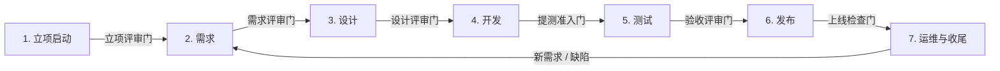

# Campus-Link 研发流程手册

| 文档信息 | 内容 |
|---------|------|
| 版本 | v1.1 |
| 状态 | 草案（随项目演进而修订） |
| 维护人 | 项目经理 |
| 最后更新 | 2026-09-11 |

> **变更记录**
>
> - **v1.1（2026-09-11）**——4.5 节补充治理类记录（评审门纪要 / 裁剪与让步放行记录 / 变更台账）的归档位置与命名约定，并新增"版本号单一登记处"约定。**未改动 7 阶段 6 门的流程实质与任何出口标准**。修订动因：4.1 节要求"评审结论与行动项记录归档至 `docs/`"，但原文未规定落点，导致三道门纪要实际从未归档（见 [设计门纪要](评审/设计门纪要.md) 第 2 节）。
> - v1.0（2026-08-30）——初版。

## 1. 总则

### 1.1 目的

规定本项目从立项到收尾的标准研发流程，确保：

- 每个阶段的产出经过评审门（Stage-Gate）把关，错误不向下传导；
- 各角色职责与交付物清晰，减少沟通损耗；
- 文档、代码、环境等资产可追溯、可交接。

### 1.2 适用范围

适用于本项目全部研发活动，包括新功能开发、缺陷修复、技术改造与线上运维。

### 1.3 执行模式：阶段门骨架 + 敏捷迭代

采用业界主流的混合模式：

- **外层（阶段门）**：全流程划分为 7 个阶段，阶段之间设置评审门，评审不通过不得进入下一阶段；
- **内层（迭代）**：设计之后的开发、测试环节按 Sprint（建议 2 周）滚动执行，每个 Sprint 产出可演示的增量；
- **裁剪原则**：流程服务于质量而非形式，允许按第 5.1 节的裁剪指南精简。

### 1.4 流程总览

> 图注：7 个阶段、6 道评审门。运维阶段产生的新需求与缺陷回流到需求阶段，形成迭代闭环。

## 2. 角色与职责

| 角色 | 核心职责 | 关键产出 |
|------|---------|---------|
| 项目经理（PM） | 排期、风险管理、干系人沟通、组织阶段门评审 | 项目计划、风险登记册、评审结论记录 |
| 产品负责人（PO / 产品经理） | 需求调研、撰写 PRD、优先级排序、需求验收 | BRD、PRD、验收结论 |
| 架构师 / 技术负责人 | 技术选型、概要与详细设计、技术风险把关 | 技术方案（HLD/LLD）、设计评审结论 |
| 开发工程师 | 编码、单元测试、Code Review、提测 | 代码、单测报告、CI 通过记录 |
| 测试工程师 / QA | 测试计划与执行、缺陷管理、过程审计 | 测试计划、测试用例、测试报告 |
| UI/UX 设计师 | 交互与视觉设计、设计走查 | 交互稿、视觉稿 |
| 运维 / SRE | 环境管理、部署、监控、故障响应 | 监控大盘、发布记录、故障复盘 |

> 小团队允许一人兼任多角色，但每道评审门至少由两名不同角色的人员参与。

## 3. 阶段详述

每章固定结构：**阶段目标 → 关键活动 → 交付物 → 出口标准（评审门）**。评审门未通过（或未形成"有条件通过"闭环）前，不得开始下一阶段工作。

### 3.1 阶段一：立项启动（Initiation）

**目标**：回答"为什么做、值不值得做"，正式授权项目启动。

**关键活动**

1. 商业论证：明确痛点、目标用户、市场机会与价值主张；
2. 可行性分析：技术、经济、运营、法律合规四个维度；
3. 立项评审会：决策"做 / 不做 / 缓做"；
4. 任命项目经理，组建团队。

**交付物**：[BRD（模板）](模板/商业需求文档模板.md) · [可行性分析报告（模板）](模板/可行性分析模板.md) · [项目章程（模板）](模板/项目章程模板.md)

**出口标准（立项评审门）**

- [ ] BRD 完成且价值主张清晰；
- [ ] 可行性分析结论为"可行 / 有条件可行"，遗留风险有对应措施；
- [ ] 项目目标可度量（SMART），范围边界（In / Out of Scope）明确；
- [ ] 预算框架与里程碑草案获干系人确认。

> 本项目实际交付物：[立项/商业需求文档.md](立项/商业需求文档.md) · [立项/可行性分析.md](立项/可行性分析.md) · [立项/项目章程.md](立项/项目章程.md)

### 3.2 阶段二：需求（Requirements）

**目标**：把商业目标转译为可开发、可测试的需求基线。

**关键活动**

1. 用户调研、竞品分析，形成用户画像与场景清单；
2. 编写 PRD：功能需求（用户故事 + 验收标准）与非功能需求（性能、安全、兼容指标）；
3. 产出原型（低保真即可，能对齐交互逻辑）；
4. 需求评审会：产品、开发、测试、UI 四方会审；
5. **需求基线化**：评审通过后冻结版本（如 PRD-v1.0），后续变更走 4.2 节变更流程。

**交付物**：[PRD（模板）](模板/产品需求文档模板.md)、原型图、需求跟踪矩阵（RTM）

**出口标准（需求评审门）**

- [ ] 需求评审会通过，产品 / 开发 / 测试 / UI 四方确认；
- [ ] 每条需求有唯一编号、优先级（P0/P1/P2）和验收标准；
- [ ] 非功能需求指标明确可测（如接口 P95 响应时间）；
- [ ] 需求已基线化并纳入变更管理。

### 3.3 阶段三：设计（Design）

**目标**：确定技术实现方案与用户界面方案，达到"开发可依据文档直接开工"的深度。

**关键活动**

1. 概要设计（HLD）：技术选型对比与结论、服务 / 模块拆分、数据模型、接口契约；
2. 详细设计（LLD）：模块内部逻辑、数据库表结构、接口文档（建议 OpenAPI/Swagger）；
3. UI/UX：交互稿 → 视觉稿；
4. 技术方案评审会（架构师主持），对齐 PRD 与 UI 稿。

**交付物**：[技术方案（模板）](模板/技术方案模板.md)、API 文档、UI 稿

**出口标准（设计评审门）**

- [ ] 技术选型有对比结论，无未决的重大技术风险；
- [ ] 数据模型与接口契约评审通过；
- [ ] UI 稿走查通过，交互逻辑与 PRD 一致；
- [ ] 开发可直接依据文档开工，无需口头补充约定。

### 3.4 阶段四：开发（Development）

**目标**：按迭代交付符合设计要求的高质量代码。

**关键活动**

1. Sprint 计划会：从基线需求中认领、拆解任务；
2. 遵守编码规范与 Git 分支策略（见 4.4 节）；
3. Code Review：PR/MR 至少 1 名同行批准（核心模块 2 名），无未解决评论方可合并；
4. 单元测试：覆盖率门槛 60%，核心模块 80%；
5. CI 持续集成：每次提交自动构建 + 静态扫描 + 单测；
6. 提测：冒烟测试通过后正式进入测试阶段。

**交付物**：代码、单测报告、CI 通过记录、提测单

**出口标准（提测准入门）**

- [ ] 本 Sprint 范围内需求全部提测，冒烟用例 100% 通过；
- [ ] CI 全绿：构建成功、静态扫描无新增阻断级问题、单测覆盖率达标；
- [ ] Code Review 完成，无未解决评论；
- [ ] 提测单附自测清单。

### 3.5 阶段五：测试（Testing）

**目标**：验证系统满足需求基线，质量达到验收标准。

**关键活动**

1. 编写[测试计划（模板）](模板/测试计划模板.md)，用例设计（等价类、边界值、场景法）；
2. 分层执行：冒烟 → 功能 / 集成 → 系统 → 性能 / 安全 / 兼容性专项；
3. 缺陷管理：按 4.3 节等级流转（新建 → 确认 → 修复 → 回归 → 关闭）；
4. UAT 用户验收测试：业务方 / 目标用户真实试用并签字。

**交付物**：测试计划、测试用例、缺陷报告、测试报告、UAT 结论

**出口标准（验收评审门）**

- [ ] 用例执行率 100%，P0 / P1 缺陷清零；
- [ ] 遗留缺陷（P2/P3）经评审各方书面接受；
- [ ] 性能与安全指标达到 PRD 非功能需求；
- [ ] UAT 签字通过。

### 3.6 阶段六：发布（Release）

**目标**：把通过验收的版本安全、可控地发布到生产环境。

**关键活动**

1. 发布评审：逐项确认[上线检查清单（模板）](模板/发布检查清单模板.md)（配置、数据迁移、灰度方案、回滚预案）；
2. 发布执行：灰度 / 金丝雀 → 逐步放量 → 全量；
3. 观察期：上线后 24–72 小时盯守核心指标；
4. 异常标准动作：**回滚**，而非线上热修。

**交付物**：发布单、上线检查清单、回滚预案、发布公告

**出口标准（上线检查门）**

- [ ] 检查清单逐项确认，无未勾选项；
- [ ] 回滚步骤与负责人明确；
- [ ] 监控告警覆盖核心接口；
- [ ] 灰度期间核心指标无异常。

### 3.7 阶段七：运维与收尾（Operations & Closure）

**目标**：保障线上稳定运行，沉淀复盘，形成迭代闭环。

**关键活动**

1. 监控告警：指标监控（如 Prometheus/Grafana）、日志、链路追踪；
2. SLA 管理：可用性目标（建议 ≥ 99.9%）、响应时间目标；
3. 故障响应：On-call 值班、应急预案、故障复盘（Postmortem）；
4. 新需求与缺陷回流到阶段二（需求）；
5. 阶段性收尾：项目复盘（[模板](模板/项目复盘模板.md)）、文档归档。

**交付物**：监控大盘、值班表、故障复盘报告、项目复盘报告

**出口标准（迭代闭环）**

- [ ] 无未响应的 P0/P1 告警；
- [ ] 故障在 SLA 约定内响应与恢复；
- [ ] 复盘行动项有人认领、有截止日期。

## 4. 横向支撑机制

### 4.1 阶段门评审会规则

- 评审材料提前 24 小时发出，评审人预先阅读，会上只议分歧；
- 每道门按第 3 章对应的出口标准逐项检查，结论三选一：**通过 / 有条件通过（带行动项限期完成）/ 不通过**；
- "有条件通过"的行动项未闭环前，不得视为该门通过；
- 评审结论与行动项记录归档至 `docs/`。

### 4.2 需求基线与变更管理

- 需求评审通过即基线化，版本号如 `PRD-v1.0`；
- 基线后的变更必须走流程：提交变更申请 → 评估影响（范围 / 排期 / 质量）→ 变更评审 → 更新基线并同步产品 / 开发 / 测试 / UI 四方；
- 禁止口头需求直接进入开发。

### 4.3 缺陷严重等级定义

| 等级 | 定义 | 处理要求 |
|------|------|---------|
| P0 致命 | 崩溃、数据丢失、核心流程不可用、安全漏洞 | 立即修复，阻塞发布 |
| P1 严重 | 主要功能不可用，但存在替代路径 | 发布前必须修复 |
| P2 一般 | 次要功能异常，影响体验 | 排期修复，遗留须评审接受 |
| P3 轻微 | 文案、样式、提示类问题 | 排期修复 |

### 4.4 环境与分支策略

- **环境**：`dev`（开发联调）→ `test`（测试）→ `staging`（预发，与生产同配置）→ `prod`（生产）；
- **分支**：`main`（受保护，仅接受 PR 合并且 CI 全绿）+ `feature/*` + `release/*` + `hotfix/*`；
- **版本号**：语义化 `vMAJOR.MINOR.PATCH`；
- 生产数据不得直接用于测试环境，确需使用必须脱敏。

### 4.5 文档命名与归档规范

- 文件名用英文小写中划线（如 `prd-mvp.md`），文档内容用中文；
- 文档头部必须有：版本、状态（草案 / 已评审 / 已废弃）、维护人、最后更新；
- 全部文档归档在 `docs/`，按阶段存放并在 [docs/README.md](README.md) 登记；
- 评审通过的文档状态改为"已评审"，未评审的保持"草案"。

**治理类记录归档位置**（4.1 / 4.2 节要求产生的记录，非阶段交付物）：

| 记录类型 | 归档位置 | 命名 |
|---------|---------|------|
| 评审门纪要（含出口标准逐项核对、结论、行动项、批准记录） | `评审/` | `gate-<阶段号>-<阶段英文名>.md`，如 `docs/评审/设计门纪要.md` |
| 流程裁剪与让步放行记录 | `流程偏离记录.md` | 单文件累积登记，条目编号 `W-<序号>`（让步放行）/ `T-<序号>`（已授权裁剪） |
| 变更台账（基线变更申请与影响评估） | `变更日志/变更台账.md` | 单文件累积登记，条目编号 `CR-<序号>` |

补充约定：

- **版本号单一登记处**：文档版本号只在 [docs/README.md](README.md) 索引表登记。其他文档交叉引用时**只写链接、不写版本号**（如"见[技术方案](设计/技术方案.md)"，而非"见技术方案 v0.2"），避免版本升级后引用大面积失效；
- **同一道门的多次评审**：追加到该门纪要文件并在文中标注轮次，不新建文件；
- **补录记录**：事后补录的纪要必须在文首声明补录日期、补录依据与证据效力，不得表述为同期记录。

## 5. 附录

### 5.1 中小团队裁剪指南

流程的价值在评审门，不在文档数量。5 人以下团队最低保留五个关键动作：

1. 需求评审（产品 + 开发 + 测试对齐）；
2. 技术方案评审（架构把关）；
3. 开发自测 + Code Review；
4. 测试回归（P0/P1 清零）；
5. 灰度上线 + 回滚预案。

**可裁剪项**：需求跟踪矩阵（用 issue 列表替代）、详细设计文档（小型功能用方案段落替代）、UAT（团队内真实使用替代）、发布评审会（用检查清单替代）。

**不可裁剪项**：上线前检查与回滚预案；用户数据备份；生产环境与测试环境隔离。

### 5.2 模板索引

| 阶段 | 模板 |
|------|------|
| 立项启动 | [BRD](模板/商业需求文档模板.md) · [可行性分析](模板/可行性分析模板.md) · [项目章程](模板/项目章程模板.md) |
| 需求 | [PRD](模板/产品需求文档模板.md) |
| 设计 | [技术方案](模板/技术方案模板.md) |
| 测试 | [测试计划](模板/测试计划模板.md) |
| 发布 | [发布检查清单](模板/发布检查清单模板.md) |
| 收尾 | [项目复盘](模板/项目复盘模板.md) |
