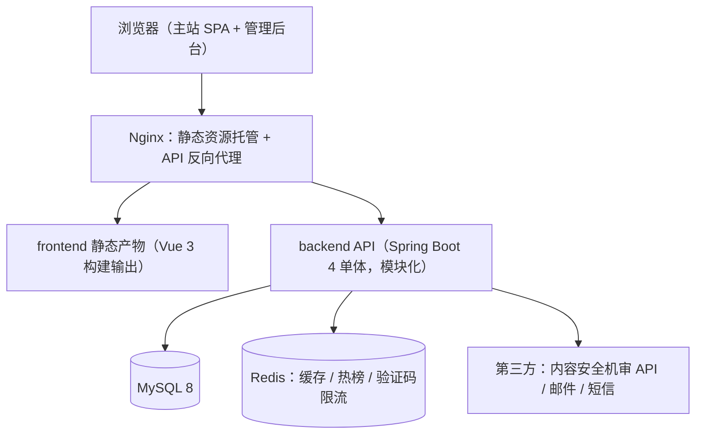
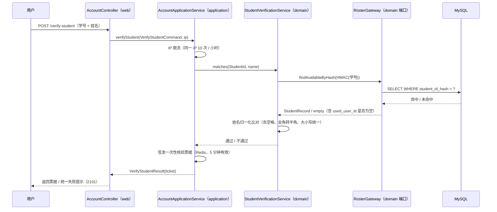

# Campus-Link 技术方案（概要设计 + 详细设计）


| 文档信息 | 内容                                                                                                                                                                                                                                                                                                                                                                                                                                                                                                                                                                                                                                                                                                                                                                                                                                                                                                                                                                                                                                                                                                                                                            |
| ---- | ------------------------------------------------------------------------------------------------------------------------------------------------------------------------------------------------------------------------------------------------------------------------------------------------------------------------------------------------------------------------------------------------------------------------------------------------------------------------------------------------------------------------------------------------------------------------------------------------------------------------------------------------------------------------------------------------------------------------------------------------------------------------------------------------------------------------------------------------------------------------------------------------------------------------------------------------------------------------------------------------------------------------------------------------------------------------------------------------------------------------------------------------------------- |
| 文档版本 | v0.7（草案）                                                                                                                                                                                                                                                                                                                                                                                                                                                                                                                                                                                                                                                                                                                                                                                                                                                                                                                                                                                                                                                                                                                                                      |
| 状态   | 草案                                                                                                                                                                                                                                                                                                                                                                                                                                                                                                                                                                                                                                                                                                                                                                                                                                                                                                                                                                                                                                                                                                                                                            |
| 维护人  | 技术负责人（发起人兼任）                                                                                                                                                                                                                                                                                                                                                                                                                                                                                                                                                                                                                                                                                                                                                                                                                                                                                                                                                                                                                                                                                                                                                  |
| 评审状态 | **v0.1 经评审**：有条件通过（发起人简化评审，2026-08-30；UI 稿为遗留行动项，开发并行补齐）。**v0.2 未评审**：技术栈反转由发起人同日决议，自述"设计评审会补充确认"但**实际未召开会议**，至今仍无任何形式评审。**v0.3 / v0.4 已于 2026-09-11 追认**：发起人在 [v0.3/v0.4 追认纪要](../评审/技术方案追认纪要.md) 签署 **②有条件追认**（范围 A + B + C，即 v0.3 / v0.4 / CR-012~CR-017），[设计门](../评审/设计门纪要.md) **A3-2 闭环**（[CR-018](../变更日志/变更台账.md) 备料、[CR-020](../变更日志/变更台账.md) 签署）。 **三点必须如实标注，不得读成"设计已评审通过"**：① 追认形式是**发起人单人书面确认**，不是手册 3.3 要求的设计评审会，[W-01](../流程偏离记录.md) 所记"单人评审"偏离未消除；② 追认是**事后**作出的，v0.4 的 DDD 重构（ADR-012）在追认前即已落地实现，属"先改代码、后补文档"（[W-02](../流程偏离记录.md) 已签署接受但**不得关闭**）；③ 追认所附三个条件已生效为 **A3-9**（架构守护测试，处置 F-2"四层依赖方向零机器强制"）/ **A3-10**（消除 F-1 · F-3 · F-4 文档-代码不一致）/ **A3-11**（board / post 合入后复评范式），**A3-9 与 A3-10 的 Sprint 2 开工前置已由 [CR-022](../变更日志/变更台账.md) 推迟至 MVP 验收后**（偏离登记为 [W-07](../流程偏离记录.md)：**推迟 ≠ 免除**，[W-02](../流程偏离记录.md) 的关闭前置仍是 A3-9），A3-10 涉及改代码须另开 CR。 **v0.5 / v0.6 / v0.7 均未单独评审**：v0.5 是 A3-1 的文档-代码对齐（不改任何设计决策），v0.6 是 §5 补入错误响应约定（[CR-021](../变更日志/变更台账.md)），v0.7 是 §5 同步分页口径与实现状态（[CR-022](../变更日志/变更台账.md)）——三者都是把**已落地并实测**的实现如实写进文档，未引入新决策。它们都属"先改代码、后补文档"同一模式，其评审归口为 **A3-10 / A3-11**（**2026-09-12 补记**：**A3-11 已执行完毕并置 ☑**（[CR-026](../变更日志/变更台账.md)）——但它回答的是"**四层范式可复制性**"（结论见[追认纪要](../评审/技术方案追认纪要.md) §8，新发现 **R-1 / R-2 / R-3**），**不等于 v0.5 / v0.6 / v0.7 已获评审**；本句的评审归口因此**收窄为 A3-10**（含 R-3 要求的 §2.4 措辞修正），**A3-9 / A3-10 已于 2026-09-12 执行完毕并置 ☑**（[CR-028](../变更日志/变更台账.md)：引入 ArchUnit + `ArchitectureGuardTest`，四层规则与 N-4 防漏写纪律**首次获得机器强制**；本文 §2.4 / §5 的文档-代码不一致同批消除）——**但"已评审"这一判断不因 A3-10 闭环而改变**：A3-10 消除的是**不一致**，v0.5 / v0.6 / v0.7 仍**未经设计评审会**）。**v0.7.4（2026-09-12，[CR-031](../变更日志/变更台账.md)）亦未单独评审**：§5 鉴权表述据路径级鉴权落地重写为**「框架层 + 业务层」两层机制**（N-4 最后残留"`SecurityConfig` 仍 `permitAll()`"就此消除）、"受保护端点匿名 + 非法请求体"的**行为变化**（`400 / 1001` → `401 / 4001`，鉴权先于 Bean Validation）据实写入、契约快照随之再生成（[api/README](接口契约/README.md) v1.5，diff 仍仅 `bearerAuth` 描述 1 行）——同属"先改代码、后补文档"，**本文档除 v0.1 外均未经设计评审会**）。**v0.7.5（2026-09-13，[CR-040](../变更日志/变更台账.md)）为设计门 A3-7 的检查清单逐项确认**：文末检查清单**勾选第 1 / 3 / 5 项**（数据模型覆盖 P0 / 安全设计五项覆盖 / 非功能措施齐备——判定口径为**设计覆盖**，实现进度在各项注记如实区分）、**保持不勾选第 2 / 4 / 6 项**（接口契约 6 行计划项未设计 / 名册获取路径未确认 B1·B2 / A3-8 未决）；**纯状态确认，本文 ADR 与 §1~§9 技术内容一字未改**，故〈文档版本〉仍为 v0.7）。**v0.7.6（2026-09-13，[CR-043](../变更日志/变更台账.md)）亦未单独评审**：§5 接口表两行据实同步（采纳端点 `POST /posts/{id}/accept` 落地取代原 `PUT /{id}/accepted-reply` 计划行、楼层列表排序改为最佳答案置顶），同属"先改代码、后补文档"，技术内容零改动，〈文档版本〉仍为 v0.7），不得因本文档头标着版本号就读成"该版已评审" |
| 关联阶段 | 设计（阶段三）                                                                                                                                                                                                                                                                                                                                                                                                                                                                                                                                                                                                                                                                                                                                                                                                                                                                                                                                                                                                                                                                                                                                                       |
| 关联文档 | [PRD](../需求/产品需求文档.md) · [项目章程](../立项/项目章程.md) · [设计门纪要](../评审/设计门纪要.md) · [v0.3/v0.4 追认纪要](../评审/技术方案追认纪要.md) · [变更台账](../变更日志/变更台账.md)                                                                                                                                                                                                                                                                                                                                                                                                                                                                                                                                                                                                                                                                                                                                                                                                                                                                                                                                                      |
| 最后更新 | 2026-09-13                                                                                                                                                                                                                                                                                                                                                                                                                                                                                                                                                                                                                                                                                                                                                                                                                                                                                                                                                                                                                                                                                                                                                    |


> 版本号以 [docs/README.md](../README.md) 第 2 节为单一登记处，本文交叉引用不写版本号（手册 4.5）。2026-09-11 的编辑性修订（头部元数据与评审状态如实化）设计内容零改动，登记于 [CR-009](../变更日志/变更台账.md)。
>
> ✅ **已知矛盾 D-1 ~ D-7 已于 2026-09-11 全部修正**（逐项见[设计门纪要](../评审/设计门纪要.md)第 5 节与 [CR-017](../变更日志/变更台账.md)）：§2.4 旧"包命名约定"已替换为 **ADR-012 四层架构**说明（含依赖方向、DIP、跨上下文调用规则）、§3 模块表已把 auth/roster/user 合并为 `account` **上下文**、§4.3 时序图参与者已改为实际四层组件、§7.3 引用已改指发布检查清单模板、§2.4 目录树排版已重构（拆为两个代码块）、§2.2 标题已去版本号；**D-4**（DDL 路径）由 [CR-014](../变更日志/变更台账.md) 随 Flyway 改造顺带修正。

> **变更记录**
>
> - **v0.7.7 状态标注（2026-09-13，[CR-048](../变更日志/变更台账.md)）——仅改 §5 接口表，不改任何设计内容，故〈文档版本〉仍为 v0.7**（比照 v0.7.1 ~ v0.7.6 的做法）：**CR-048（F-FORUM-005 点赞收藏）落地后据实同步**——① `POST /api/v1/posts/{id}/like` / `favorite` 行由 ⬜ 改 🟡 部分实现（toggle 语义落地，原 `DELETE` 语义未实现且不再需要）；② 新增 `POST /api/v1/posts/{postId}/replies/{replyId}/like` 与 `GET /api/v1/favorites/mine` 两行（✅）。**本文的 ADR、§1~§4、§6~§9 技术内容一字未改。**
> - **v0.7.6 状态标注（2026-09-13，[CR-043](../变更日志/变更台账.md)）——仅改 §5 接口表两行，不改任何设计内容，故〈文档版本〉仍为 v0.7**（比照 v0.7.1 ~ v0.7.5 的做法）：**CR-043（F-QA-001 采纳最佳答案）落地后据实同步**——① `POST /api/v1/posts/{id}/accept` 行标 ✅ 已实现（**取代原计划行** `PUT /posts/{id}/accepted-reply`——该计划路径从未实现，由本实现取代，非缺口）；② `GET /posts/{id}/replies` 行的排序规则改为"**最佳答案置顶**（`is_accepted DESC`），其余按 `floor_no` 升序"（CR-043 调整）。**本文的 ADR、§1~§4、§6~§9 技术内容一字未改。**
> - **v0.7.3（2026-09-12，[CR-028](../变更日志/变更台账.md)）——消除 §2.4 / §5 的文档-代码不一致（设计门 A3-10 + 复评 R-2 / R-3）**：① **§2.4 的 domain 依赖边界按 R-3 修正**——原"仅 JDK 与自身"被两个样本证伪，改为"仅 JDK、`common` 共享内核基础类型（result / exception / crypto）与 lombok 注解，**不依赖 Spring / MyBatis 等框架**"，并写明**领域服务不挂 `@Service`、装配点在 `infrastructure` 组合根**（F-1 的文档侧）；② **§2.4 增写"web 与 domain 的边界"**——按复评 **R-2** 显式裁清：**允许**只读类型引用（`domain.model` 与 `domain.gateway` 下的不可变载体如 `PageResult`），**禁止** web 注入 `domain.gateway` 端口、**禁止** web 调用 `domain.service`（R-1 裁决的规则化，`UserController` 已随之改走 application）；③ **§2.4 目录树据实更新（F-4）**——补 `common/web/`、`common/audit/mapper`、`module/forum`（第二样本）与 `src/test/.../architecture/`，**前端树补 `composables/` / `constants/` / `styles/` / `utils/time.ts`** 并标注 **highlight.js 仍未引入**（ADR-005 欠账，属 W-03 补偿①未做项）；④ **§2.4 的 `@MapperScan` 记为单值** `{"com.campuslink.**.mapper"}`（F-3 收窄后的事实）；⑤ **§5 鉴权表述据实修正（N-5）**——写明运行时强制点是 `JwtAuthenticationFilter` + Controller 内 `CurrentUser` 统一入口、`SecurityConfig` 仍 `permitAll()` **无路径级拦截**，并补"每个映射方法必须声明公开 / 受保护、受保护者必须调用 `CurrentUser`"的机器校验与两条框架行为须知（`@Valid` 先于方法体、三类路径级错误永不进快照）；⑥ **§2.4 新增机器强制声明**（守护测试覆盖的规则清单）与"改规则须同步改断言"的约束。⑦ **头部评审状态与文末检查清单如实回填**：A3-9 / A3-10 **已执行完毕并置 ☑**，但**"v0.5 / v0.6 / v0.7 未经设计评审会"与"检查清单相应项仍不勾选"的判定一律不变**（不勾选的理由已改为 A3-8 未决 + 守护测试只覆盖结构）。**本文的 ADR、§1~§4、§6~§9 技术内容一字未改；A3-9 的守护测试本体是代码，不在本文。**
> - **v0.7.2 状态标注（2026-09-12，[CR-026](../变更日志/变更台账.md)）——仅改状态标注，不改任何设计内容，故〈文档版本〉仍为 v0.7**（比照 v0.6.1 / v0.7.1 的做法）：设计门 **A3-11（新上下文落地后复评四层范式）已执行完毕并置 ☑**——`module/forum`（第二样本）对照 `module/account`（第一样本）的三问复查**全部可复制、未发现范式级缺陷、不需回退或修改 ADR-012**（结论见[追认纪要](../评审/技术方案追认纪要.md) §8），新发现 **R-1 / R-2 / R-3** 三项样本间不一致；**§2.4 的措辞修正须吸收 R-3**（`domain` 引用 `common` 是两个上下文的共同事实，本方案 §2.4 现表述为"domain 不依赖框架"，属措辞不精确，修正归口 **A3-10**）；文末检查清单"无未决重大技术风险"项的进展注记同步补记——**该项仍不勾选**（A3-8 / A3-9 未闭环；复评是人工核对、不产生机器强制）。**本文的 ADR、§1~§8 全部技术内容一字未改。**
> - **v0.7.1 状态标注（2026-09-12，[CR-023](../变更日志/变更台账.md)）——仅改状态标注，不改任何设计内容，故〈文档版本〉仍为 v0.7**（比照 v0.6.1 的做法）：W-03 的**补偿② 产物已齐备**（`UI规范/` 已建立、页面清单 + **12 张截图**已归档，⚠️ **程序化采集**，≠ 人工逐页采集）——§9 风险表 UI 稿行的处置栏与文末检查清单 UI 稿项的进展注记据实更新，并保留"**A3-6 仍开放**"（补偿① 的手册 5.1 那一半与补偿③ 仍未执行）。**本文的 ADR、§1~§8 全部技术内容一字未改。**
> - **v0.7（2026-09-12）——§5 同步最小 MVP 落码后的实现状态（[CR-022](../变更日志/变更台账.md)），不改任何既有设计决策**：① **分页口径由 `pageNum/pageSize` 改为 `page/size`**（`page` 从 1 起默认 1，`size` 默认 20 上限 100，返回 `{list,total,page,size}`）——这是 [增量设计](../开发/Sprint2增量设计.md) §6 **D-6** 要求的同步动作，落码已按新口径实现，不同步即为新的文档-代码不一致；同时写明**边界归一化在 application 层**（`page<1→1`、`size<1→20`、`size>100→100`，避免 `ConstraintViolationException` 落兜底报成 5xx，即 N-3 那类缺陷）；② **§5 接口表每行新增"状态"列**：**11 行标 ✅ 已实现**（含本次新增的 `GET /api/v1/boards` 与 `GET /api/v1/posts/{id}/replies` 两行——原表没有；其中 4 行为 MVP 子集，明细写明未实现的部分——`sort=hot` / `tags[]` / `DELETE` / `quotedReplyId`）、**原 `GET /boards/{code}/posts` 行移除**（能力已由 `GET /posts?boardCode=` 取代，非缺口）、**6 行**仍为 ⬜ 计划项；③ **文末检查清单"接口契约完整"项的进展注记同步**（快照 12 端点 / 30 schema、计划项由 11 行减为 **6 行**、N-4 补充"Sprint 2 已人工处置但机制未闭环"），**该项仍不勾选**——未借进展之名改写检查项文字；④ 头部"评审状态"补 **v0.7 未单独评审**（与 v0.5 / v0.6 同属"先改代码、后补文档"，评审归口 A3-10 / A3-11）。**本文的 ADR、§1~§4、§6~§9 全部技术内容一字未改。**
> - **v0.6.1 状态标注（2026-09-12，[CR-022](../变更日志/变更台账.md)）——仅改状态标注，不改任何设计内容，故〈文档版本〉仍为 v0.6**（比照 [CR-019](../变更日志/变更台账.md) 的做法：让文档追上事实不构成版本升级）：① 头部「评审状态」中"**A3-9 与 A3-10 为 Sprint 2 开工阻断项**"改为"**其 Sprint 2 开工前置已由 CR-022 推迟至 MVP 验收后**"（偏离登记为 [W-07](../流程偏离记录.md)），并补"**推迟 ≠ 免除**，[W-02](../流程偏离记录.md) 的关闭前置仍是 A3-9"；② 文末检查清单"无未决重大技术风险"项的进展注记同步改写，并加一句"**推迟不改变本行判定**——A3-9 仍无机器强制、F-1 / F-3 / F-4 三处不一致仍然存在"，**该项仍不勾选**。**本文的 ADR、§2~§9 全部技术内容一字未改。**
> - **v0.6（2026-09-12）**——**§5 补入错误响应契约（[CR-021](../变更日志/变更台账.md)，不改任何既有设计决策）**：① 新增 **1xxx 通用码清单**（`1001`→400、`1002`→405 带 `Allow`、`1003`→415、`1004`→404、`9999`→500），并写明 HTTP 状态码**单一来源**是 `ResultCode.httpStatus`；② 新增 **错误响应约定**五条——错误体 `ApiError{code,message,traceId}`（**无** `data`）、所有 ≥400 由 `GlobalExceptionHandler` 统一产出、日志三档（客户端 WARN 不打栈 / 业务不记 / 未知才 ERROR 打全栈）、契约由 `@ErrorCodes` + `OpenApiErrorResponseCustomizer` 派生且**禁止改用 swagger** `@ApiResponses`（同一事实存两份必漂移）、`1002`/`1003`/`1004` 三类响应**永远进不了快照**（OpenAPI 表达极限）。动因：[CR-019](../变更日志/变更台账.md) 归档快照时实测发现契约缺口 **N-1/N-2/N-3**（N-3 为 P2 缺陷），CR-021 修复后须把新约定写进基线，否则 Sprint 2 新增端点无章可循。**遗留**：**N-4**（契约声明 bearerAuth 但 `SecurityConfig` 仍 `permitAll()`，声明 ≠ 强制）归口 **A3-9**；**N-5**（本节"未登录可读、写操作 401"的表述与"各 Controller 手工校验"的实现机制不符）归口 **A3-10**，本次**未改该表述**；**N-6**（名册 CSV 表头识别只认中文，P3）未修。③ **文末评审检查清单"接口契约完整"项同步**：原不满足理由②"快照未声明错误响应与鉴权（N-1/N-2）、畸形请求体返回 500（N-3），三项待修"已过期，换为当前三条理由（仅覆盖 6 端点 / N-4·N-5·N-6 / `1002`·`1003`·`1004` 进不了快照）；**该项仍不勾选**，未借修复之名改写检查项文字。
> - **v0.5（2026-09-11）**——**修正 D-1 ~ D-7（文档与代码对齐，不改任何设计决策）**，闭环设计门 A3-1（Sprint 2 开工阻断项）与 A3-3，登记于 [CR-017](../变更日志/变更台账.md)：§2.4 旧分包约定 → **ADR-012 四层架构**（含分层职责表、单向依赖、DIP、跨上下文规则、Mapper 位置）+ 目录树拆为 backend / frontend 两块并同步 `sql/`→`db/migration` 与 `scripts/`；§3 模块表 auth/roster/user → 单个 `account` 行；§4.3 时序图参与者 → `AccountController` / `AccountApplicationService` / `StudentVerificationService` / `RosterGateway`；§7.3 引用 → 发布检查清单模板；§2.2 标题去版本号。D-4 由 [CR-014](../变更日志/变更台账.md) 顺带修正。**注**：本条**未覆盖**同日 [CR-019](../变更日志/变更台账.md) 对 §5 接口表的补入（`GET /api/v1/users/me`），当时随 v0.5 一并落盘而未单独记版——属登记疏漏，如实标注于此，该行的内容本身正确。
> - **v0.4（2026-09-07）**——二次开发优化：**auth / roster / user 合并重构为** `account` **限界上下文（DDD 四层，ADR-012）**——domain（聚合根 Account + 值对象 EmailAddress/StudentId + 领域服务 + 9 个端口 gateway + 领域事件）/ application（用例编排 + Command）/ infrastructure（仓储、Redis、log/mail 策略等适配器）/ web（契约不变）；落地模式：端口-适配器（DIP）、策略（CodeSender、RosterGateway bypass/DB 条件装配）、工厂方法、观察者（注册事件 AFTER_COMMIT 审计）、防腐层（DO↔聚合转换器）、仓储、门面。`mvn verify` 14/14 全绿（含 4 个新增领域单测），对外 API 契约不变。前端同步优化：Element Plus 按需自动引入（主包 1056KB → 271KB）、boards 常量去重、useCountdown 组合式函数、ApiError 统一错误模型、路由登录守卫。
> - **v0.3（2026-08-31）**——发起人决议技术栈升级：**JDK 17 → 21、Spring Boot 3.2 → 4.1.1**（基于 Spring Framework 7 / Security 7）。适配点：starter 更名 `spring-boot-starter-web` → `spring-boot-starter-webmvc`；MyBatis-Plus 改用官方 `mybatis-plus-spring-boot4-starter` 3.5.17（分页拦截器需配套 `mybatis-plus-jsqlparser` 模块）；springdoc 3.1.0、jjwt 0.13.0、jsoup 1.23.2。`mvn verify` 10/10 全绿，业务代码零改动兼容。
> - **v0.2（2026-08-30）**——发起人决议三项，本方案同步改版：
>   1. **后端技术栈定稿 Spring Boot**（ADR-003 反转）：由 NestJS 反转为 **Spring Boot 3 + Java 17**，ORM 由 Prisma 改为 MyBatis-Plus，数据库由 PostgreSQL 改为 MySQL 8（ADR-009），Markdown 渲染链改为 Java 栈（ADR-005 修订），后端目录结构重写；
>   2. **新增学籍核验模块**（`roster`）：支撑 PRD v1.1 的 F-ACC-004 学生认证（学号 + 姓名比对，已由 P1 提升为 P0），见 4.3 节；
>   3. **部署形态挂起**（ADR-011）：云主机 + ICP 备案 vs 校园内网，推迟至阶段六（发布）启动前决策；开发阶段先本地与局域网跑通。
> - v0.1（2026-08-30）为 NestJS + PostgreSQL 方案，已废弃。
>
> **说明**：本方案覆盖 [PRD](../需求/产品需求文档.md) 基线全部 P0 需求（19 条）的技术实现。ADR-003 / ADR-009 / ADR-010 / ADR-011 已由发起人拍板，其余选型为建议值，以设计评审会决议为准。


## 1. 需求回顾

- **范围**：[PRD](../需求/产品需求文档.md) 第 3.1 节全部 P0 功能——账号（**学籍核验注册** / 登录 / 主页 / 注销）、版块与帖子（6 版块 / 发帖 / 列表 / 楼层回复 / 点赞收藏 / 删除 / 搜索）、问答采纳、通知中心、内容安全（机审 / 举报 / 处置）、运营后台（登录权限 / 处置台 / 工单）。P1 功能不在本期实现；
- **关键范围约束**：**服务对象限定为重庆工程学院计算机专业在校学生**（PRD 第 1 节），因此学籍核验是注册链路的强制环节而非增值功能；
- **关键非功能约束**（PRD 第 4 节）：列表首屏 P90 ≤ 2s；读接口 P95 ≤ 500ms；发布接口 P95 ≤ 800ms（含机审调用）；**Markdown 白名单渲染防存储型 XSS**；容量：注册 ≥ 1 万、帖子 ≥ 10 万、单帖回复 ≥ 1000 楼；桌面 4 浏览器 + 移动端响应式核心链路可用；
- **产品形态**：Web 网站优先（桌面 + 响应式），见[可行性报告](../立项/可行性分析.md)第 1 节。


## 2. 总体架构


### 2.1 架构图




### 2.2 技术选型


| 决策点             | 候选                                                         | 结论                                                      | 理由                                                                                                                  |
| --------------- | ---------------------------------------------------------- | ------------------------------------------------------- | ------------------------------------------------------------------------------------------------------------------- |
| 前端框架            | Vue 3 + Vite / React                                       | **Vue 3 + Vite + Pinia + TypeScript**                   | 生态成熟、上手快、中文资料丰富；React 无硬伤，作为备选（ADR-002）                                                                             |
| **后端框架**        | NestJS / **Spring Boot 4**                                 | **Spring Boot 4.1 + Java 21（已定稿）**                      | 团队主技术栈为 Java；2026-08-31 升级到当前主流稳定线（Spring Framework 7 / Security 7），工程化经验可复用（ADR-003）                               |
| ORM             | **MyBatis-Plus** / Spring Data JPA                         | **MyBatis-Plus 3.5.17（spring-boot4-starter）**           | SQL 可控、分页插件完善；Boot 4 用官方 `mybatis-plus-spring-boot4-starter`，分页拦截器需配套 `mybatis-plus-jsqlparser` 模块；复杂列表查询手写 SQL 更直观 |
| 数据库             | **MySQL 8.0** / PostgreSQL                                 | **MySQL 8.0（已定稿）**                                      | 团队熟悉度最高；**内置 ngram 全文解析器支持中文分词**，可满足 MVP 标题 + 标签检索；运维与备份工具链成熟（ADR-009）                                              |
| 缓存              | Redis                                                      | Redis 7                                                 | 热榜缓存、列表缓存、验证码与限流计数、定时任务分布式锁                                                                                         |
| 站内搜索            | DB（MySQL ngram FULLTEXT + 标签）/ MeiliSearch / Elasticsearch | **MVP：MySQL ngram FULLTEXT + 标签精确匹配；P1：MeiliSearch**    | 试点规模 DB 够用；中文正文全文检索 P1 引入 MeiliSearch（轻量、开箱中文分词），明确不引入 ES（ADR-004）                                                  |
| **Markdown 渲染** | flexmark-java + jsoup / commonmark-java                    | **flexmark-java 渲染 + jsoup 白名单清洗 + 前端 highlight.js 着色** | 服务端单点渲染防 XSS；代码高亮交给前端，避免在服务端生成大量 `span` 样式类而扩大白名单（ADR-005 修订）                                                       |
| 安全框架            | Spring Security + JWT                                      | Spring Security 7 + JJWT 0.13                           | 生态标准；自定义过滤器实现 JWT 鉴权与角色校验                                                                                           |
| 参数校验            | Jakarta Validation                                         | Hibernate Validator                                     | 注解式校验，配合全局异常处理器统一返回                                                                                                 |
| 定时任务            | Spring `@Scheduled` / XXL-Job                              | `@Scheduled` + Redis 锁                                  | MVP 单实例部署足够；多实例时 Redis 锁保证不重复执行                                                                                     |
| 对象存储            | 阿里云 OSS / 腾讯云 COS                                          | **P1 引入；MVP 仅允许 https 图片外链**                            | PRD MVP 未强制图片上传；引入后需同步扩充白名单域名                                                                                       |
| 内容机审            | 阿里云内容安全 / 腾讯云天御                                            | 阿里云（建议）                                                 | 文本审核 API 成熟、按量计费；以评审时报价为准                                                                                           |
| 注册验证码           | 邮件 / 短信                                                    | **邮件优先，短信备用**                                           | 成本低一个量级；PRD 允许邮箱或手机号注册                                                                                              |


### 2.3 架构风格

**模块化单体（modular monolith）**：目标容量（1 万注册 / 10 万帖）单服务轻松承载，不引入微服务与消息队列的分布式复杂度；模块边界按第 3 节划分，为未来拆分留余地（ADR-001）。

### 2.4 代码仓库结构建议

**backend/**（Spring Boot 4 + Maven）

```
backend/
├── src/main/java/com/campuslink/
│   ├── CampusLinkApplication.java
│   ├── common/                 # 共享内核
│   │   ├── result/             # 统一响应 / 错误码
│   │   ├── exception/          # 全局异常处理
│   │   ├── markdown/           # 渲染服务（唯一出口）
│   │   ├── audit/              # 审计日志切面（`mapper/` 子包放 AuditMapper，见下）
│   │   ├── crypto/             # 学号 / 邮箱加解密
│   │   ├── redis/              # Redis 键命名空间（RedisKeys）
│   │   └── web/                # 契约与鉴权锚点：ApiDocs / PublicEndpoint / CurrentUser
│   ├── config/                 # Security / Redis / MyBatis / CORS / 配置属性 / OpenAPI
│   ├── security/               # JWT 过滤器、角色鉴权
│   └── module/                 # 限界上下文，每上下文内部 DDD 四层（ADR-012）
│       ├── account/            # 账号与学籍（已按 DDD 重构）
│       │   ├── domain/         # model(聚合/值对象) + service + gateway(端口) + event + exception
│       │   ├── application/    # 用例编排 + Command
│       │   ├── infrastructure/ # persistence / redis / notify / memory / seed / config(领域服务装配) 适配器
│       │   └── web/            # Controller + VO（对前端契约不变）
│       ├── forum/              # 论坛（Sprint 2 MVP 交付：board / post / reply 合一上下文）
│       │   └── domain/ application/ infrastructure/ web/   # 同一四层范式（第二份样本）
│       └── qa/ interaction/ notification/ search/ moderation/
│                               # 后续上下文按同一四层范式演进
├── src/main/resources/
│   ├── application.yml
│   └── db/migration/           # Flyway 迁移 V<n>__<描述>.sql（见该目录 README）
├── src/test/java/              # 单元测试（JUnit 5 + Mockito）+ architecture/ArchitectureGuardTest（架构守护）
├── scripts/                    # PyMySQL 数据变更脚本 D<序号>__<描述>.py（见 scripts/README）
└── pom.xml
```

**frontend/**（Vue 3 + Vite）

```
frontend/
├── src/
│   ├── views/                  # 首页 / 版块 / 帖子 / 发布 / 登录（搜索 / 主页 / 通知 / 我的 / admin 待实现）
│   ├── components/             # 通用组件（Sprint 2 仅 Placeholder.vue；帖子渲染 / Markdown 编辑器 / 楼层列表待实现）
│   ├── stores/                 # Pinia（auth；notification 待实现）
│   ├── router/                 # 路由与登录守卫
│   ├── api/                    # 接口封装（client.ts 统一响应处理 + auth.ts / forum.ts）
│   ├── composables/            # 可复用逻辑（useCountdown / useNarrowScreen）
│   ├── constants/              # 共享常量（boards.ts 等）
│   ├── styles/                 # 设计令牌唯一来源 tokens.css + 工具类 tailwind.css（CR-023 / CR-024）
│   └── utils/                  # time.ts（时间格式化；**highlight.js 仍未引入**，见下）
├── index.html
└── vite.config.ts
```

> **与代码的实际差异（F-4，[CR-028](../变更日志/变更台账.md) 处置）**：上树已据实更新为**当前仓库真实结构**。两点须知情：① `utils/` 现仅有 `time.ts`（[CR-025](../变更日志/变更台账.md) 新增），**没有 highlight.js 初始化**；② **ADR-005 约定"代码高亮由前端 highlight.js 完成"，至今未实现**——服务端已按约定只输出 `<pre><code class="language-*">`，但前端未接高亮库，故代码块当前**无着色**。这是**已登记的实现欠账**（[CR-025](../变更日志/变更台账.md) 遗留敞口① + [ui-guideline](UI规范/界面规范.md) §5.6，属 **W-03 补偿① 的未做项，A3-6 未闭环**），不是文档笔误；补做时须把依赖变更同步回本节与 ADR-005 行。

管理后台与主站共用 frontend 构建，按路由区分并以**后端权限校验兜底**（前端显隐仅为体验，不作为安全边界）。

**包结构与依赖方向（ADR-012）**：`module` 下每个**限界上下文**（现有 `account`、`forum`；后续 `qa`、`notification` …）内部固定分四层：


| 层                | 放什么                                           | 可依赖                    |
| ---------------- | --------------------------------------------- | ---------------------- |
| `domain`         | 聚合根、值对象、领域服务、领域事件、**出站端口（gateway）**           | 仅 JDK、**`common` 共享内核的基础类型**（result / exception / crypto 等）与 lombok 注解；**不依赖 Spring / MyBatis 等框架** |
| `application`    | 用例编排、Command / 结果模型                           | `domain`（含 `common`）    |
| `infrastructure` | 端口实现（MyBatis-Plus 仓储、Redis、通知等适配器）、`*.mapper` | `application`、`domain`（含 `common`） |
| `web`            | Controller、请求 / 响应 VO                         | `application`（含 `common`）；**对 `domain` 仅允许只读类型引用**（见下） |


- **依赖方向单向**：`web` / `infrastructure` → `application` → `domain`；**端口定义在** `domain`**、实现在** `infrastructure`**（DIP）**；
- **domain 的依赖边界（[CR-028](../变更日志/变更台账.md) 按复评 R-3 修正措辞）**：domain 层**不依赖框架**（禁 `org.springframework` / `com.baomidou` / `org.apache.ibatis` / `jakarta` / `io.swagger` / `org.slf4j`），但**可以依赖 `common` 共享内核的基础类型**——这是两个上下文各自的既有事实（`StudentRecord` 引 `common.crypto.NameNormalizer`、forum 的两个领域异常引 `common.exception.ApiException` + `common.result.ResultCode`），旧表述"仅 JDK 与自身"**与代码不符**。**领域服务不挂 `@Service` 等框架注解**，装配点在 `infrastructure` 的组合根（如 `module/account/infrastructure/config/AccountDomainConfig` 的 `@Bean`）；
- **web 与 domain 的边界（[CR-028](../变更日志/变更台账.md) 按复评 R-2 显式裁清）**：**允许** web 对 domain 的**只读类型引用**——`domain.model` 的聚合根 / 值对象（用于 VO 映射，如 `UserVo.from(Account)`）与 `domain.gateway` 下的**不可变载体**（如 `PageResult`，用于分页拆包）；**禁止** web 注入 `domain.gateway` 端口、**禁止** web 调用 `domain.service`（端口与领域服务属 domain 的内部协作契约，越过 application 会绕过用例编排与权限归属）。裁决理由与两样本证据见[追认评审纪要](../评审/技术方案追认纪要.md) §8.3 的 **R-1 / R-2**；
- **跨上下文只允许调用对方的** `application` **服务**，不允许跨上下文直连 `mapper` 或触及对方 `domain` 内部——这是上下文边界可拆分的前提；
- MyBatis-Plus Mapper 统一放 `*.mapper` 包（含共享内核的 `common/audit/mapper`），`CampusLinkApplication` 的 `@MapperScan` 值**恰为** `{"com.campuslink.**.mapper"}` 这一个通配（[CR-028](../变更日志/变更台账.md) 处置 F-3 时由双值收窄，**不再往扫描列表里塞特例**）；
- 新增上下文一律按上述四层范式演进（ADR-012 结论；`module/forum` 为第二份样本，可复制性经 [CR-026](../变更日志/变更台账.md) 复评确认）。

> ⚠️ **上述规则自 [CR-028](../变更日志/变更台账.md) 起由 `ArchitectureGuardTest` 机器强制**（此前仅人工自查，是追认评审 **F-2** 记录的敞口、[W-02](../流程偏离记录.md) 的让步范围）：分层依赖方向、domain 的框架黑名单（lombok 放行）、web↔domain 边界、跨上下文只调 application、端口实现位置、Mapper 位置与 `@MapperScan` 单值、以及 **N-4 的"每个 HTTP 映射方法必须显式声明公开 / 受保护且受保护者必须调用 `CurrentUser`"** 全部写成了断言。**改动本节任何一条规则，必须同步改守护测试的规则清单**，否则文档与机器强制会分叉。

> **历史说明**：本节此前的"每个模块按 `controller` / `service` / `mapper` / `entity` / `dto` / `vo` 分包"约定是 ADR-012 之前的旧结构，已被上述四层架构取代（设计门缺陷 **D-1**，修正见 [CR-017](../变更日志/变更台账.md)）。


## 3. 模块设计


| 模块           | 职责                                                                                                                                          | 依赖                      |
| ------------ | ------------------------------------------------------------------------------------------------------------------------------------------- | ----------------------- |
| **account**  | **账号与学籍上下文**（ADR-012 已合并 auth / roster / user）：注册（**学籍核验 + 邮箱验证码**）、登录、JWT 签发与续期、验证码与核验限流；学籍名册导入（管理员）与核验；个人主页、资料编辑、**注销（7 天冷静期 + 匿名化定时任务）** | Redis、DB、crypto         |
| board        | 固定 6 版块与标签元数据（管理接口 P1）                                                                                                                      | DB                      |
| post         | 发帖 / 列表 / 详情 / 删除、调用 Markdown 渲染、计数冗余维护                                                                                                     | moderation、Redis        |
| reply        | 楼层回复（floor_no 分配）、引用回复                                                                                                                      | moderation              |
| qa           | 采纳最佳答案（校验：提问者本人 + 问题帖 + 非自答）                                                                                                                | post、reply、notification |
| interaction  | 点赞 / 收藏（唯一约束去重、事务内更新冗余计数）                                                                                                                   | DB                      |
| notification | 通知生成（回复 / 点赞 / 收藏 / 采纳 / 引用）、未读数、已读                                                                                                         | DB                      |
| search       | 标题 + 标签检索（MySQL ngram FULLTEXT + 标签精确匹配）                                                                                                    | DB                      |
| moderation   | 机审对接（发布前同步调用；**服务异常时按开关降级关闭发布入口**）                                                                                                          | 第三方                     |
| admin        | 后台登录与权限（超管 / 运营）、内容处置台、举报工单闭环、名册导入                                                                                                          | post、reply、**account**  |
| common       | Markdown 渲染服务、统一错误码、审计日志、加解密、**Redis 键命名空间**、健康检查                                                                                           | —                       |


> **已落地**：auth / roster / user 已于 2026-09-07 合并为 `account` **限界上下文**，内部按 `domain / application / infrastructure / web` 四层组织（ADR-012，结构见 §2.4），**对外接口契约不变**；board / post 等后续上下文在各自 Sprint 内按同一四层范式演进。


## 4. 数据模型


### 4.1 核心表

> 命名统一小写下划线；所有表含 `id`（BIGINT 自增）、`created_at`、`updated_at`；**所有时间字段存 UTC**。


| 表                  | 关键字段                                                                                                                                                                                                                                                    | 说明                                                               |
| ------------------ | ------------------------------------------------------------------------------------------------------------------------------------------------------------------------------------------------------------------------------------------------------- | ---------------------------------------------------------------- |
| users              | id, email / phone（唯一）, nickname, avatar_url, school, major, grade, bio, role（user / ops / superadmin）, status（active / banned / deactivated）, **student_id_enc**（AES-GCM 加密）, **student_id_hash**（HMAC-SHA256，唯一索引）, **verified**（是否通过学籍核验）, anonymized | 学号与邮箱 / 手机均为敏感个人信息，加密存储；注销后 anonymized = true 并清除 student_id_enc |
| **student_roster** | id, student_id_hash（唯一）, name, grade, department, **used_user_id**（已占用则回填）, source_batch（导入批次）, created_at                                                                                                                                              | **名册表：学号以 HMAC 哈希存储，不落明文学号**；由学院 / 辅导员提供后由管理员导入（PRD Q7）          |
| boards             | id, code（唯一）, name, description, type（question / discussion）, sort                                                                                                                                                                                      | 固定 6 条种子数据                                                       |
| posts              | id, board_id, author_id, type, title, **content_md**, **content_html**（发布时渲染落库）, tags, status（published / removed）, is_deleted, reply_count, like_count, favorite_count, is_accepted, accepted_reply_id, hot_score                                      | 计数冗余字段事务内维护                                                      |
| tags / post_tags   | tags: id, name, use_count；post_tags: post_id, tag_id                                                                                                                                                                                                    | 标签 0~5 个 / 帖                                                     |
| replies            | id, post_id, author_id, floor_no, content_md, content_html, quoted_reply_id, like_count, is_accepted, status                                                                                                                                            | floor_no 按 post 内自增                                              |
| likes              | user_id, target_type（post / reply）, target_id                                                                                                                                                                                                           | **UNIQUE(user_id, target_type, target_id)** 去重                   |
| favorites          | user_id, post_id                                                                                                                                                                                                                                        | UNIQUE(user_id, post_id)                                         |
| notifications      | id, user_id, type（reply / like / favorite / accept / quote）, actor_id, target_type, target_id, is_read                                                                                                                                                  | —                                                                |
| reports            | id, reporter_id, target_type, target_id, reason, detail, status（pending / processing / closed）, resolution, handler_id                                                                                                                                  | 24h 同对象去重                                                        |
| audit_logs         | id, actor_id, action, target_type, target_id, detail                                                                                                                                                                                                    | 后台全操作留痕                                                          |


### 4.2 索引设计

- `posts(board_id, status, is_deleted, created_at DESC)` — 版块列表；
- `posts(status, is_deleted, created_at DESC)` — 全站最新；
- `posts(hot_score DESC)` — 热榜；
- `posts` **标题 ngram FULLTEXT 索引**（`WITH PARSER ngram`，见 ADR-009）— 标题中文模糊搜索；
- `replies(post_id, floor_no)` — 楼层加载；
- `notifications(user_id, is_read, created_at DESC)` — 通知未读数；
- `student_roster(student_id_hash)` **UNIQUE** — 名册去重与核验查询；
- `users(student_id_hash)` **UNIQUE** — 一个学号只能绑定一个账号；
- 完整 DDL 以 **Flyway 版本化迁移**形式维护：`backend/src/main/resources/db/migration/V<n>__<描述>.sql`（起始基线 `V1__init_schema.sql`，`V2__seed_boards.sql` 为内置 6 版块参考数据），应用启动时自动执行并记录于 `flyway_schema_history`；**纯数据增删改**走 `backend/scripts/data/D<序号>__<描述>.py`（PyMySQL）。原 `backend/sql/` 目录已删除（[CR-014](../变更日志/变更台账.md)），历史由 git 承担——该变动同时消除了设计门纪要 **D-4**（"完整 DDL 在 `backend/sql/schema.sql`"与实际文件不符）所记录的路径漂移。


### 4.3 学籍核验设计（PRD F-ACC-004）

**核验流程**




> **分层对应**：`web` 只做协议转换；限流与票据编排在 `application`；比对规则（含姓名归一化）在 `domain` 的领域服务；名册读取经 `domain` 定义的 `RosterGateway` 端口，由 `infrastructure` 的实现落地（开发期 `InMemoryTestRosterGateway`，生产 `RosterGatewayDbImpl`）——即端口-适配器（DIP），见 §2.4。

**关键设计要点**

- **名册不落明文学号**：`student_roster` 只存 `student_id_hash`（HMAC-SHA256，密钥走环境变量 `APP_HASH_KEY`），核验时用同样算法哈希待验学号后查询。姓名因需容错比对而明文存储，但名册表**不对外暴露任何接口**；
- **账号表同理**：`users.student_id_enc` 用 AES-GCM 加密（密钥 `APP_CRYPT_KEY`），`student_id_hash` 加唯一索引保证"一号一账号"；两把密钥分离管理；
- **失败提示不泄露信息**：学号不存在、姓名不匹配、学号已注册三种情况**统一返回"学籍信息校验未通过"**，防止被枚举名册；
- **爆破防护**：同一 IP 每小时最多 10 次核验尝试，超限锁定 1 小时；账号维度另设独立计数；
- **一次性核验票据**：核验通过后签发短期票据（Redis，5 分钟有效），注册时携带，避免核验接口被直接用于批量探测；
- **名册导入**：管理员上传 CSV（学号, 姓名, 年级, 专业）→ 服务端流式解析 → 批量 HMAC 后 `INSERT IGNORE` → 返回成功 / 跳过 / 失败行数；导入操作写 `audit_logs`；
- **名册缺失时的降级**：开发联调阶段提供 `app.roster.bypass=true` 开关，使用内置测试名册；**生产环境该开关必须关闭，并纳入上线检查清单**（流程手册不可裁剪项）。


## 5. 接口契约

- **风格**：REST，前缀 `/api/v1`；OpenAPI 由 springdoc-openapi 自动生成，部署于 `/api/docs`；**已归档快照** `[接口契约/openapi.json](接口契约/openapi.json)`（来源、再生成命令、实测请求响应示例见 [api/README.md](接口契约/README.md)；首次归档 [CR-019](../变更日志/变更台账.md)，[CR-021](../变更日志/变更台账.md) 修复 N-1/N-2/N-3 后**已再生成**，[CR-022](../变更日志/变更台账.md) 的 Sprint 2 MVP 新增 6 个论坛端点后**再次生成**，[CR-028](../变更日志/变更台账.md) 闭环 N-4 后**再次生成**（**仅 `bearerAuth` 描述据实改写，端点 / schema / `security` 声明一字未变**，即 v1.3 → v1.4 无破坏性变更），[CR-031](../变更日志/变更台账.md) 落地路径级鉴权后**再次生成**（同样**仅 `bearerAuth` 描述一行改写**，端点 / schema / `security` 声明仍未变，即 v1.4 → v1.5 无破坏性变更），现为 **12 端点 / 30 schema**，含错误响应与 `bearerAuth` 声明）——快照只覆盖**已实现**的端点，本节表格含未实现的计划项（下表有"状态"列逐行标注）；**注意快照的来源当前是未提交的工作区而非某个 commit**，见 api/README §2；
- **鉴权（[CR-028](../变更日志/变更台账.md) 按 N-5 据实修正机制表述；[CR-031](../变更日志/变更台账.md) 补齐路径级拦截）**：`Authorization: Bearer <jwt>`，7 天滑动续期；运行时强制点分**两层**——
  - **框架层（[CR-031](../变更日志/变更台账.md) 起）**：`config/SecurityConfig` 已去掉 `anyRequest().permitAll()`，改为 `.anyRequest().access(EndpointAuthorizationManager)`；`security/EndpointAuthorizationManager` **以端点注解为单一事实来源**裁决——标 `@PublicEndpoint` 放行、标 `@SecurityRequirement` 要求登录、`module` 端点**两者都未声明即 fail-closed**（要求登录），非业务处理器（springdoc / `ErrorController` / actuator / 静态资源）与非映射请求放行（交回 MVC 产出 404 / 405 / 415）。匿名调用受保护端点在**进入业务代码前**即被拒，由过滤器链内的 `security/ApiErrorSecurityHandler` 产出 `401 / 4001`（错误体仍是 `ApiError`，`GlobalExceptionHandler` 覆盖不到链上前置段）。**已知边界**：解析处理器发生未知异常时按 **fail-closed** 拒绝（静默放行等于本层失效）；`AccessDeniedHandler`（`403 / 4002`）为防御性接线，当前裁决口径下只有匿名会被拒，故实际走入口点分支。
  - **业务层**：`common/web/CurrentUser` 统一入口承担角色与资源级授权（`requireId` → 未登录 `401 / 4001`；`requireRole` → 权限不足 `403 / 4002`）。**框架只区分"登录 / 未登录"，不做角色判定**——"仅作者可删"这类规则必须在业务代码里。
  **防漏写由机器强制**：`ArchitectureGuardTest` 要求每个 HTTP 映射方法**显式二选一**——标 `@PublicEndpoint`（公开）或标 `@SecurityRequirement`（受保护），且**标了受保护就必须真的调用 `CurrentUser`**（G7）；漏写或只声明不调用 → 测试失败。契约侧由 `@SecurityRequirement(name = ApiDocs.BEARER_AUTH)` 表达（**不要加全局 security**，否则公开端点会被错标为需鉴权）。**G8 另守"路径级鉴权不被摘除"**：`SecurityConfig` 必须依赖 `EndpointAuthorizationManager`、不得再出现 `permitAll()`。
  **后台接口**额外校验角色：`role in (ops, superadmin)`，经 `CurrentUser.requireRole(authentication, "ROLE_SUPERADMIN")` 实现（名册导入即此模式）。
  **两点框架行为须知**：① **受保护端点的"匿名 + 非法请求体"由框架先行裁决**——[CR-031](../变更日志/变更台账.md) 起被过滤器链前置为 `401 / 4001`（鉴权先于 Bean Validation；CR-031 前该组合会落到 `@Valid` 先执行、返回 `400 / 1001`）；② `1002` / `1003` / `1004` 三类路径级错误由 `GlobalExceptionHandler` 统一产出，**永不进 OpenAPI 快照**（见 [api/README](接口契约/README.md) §6.3）；
- **统一响应**：`{ code, message, data, traceId }`；`code = 0` 成功；错误码分段：1xxx 通用、2xxx 账号（**21xx 学籍核验**）、3xxx 版块与帖子、4xxx 权限、5xxx 安全与机审；
- **1xxx 通用码（CR-021 补齐，**`common/result/ResultCode`**）**：`1001` 参数错误 → **400**、`1002` 请求方法不支持 → **405**（响应须带 `Allow` 头，RFC 9110）、`1003` 不支持的请求内容类型 → **415**、`1004` 接口不存在 → **404**、`9999` 系统繁忙 → **500**。**HTTP 状态码不是另行约定的**：每个 `ResultCode` 自带 `httpStatus`，处理器与契约都从它取值，避免同一事实存两份；
- **错误响应约定（CR-021）**：
  - **错误体为** `common/result/ApiError`**，形状固定** `{ code, message, traceId }`**——没有** `data`（错误不携带业务数据，与成功外壳有意区分）；
  - **所有 ≥400 的响应一律由** `common/exception/GlobalExceptionHandler` **统一产出**，Controller 只抛 `ApiException(ResultCode)`，不得自行拼装错误响应；
  - **日志分档**：客户端错误（`1001`~`1004`）记 **1 行 WARN 不打栈**；业务错误（`2xxx`/`4xxx`）**不记日志**；只有落到兜底 `Exception` 分支的未知异常才 `log.error` 打全栈。**客户端错误绝不能落兜底分支**——那会把它报成 5xx 并污染监控（[CR-019](../变更日志/变更台账.md) 发现的 **N-3**，P2，已由 CR-021 修复）；
  - **契约同步**：端点用项目自有注解 `common/result/ErrorCodes` 声明会抛的业务码，`config/OpenApiErrorResponseCustomizer` 据此生成 4xx/5xx 响应并把 `ApiError` 注册进 `components`；**禁止改用 swagger 的** `@ApiResponses`，那会在每个端点重复书写 `ResultCode` 已有的状态码与提示语，改错误码必漂移；
  - **三类响应进不了快照**（OpenAPI 表达极限，非缺陷）：`1002` / `1004` 无对应 operation 可挂，`1003` 因 springdoc 不生成 415 分支——详见 [api/README.md](接口契约/README.md) §6.3；
- **注册冲突的错误码策略（CR-016）**：唯一键冲突一律返回**业务错误码**，不得落到 `9999` 系统错误——
  - **学号已被占用 →** `2101`**（"学籍信息校验未通过"）**，与"学号不存在""姓名不匹配"**同码同提示**。三者必须不可区分，否则调用方可据提示差异枚举出"哪些学号在名册中且已被占用"（PRD F-ACC-004 防名册枚举）；
  - **邮箱已被占用 →** `2004`**（"该邮箱已注册"）**，可明确提示——邮箱不属于名册数据，不构成枚举风险；
  - **入参格式违规 →** `1001` **+ 字段级提示**（如"学号必须为 9 位数字"），与上述"统一提示"区别开：格式错误不泄露任何名册信息，故可明确指出问题字段；
- **分页（[CR-022](../变更日志/变更台账.md) 起口径改为 `page` / `size`）**：`?page=&size=`（`page` 从 1 起、默认 1；`size` 默认 20、最大 100），返回 `{ list, total, page, size }`。**与旧口径的差别**：原写 `?pageNum=&pageSize=`、返回 `{ list, total, pageNum, pageSize }`，Sprint 2 的 [增量设计](../开发/Sprint2增量设计.md) §3 定为短名并已落码（前端 `client.ts` 与既有代码均用短名），故本节同步为实际实现——不同步即为新的文档-代码不一致（增量设计 §6 的 **D-6**）。**边界归一化在 application 层**：`page < 1 → 1`、`size < 1 → 20`、`size > 100 → 100`（避免 `ConstraintViolationException` 落到兜底分支报成 5xx，即 N-3 那类缺陷）。**现存 4 个分页端点已全部按此口径实现**；
- **时间**：ISO 8601 UTC 传输，展示时区由前端处理。

核心接口示例（**"状态"列为 [CR-022](../变更日志/变更台账.md) 落码后的实际状况**；分页口径一律 `page` / `size`，见上）：

| 接口                                       | 方法            | 说明                                              | 状态 |
| ---------------------------------------- | ------------- | ----------------------------------------------- | ---- |
| `/api/v1/auth/verify-student`            | POST          | **学籍核验（学号 + 姓名），通过则返回一次性核验票据**                  | ✅ 已实现 |
| `/api/v1/auth/captcha`                   | POST          | 发验证码（限流）                                        | ✅ 已实现 |
| `/api/v1/auth/register` / `login`        | POST          | 注册（携带核验票据）/ 登录                                  | ✅ 已实现 |
| `/api/v1/users/me`                       | GET           | **我的主页（F-ACC-002 最小版，需登录）**；他人主页与资料编辑在后续 Sprint | ✅ 已实现 |
| `/api/v1/boards`                         | GET           | **版块列表**（6 个启用版块，按 `sort` 升序，不分页） | ✅ 已实现（本节原表未列，[CR-022](../变更日志/变更台账.md) 新增） |
| `/api/v1/posts?boardCode=&page=&size=`   | GET           | 帖子列表：不带 `boardCode` 为**全站最新**，带则为版块内（时间序） | ✅ 已实现（MVP 子集：**无 `sort=hot`**，热门依赖 ADR-006 定时任务） |
| `/api/v1/posts`                          | POST          | 发帖（boardCode, title, contentMd）                  | ✅ 已实现（MVP 子集：**无 `tags[]`**） |
| `/api/v1/posts/{id}`                     | GET           | 帖子详情，返回服务端渲染好的 `contentHtml`（ADR-005）             | ✅ 已实现（**`DELETE` 未实现**） |
| `/api/v1/posts/{id}/replies?page=&size=` | GET           | 楼层列表（**最佳答案置顶**，其余按 `floor_no` 升序）                | ✅ 已实现（本节原表未列，[CR-022](../变更日志/变更台账.md) 新增；排序规则 [CR-043](../变更日志/变更台账.md) 调整） |
| `/api/v1/posts/{id}/replies`             | POST          | 楼层回复                                           | ✅ 已实现（MVP 子集：**无 `quotedReplyId`**） |
| `/api/v1/posts/{id}/accept`              | POST          | 采纳最佳答案 { replyId }（仅提问者 + 问答帖 + 非自答；可更换；错误码 3002 / 3003） | ✅ 已实现（[CR-043](../变更日志/变更台账.md)；原计划路径 `PUT /{id}/accepted-reply` 由本实现取代） |
| `/api/v1/posts/{id}/like` / `favorite`   | POST / DELETE | 点赞 / 收藏切换                                       | 🟡 部分实现（[CR-048](../变更日志/变更台账.md)）：`POST …/{id}/like` 与 `POST …/{id}/favorite` 均已实现为 **toggle**（响应 `{active, count}`），取消即再次 POST；表列原 `DELETE` 语义未实现且不再需要 |
| `/api/v1/posts/{postId}/replies/{replyId}/like` | POST   | 楼层点赞 toggle（[CR-048](../变更日志/变更台账.md) 新增行）      | ✅ 已实现（响应 `{active, count}`） |
| `/api/v1/favorites/mine?page=&size=`     | GET           | 我的收藏（按收藏时间倒序分页，出参同帖子摘要；需登录）                     | ✅ 已实现（[CR-048](../变更日志/变更台账.md) 新增行；PRD F-FORUM-005"个人主页可查看"本期落独立页 `/favorites`） |
| `/api/v1/notifications?unread=`          | GET / PUT     | 通知列表 / 全部已读                                     | ⬜ 计划项 |
| `/api/v1/search?q=&board=&page=`         | GET           | 标题 + 标签搜索                                       | ⬜ 计划项 |
| `/api/v1/reports`                        | POST          | 举报                                              | ⬜ 计划项 |
| `/api/v1/admin/roster/import`            | POST          | **学籍名册 CSV 导入（superadmin）**                     | ✅ 已实现 |
| `/api/v1/admin/...`                      | —             | 处置台与工单（ops / superadmin）                        | ⬜ 计划项 |

> **两处需要说明的行**：① 原表中的 `GET /api/v1/boards/{code}/posts?pageNum=` **已被 `GET /api/v1/posts?boardCode=` 取代**（同一能力、少一个路径），故从表中移除而非留作缺口——**版块内列表是可用的**，见 [CR-022](../变更日志/变更台账.md) 与 [api/README.md](接口契约/README.md) §5；② 分页口径的三处 `?pageNum=` 已全部改为 `?page=&size=`，这是 [增量设计](../开发/Sprint2增量设计.md) §6 **D-6** 要求的同步动作。
>
> **✅ 的含义**：该端点在运行中的服务上存在且被真机验证过（[api/README.md](接口契约/README.md) §3 的 12 行端点清单），**不等于技术方案文末检查清单第 3 项"接口契约完整"已勾选**——那一项要求的是**全部**接口契约归档，仍有 6 行是计划项。


## 6. 关键技术决策记录（ADR）


| 编号                   | 决策                                                     | 背景                                           | 备选方案                      | 结论与理由                                                                                                                                                                                                                                                                                                  |
| -------------------- | ------------------------------------------------------ | -------------------------------------------- | ------------------------- | ------------------------------------------------------------------------------------------------------------------------------------------------------------------------------------------------------------------------------------------------------------------------------------------------------ |
| ADR-001              | 模块化单体架构                                                | 容量目标小、团队小                                    | 微服务                       | 单服务承载足够，避免分布式复杂度；模块边界清晰保留拆分余地                                                                                                                                                                                                                                                                          |
| ADR-002              | 前端 Vue 3 + Vite + Pinia，MVP 不做 SSR                     | SEO 对论坛有长期价值                                 | Nuxt（SSR）、React           | 上手快迭代快；SEO 以 P2 预渲染 / Nuxt 迁移评估，试点期流量主要来自站内与社群                                                                                                                                                                                                                                                         |
| **ADR-003（已定稿）**     | **后端 Spring Boot 4.1 + Java 21**                       | 团队主技术栈与求职方向为 Java                            | NestJS（TypeScript）        | **2026-08-30 决议采用 Spring Boot，2026-08-31 升级至 4.1 + JDK 21（当前主流稳定线，Spring Framework 7）**。接口契约与数据模型不受影响；收益是工程化经验可复用、交付风险最低                                                                                                                                                                               |
| ADR-004              | 搜索：MVP 用 MySQL ngram FULLTEXT + 标签匹配                   | PRD 只要求标题 + 标签                               | Elasticsearch、MeiliSearch | 当前规模 DB 够用；**中文正文全文搜索 P1 引入 MeiliSearch**（轻量、开箱中文分词），明确不引入 ES                                                                                                                                                                                                                                          |
| **ADR-005（v0.2 修订）** | **Markdown：服务端单点渲染，flexmark-java + jsoup 白名单，代码高亮交前端** | XSS 是论坛安全生命线（PRD 第 4 节）                      | 前端渲染、服务端高亮                | 渲染**只发生在服务端一个执行点**（`common/markdown`），发布时渲染 `content_html` 落库避免请求开销；前端预览调用同一渲染接口；**代码高亮由前端 highlight.js 完成**，服务端只输出 `<pre><code class="language-*">`，避免为 hljs 样式类扩大白名单。**⚠️ 实现进度如实标注（2026-09-12）**：**决策的服务端一侧已实现，前端一侧尚未兑现**——`highlight.js` 至今未引入，代码块当前**无着色**（[CR-025](../变更日志/变更台账.md) 遗留敞口① / [ui-guideline](UI规范/界面规范.md) §5.6，属 W-03 补偿① 未做项、A3-6 未闭环）。**决策本身不变**，缺的是依赖与初始化代码 |
| ADR-006              | 热门排序：`hot_score = 互动分 × exp(-0.05 × 小时龄)`，定时任务 10 分钟刷新 | PRD 要求简单热门、不个性化                              | 点击流加权                     | 点赞 / 回复 / 收藏加权求和乘时间衰减；λ 与权重待试点数据调优（PRD Q6）                                                                                                                                                                                                                                                             |
| ADR-007              | 通知：30s 轮询未读数                                           | 实现简单、试点规模足够                                  | WebSocket 推送              | WebSocket 列 P1；轮询接口轻量（仅未读计数）                                                                                                                                                                                                                                                                           |
| ADR-008              | 环境：dev / staging / prod 三环境                            | 流程手册 4.4 定义四环境                               | 独立 test 环境                | **test 并入 staging**（流程手册 5.1 允许裁剪），staging 与生产同构低配，降低成本                                                                                                                                                                                                                                                |
| **ADR-009（v0.2 新增）** | **数据库 MySQL 8.0**                                      | ADR-003 定稿后需确定数据库                            | PostgreSQL 14             | 团队熟悉度最高，运维与备份工具链成熟；**中文检索用内置 ngram FULLTEXT 解析器替代 pg_trgm**；ORM 用 MyBatis-Plus 而非 JPA，便于复杂列表查询与分页                                                                                                                                                                                                      |
| **ADR-010（v0.2 新增）** | **学籍核验：名册预置 + 学号姓名比对**                                 | 服务范围限定重庆工程学院单校，需确认在校身份                       | 校园邮箱域名、邀请码、不认证            | 准确性最高且可离线运行，不依赖学校邮箱基础设施；代价是需获取并维护名册（PRD Q7）。名册不落明文学号，仅存 HMAC 哈希；失败提示统一化防名册枚举                                                                                                                                                                                                                           |
| **ADR-011（v0.2 新增）** | **部署形态挂起至阶段六决策**                                       | 公网备案 vs 校园内网两难                               | 公网域名 + ICP 备案 / 校园内网      | 发起人 2026-08-30 决议：开发阶段先本地与局域网跑通，部署形态在阶段六启动前决策。**风险**：若届时选公网备案，需预留 1~3 周备案窗口（章程 R2）                                                                                                                                                                                                                     |
| **ADR-012（v0.4 新增）** | **账号上下文 DDD 四层重构（二次开发优化）**                             | Sprint 1 事务脚本式 Service 难以承载版块 / 问答的复杂规则与领域事件 | 维持事务脚本 / 全面微服务化           | **采用**：`module/account` 四层（domain / application / infrastructure / web）+ 端口-适配器（9 个 domain 端口：仓储、票据、验证码、编解码、限流、令牌、名册等）+ 策略（CodeSender log/mail、RosterGateway bypass/DB 按配置互斥装配）+ 工厂方法（Account.registered）+ 观察者（AccountRegisteredEvent 事务提交后审计）+ 防腐层（DO↔聚合转换器）+ 仓储模式。对外 API 契约不变；其余上下文按此范式渐进演进，不做全面微服务化 |


## 7. 非功能设计


### 7.1 安全设计

- **Markdown 白名单初始清单**（发布前须经测试与安全走查）：允许标签 `p, br, h1-h4, blockquote, pre, code, ul, ol, li, a, img, table/thead/tbody/tr/th/td, strong, em, del, hr`；
  - `a.href` 仅允许 `http(s)` 与相对路径（禁止 `javascript:`）；
  - `img.src` 仅允许 `https` 外链（P1 增站内对象存储域名白名单）；
  - `code.class` 仅允许 `language-*`；
  - **禁止一切 script / iframe / 事件属性 / style 属性**；
  - 清洗使用 jsoup `Safelist` 白名单模式（非黑名单），并配 XSS 用例回归（提测前完成，见第 9 节）；
- **CSP**：`default-src 'self'`，图片域名单列，禁 inline script；
- **敏感信息加密**：email / phone / 学号静态加密（AES-GCM，密钥走环境变量，不入库不入日志）；`student_id_hash` 与 `student_id_enc` 密钥分离；
- **验证码与限流**：Redis 计数——60s 重发限制、单账号 10 条 / 日、**学籍核验 IP 10 次 / 小时**、登录失败次数限制；
- **审计**：后台全操作（含名册导入、内容处置）写 `audit_logs`，由 `common/audit` 切面统一处理；
- **注销执行**：7 天冷静期定时任务 → 匿名化（昵称置"已注销用户"、email / phone / student_id_enc 置空、avatar 清除），其帖子保留但作者信息脱敏；涉及个人信息的帖子正文由处置台人工复核（PRD Q2，法务意见待补）。


### 7.2 性能设计

- 版块列表 Redis 缓存 60s（发布 / 删除时失效）；热榜由定时任务预计算存 Redis；详情页 `content_html` 落库直读，请求时零渲染；
- 计数为冗余字段事务更新，列表页无 COUNT 聚合；
- 首屏 P90 ≤ 2s：静态资源 Nginx 直接托管（后续可上 CDN）+ 接口缓存；
- MyBatis 慢 SQL 日志阈值 200ms，开发期即开启；列表查询禁止 `SELECT *` 与无索引排序。


### 7.3 可用性设计

- **机审降级**：机审服务异常时按配置开关关闭发布入口（fail-closed），运营可在后台切换；不可跳过审核（fail-open）；
- **备份**：MySQL 每日 `mysqldump` 上传对象存储，保留 30 天；发布前手动快照（见[发布检查清单模板](../模板/发布检查清单模板.md) §2 第 7 项"数据备份完成"）；
- **监控告警（上线检查门要求）**：MVP 以云主机监控（CPU / 内存 / 磁盘 / 网络）+ Nginx 5xx 告警 + Spring Boot Actuator `/actuator/health` 探活满足流程手册 3.6 出口标准；Prometheus / Grafana 体系列 P1 增强。


## 8. 部署架构（**形态待定，阶段六决策**）

> **决策截止点**：阶段六（发布）启动前，由发起人确定。在此之前开发、联调、测试均在**本地与局域网**进行，不产生云资源成本。

**候选方案（二选一）**


| 方案                    | 优点                           | 代价                                          | 适用前提        |
| --------------------- | ---------------------------- | ------------------------------------------- | ----------- |
| A：公网云主机 + 域名 + ICP 备案 | 校外可访问，体验完整，宿舍 / 家里 / 实习地均可使用 | 需 ICP 备案（1~3 周，个人主体可办）+ 云主机数百元 / 月；须有内容审核机制 | 目标用户主要在校外访问 |
| B：校园内网服务器             | 无备案与云成本，合规压力小                | **仅限校园网内访问**，宿舍与校外访问受限，对学习论坛体验影响大           | 用户访问集中在校园网  |


**与形态无关的固定项**

- **容器化**：Docker Compose 编排 `nginx` / `backend` / `mysql` / `redis`（P1 增 `meilisearch`）；frontend 构建为静态产物由 Nginx 托管。⚠️ **开发期例外**：本机原生 MySQL 8 + Redis 已占用 3306 / 6379，且 8080 被其它项目占用，故**开发期改用本机原生服务、后端默认端口 8088**，`docker-compose.dev.yml` 保留至发布阶段启用（[CR-012](../变更日志/变更台账.md)）。**部署形态本身（ADR-011）不受影响**，仍在阶段六启动前决策；
- **CI/CD**：流水线 = 编译 → 静态检查 → 单元测试 → 构建镜像 → 部署 staging → 手动确认发布 prod；采用 GitHub Actions，工作流位于**根仓库** `.github/workflows/`（`backend-ci.yml` / `frontend-ci.yml`，以 `working-directory` 指向子目录 + `paths` 过滤触发）——✅ 已生效：远程就绪、两个工作流随首次推送**首跑成功**（[CR-011](../变更日志/变更台账.md)）。**静态扫描尚未接入**，故流水线中的"静态检查"环节目前缺失；
- **分支策略**：按流程手册 4.4 节执行（`main` 受保护 + `feature/`*），CI 全绿方可合并。⚠️ 远程虽已就绪，但**分支保护规则与 PR 流程尚未配置**，该策略目前未实际生效；
- **环境**：dev（本地）→ staging（预发，与生产同配置）→ prod（生产），test 并入 staging（ADR-008）；
- **数据库变更管理（[CR-014](../变更日志/变更台账.md)）**：结构变更全部以 **Flyway 版本化迁移**表达（`backend/src/main/resources/db/migration/V<n>__<描述>.sql`），应用启动时自动执行、记录于 `flyway_schema_history`，**各环境执行同一套迁移**，不再依赖容器初始化脚本或人工执行 SQL（`docker-compose.dev.yml` 已移除 `./sql` 挂载）；纯数据增删改走 `backend/scripts/data/D<序号>__<描述>.py`（PyMySQL，默认 dry-run）。唯一的人工引导动作是 `CREATE DATABASE`（JDBC 连接的前提，不属迁移范围）。**回滚约束**：已 apply 的迁移不可修改，社区版无 undo，回滚通过新增前向迁移或人工回滚脚本实现。


## 9. 风险与待确认项


| 事项                                                                                                                                                                                                                                                  | 类型             | 责任人         | 截止                                                                                |
| --------------------------------------------------------------------------------------------------------------------------------------------------------------------------------------------------------------------------------------------------- | -------------- | ----------- | --------------------------------------------------------------------------------- |
| Markdown 白名单清单的安全走查与用例覆盖                                                                                                                                                                                                                            | 风险             | 技术负责人 + 测试  | 提测前                                                                               |
| 机审服务商选型与预算确认                                                                                                                                                                                                                                        | 待确认            | 产品 + 技术     | 开发启动前                                                                             |
| ~~后端框架终稿~~                                                                                                                                                                                                                                          | —              | —           | **已定稿（ADR-003，Spring Boot）**                                                      |
| UI 稿裁剪已获批，但走查与替代交付物仍未做（**2026-09-12 更新**：替代交付物已齐备、逐页走查仍未做——见下行）                                                                                                                                                                                                                              | 风险（遗留行动项 A3-6） | 项目经理        | 提测准入门前                                                                            |
| ↳ 处置：[W-03](../流程偏离记录.md) 已于 2026-09-11 由发起人签署"接受"（[CR-020](../变更日志/变更台账.md)），**不再产出交互稿与视觉稿**，路线正式定为按 PRD §5.1 页面清单直接用 Element Plus 拼装。**仍待做**：W-03 补偿①（把该裁剪写入手册 5.1 可裁剪项）、补偿③（提测前逐页走查）。**补偿② 的状态更新（2026-09-12，[CR-023](../变更日志/变更台账.md)）**：原记"该目录尚不存在"**已过期**——`UI规范/` 已建立、页面清单 + 组件 / 交互约定已归档、**12 张截图已齐备**（⚠️ **程序化采集**，单内核 / 单机 / 开发库数据，≠ 人工逐页）；**但 A3-6 仍开放**（①、③ 未执行，详见 [W-03](../流程偏离记录.md)） | —              | —           | —                                                                                 |
| ~~根仓库（monorepo）的远程托管与 CI 生效~~                                                                                                                                                                                                                       | —              | —           | **✅ 已闭环（2026-09-11，CR-011）**：远程就绪、首次提交推送、两个 workflow 首跑成功；剩 `main` 分支保护与 PR 流程待配置 |
| PRD Q2：注销内容匿名化细则的法务意见                                                                                                                                                                                                                               | 待确认            | 产品          | 提测前                                                                               |
| PRD Q6：热门排序权重参数                                                                                                                                                                                                                                     | 待确认            | 技术          | 试点期调优                                                                             |
| **PRD Q7：学籍名册获取渠道与更新机制**                                                                                                                                                                                                                            | **待确认（阻塞）**    | **产品（发起人）** | **Sprint 1 开始前**                                                                  |
| **部署形态决策（ADR-011）与 ICP 备案窗口预留**                                                                                                                                                                                                                     | **待确认**        | **发起人**     | **阶段六启动前**                                                                        |
| 名册旁路开关 `app.roster.bypass` 的生产关闭校验                                                                                                                                                                                                                  | 风险             | 发布负责人       | 上线检查清单                                                                            |


---


## 评审检查清单（设计评审门）

- [x] 技术选型对比充分，ADR-003（后端框架）已终稿；
- [x] 数据模型覆盖 PRD 全部 P0 功能，索引设计可支撑列表与搜索指标。**确认（2026-09-13，[CR-040](../变更日志/变更台账.md) / 设计门 A3-7）**：V1 迁移 12 张表对 [PRD](../需求/产品需求文档.md) §3.1 P0 逐项映射（F-ACC-001~003 → `users`；F-ACC-004 → `users` + `student_roster`；F-FORUM-001~006 → `boards` / `posts` / `replies` / `likes` / `favorites`；F-FORUM-008 → `tags` / `post_tags` + `ft_posts_title`（ngram 全文）；F-QA-001 → `posts.is_accepted` / `accepted_reply_id`；F-SOC-001 → `notifications`；F-SAFE-002 → `reports`；F-SAFE-003 / F-ADMIN-002~003 → `posts.status` + `reports` + `audit_logs`）；F-SAFE-001 机审为第三方 API 同步调用（§3 模块表"moderation"，fail-closed 降级），**无专表属设计决定**、处置留痕走 `audit_logs`。索引支撑指标：`idx_posts_board_list` / `idx_posts_latest` / `idx_posts_hot` / `ft_posts_title`。证据：[V1 迁移](../../backend/src/main/resources/db/migration/V1__init_schema.sql) + [数据模型 ER 图与量级预估](数据模型ER图与量级预估.md)（A3-5 交付物，[CR-035](../变更日志/变更台账.md)）；
- [ ] 接口契约完整，可支撑前后端并行开发（OpenAPI 就绪）；**进展（2026-09-11，[CR-019](../变更日志/变更台账.md) / 设计门 A3-4）**：springdoc 实时生成（`/api/docs`）+ 快照已归档 `[接口契约/](接口契约/README.md)`，含主链路实测请求响应结构。**2026-09-12 进展（[CR-021](../变更日志/变更台账.md)）**：归档时实测出的 **N-1**（错误响应未声明）/ **N-2**（未声明 `bearerAuth`）/ **N-3**（畸形请求体返回 500 而非 400，**P2 缺陷**）**三项已全部修复**并真机复测通过。**2026-09-12 再进展（[CR-022](../变更日志/变更台账.md)）**：Sprint 2 MVP 的 6 个论坛端点已实现并再生成快照（**12 端点 / 30 schema**，10 条主链路实测响应见 api/README §4.5），§5 表的"状态"列已逐行标注实现情况。**仍未达"完整"，故不勾选**：① 快照覆盖 12 个端点，§5 表另有 **6 行计划项**契约未设计（采纳 / 点赞收藏 / 通知 / 搜索 / 举报 / 处置台；帖子删除（F-FORUM-006）等行内未实现能力同样未设计）；② ~~**N-4**（契约声明了 `bearerAuth`，但 `SecurityConfig` 仍 `permitAll()`，**声明 ≠ 强制**，归口 A3-9；Sprint 2 的两个新受保护端点已人工补齐判空 + 401 单测 + 真机实测，**但机制仍未闭环**）、**N-5**（本文 §5 的鉴权表述与实现机制不符，归口 A3-10）、**N-6**（名册 CSV 表头识别只认中文，P3）三项仍开放~~ **→ 2026-09-12 补记（[CR-028](../变更日志/变更台账.md)）：N-4 / N-5 / N-6 三项已全部处置**——N-4 的"漏写鉴权静默变公开"缺口由 `CurrentUser` 统一入口 + `@PublicEndpoint` 声明 + `ArchitectureGuardTest` **机器校验**闭环（**当时残留**：`SecurityConfig` 仍 `permitAll()`，路径级拦截未做，**此项属框架兜底、不属 N-4 范围**——**该残留已由同日 [CR-031](../变更日志/变更台账.md) 补齐**：去 `permitAll()`、按 `EndpointAuthorizationManager` 在过滤器链内前置拦截，匿名进入业务代码前即被拒 `401 / 4001`）；N-5 已按本文 §5 修正；N-6 已修（表头中英双认 + 导入侧 `^\d{9}$` 校验，附 10 个回归用例）。**该项仍不勾选**——理由仍在 ①（6 行计划项未设计）与 ③；
- [x] 安全设计覆盖：Markdown 白名单渲染、CSP、验证码限流、敏感信息加密、审计。**确认（2026-09-13，[CR-040](../变更日志/变更台账.md) / 设计门 A3-7；判定口径：本项判定的是**设计覆盖**，实现进度如实注记）**：五项在 §7.1 全有设计——① Markdown 白名单（jsoup `Safelist`，**已实现**，`MarkdownRendererTest` 6 个 XSS 回归用例为论坛安全生命线）；② CSP（`default-src 'self'`、图片域名单列、禁 inline script——**设计在案、实现未做**，属后续阶段工作）；③ 验证码与限流（Redis 计数四条，限流 `RateLimitGateway` **已实现**，dev 固定验证码有显式开关与启动警告）；④ 敏感信息加密（AES-GCM `*_enc` + HMAC `*_hash` 密钥分离，**已实现**）；⑤ 审计（`common/audit` 切面 + `audit_logs`，**已实现**，名册导入等后台操作留痕）；
- [ ] 学籍核验设计（4.3 节）评审通过，名册获取路径确认。**确认（2026-09-13，[CR-040](../变更日志/变更台账.md) / 设计门 A3-7）**：前半句已满足（4.3 节设计随 v0.1 评审会通过、v0.3 / v0.4 追认未改动该节）；**后半句未满足——名册获取路径至今未确认**（[B1 / B2](../下一步行动.md) 学籍名册是项目唯一外部依赖、仍开放，注册链路靠 `app.roster.bypass` 验证），**故不勾选**；
- [x] 非功能指标（PRD 第 4 节）均有对应措施（缓存、索引、降级、备份）。**确认（2026-09-13，[CR-040](../变更日志/变更台账.md) / 设计门 A3-7；同上口径：判定设计覆盖）**：PRD §4 指标 → 措施映射齐备——缓存（§7.2 版块列表 Redis 60s / 热榜预计算存 Redis）、索引（§4 + 检查清单第 1 项）、降级（§7.3 机审 fail-closed，不可 fail-open）、备份（§7.3 每日 mysqldump 保留 30 天 + 发布前快照）、监控告警（§7.3）。**实现进度如实注记**：列表缓存 / 热榜定时任务 / 备份脚本均未实现，属 Sprint 3+ 与阶段六工作，不影响本项"设计均有对应措施"的判定；
- [x] UI 稿产出与走查安排落实（遗留行动项：开发阶段并行补齐，发起人已接受）；**签署进展（2026-09-11，[CR-020](../变更日志/变更台账.md)）**：[W-03](../流程偏离记录.md) 已由发起人签署"接受"，裁剪正式获批——**不再产出交互稿与视觉稿**，改以"Element Plus 默认组件 + 页面截图归档 + 提测前逐页走查"替代。**但本项勾选的含义未变**：勾的是"**安排**落实"，不是[流程手册](../流程手册.md) 3.3 要求的"**走查通过**"——[设计门纪要](../评审/设计门纪要.md) §3 出口标准第 3 项已批评此为"检查项被改写后勾选"，该批评成立，本文**不回头改写勾选项文字**来掩盖它。故出口标准第 3 项**仍为 ❌ 未满足**，行动项 **A3-6 仍开放**，W-03 的三条补偿措施（组件规范约定 / `UI规范/` 截图归档 / 提测前逐页走查）**均未执行**——**2026-09-12 进展（[CR-023](../变更日志/变更台账.md)）**：② 的产物**已齐备**（页面清单 + **12 张截图**归档，⚠️ 程序化采集、非人工逐页），① 的手册 5.1 那一半与 ③ 仍未执行；**本行勾选含义与"出口标准第 3 项仍为 ❌"的判定均不变**；
- [ ] 无未决重大技术风险，遗留项有责任人与截止日期。**进展（2026-09-11，[CR-020](../变更日志/变更台账.md)）**：ADR-011 部署形态与机审服务商选型仍未决（**A3-8**）；v0.3 / v0.4 的追认已于同日签署 **②有条件追认**（[追认纪要](../评审/技术方案追认纪要.md)，**A3-2 闭环**），所附三条件生效为 **A3-9（架构守护测试）/ A3-10（消除 F-1 / F-3 / F-4）/ A3-11（新上下文落地后复评范式）**，其中 **A3-9 与 A3-10 的 Sprint 2 开工前置已于 2026-09-12 由 [CR-022](../变更日志/变更台账.md) 推迟至 MVP 验收后**（偏离登记为 [W-07](../流程偏离记录.md)），且 A3-10 涉及改代码须另开 CR。**2026-09-12 补记（[CR-026](../变更日志/变更台账.md)）**：**A3-11 已执行完毕并置 ☑**——`module/forum`（第二样本）复查三问**全部可复制、未发现范式级缺陷**（结论见[追认纪要](../评审/技术方案追认纪要.md) §8），新发现 **R-1 / R-2 / R-3**，其中 **R-3 即本方案 §2.4 的措辞修正输入（归口 A3-10）**；**复评是人工核对、不产生机器强制，A3-9 仍必须做**。**推迟不改变本行的判定**——A3-9 仍无机器强制、F-1 / F-3 / F-4 三处不一致仍然存在。遗留项均已登记责任人与截止，但"**无未决重大技术风险**"这一断言在 A3-8 / A3-9 未闭环前**不成立，故不勾选**；**2026-09-12 再补记（[CR-028](../变更日志/变更台账.md)）**：**A3-9 / A3-10 已执行完毕并置 ☑**——ADR-012 的四层规则首次获得**机器强制**（`ArchitectureGuardTest`：分层依赖方向 / domain 框架黑名单 / web↔domain 边界 / 跨上下文只调 application / 端口位置 / Mapper 位置与 `@MapperScan` 单值 / N-4 声明与调用一致性），F-1 · F-3 · F-4 与 N-5 · N-6 同批消除（详见 §2.4 / §5 与本记录 v0.7.3 条）。**但本行仍不勾选**——理由是 **A3-8（部署形态 ADR-011 与机审服务商选型）仍未决**，且守护测试**只覆盖结构约束、不覆盖语义**（[CR-028](../变更日志/变更台账.md) 遗留敞口②）；**另须如实标注**：A3-9 闭环只解除 [W-02](../流程偏离记录.md) 的关闭**前置**，**W-02 仍须发起人签署方可关闭，本行不得代签**；