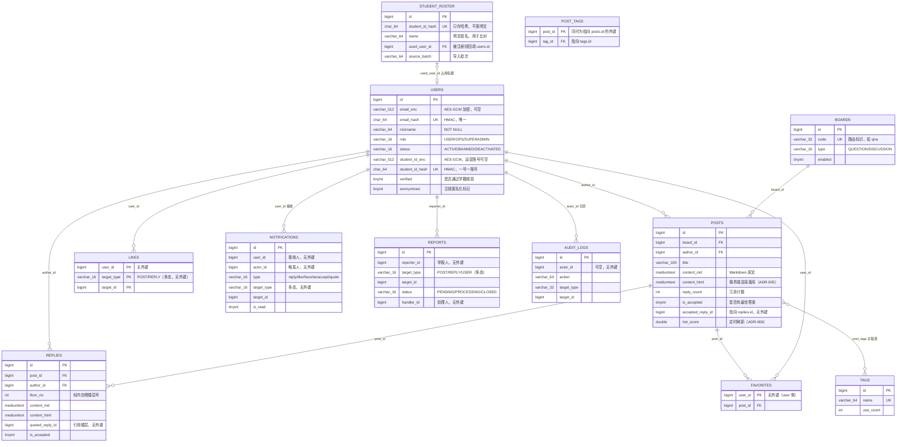

# 数据模型 ER 图与量级预估

| 文档信息 | 内容 |
|---------|------|
| 版本 | v1.0 |
| 状态 | 已归档（设计门行动项 **A3-5** 交付物，[CR-035](../变更日志/变更台账.md)） |
| 维护人 | 技术负责人（发起人兼任） |
| 最后更新 | 2026-09-13 |

> **变更记录**
>
> - **v1.0（2026-09-13）**——初版（[CR-035](../变更日志/变更台账.md)，设计门 A3-5）。§2 ER 图以 `V1__init_schema.sql` 实际 12 张表为唯一事实源；§5 量级预估以 [PRD](../需求/产品需求文档.md) §4 容量基线为输入。

## 1. 目的、事实源与边界

- **目的**：为设计门行动项 A3-5 提供两件东西——① 现有数据模型的**实体关系可视化**（文字定义在[技术方案 §4](技术方案.md)，本图为可视化对照）；② 按 PRD 容量基线的**数据量级与索引水位预估**，作为测试阶段造数规模与发布阶段容量验收的参考。
- **事实源**：`backend/src/main/resources/db/migration/V1__init_schema.sql`（Flyway 基线，**已执行不可改**；`V2__seed_boards.sql` 仅种入 6 个版块数据、无结构）。**表结构、字段、索引以迁移文件为准**——本文与其冲突时，以迁移文件为准并须修正本文。
- **边界**：本文**不引入任何表结构 / 索引变更**；量级数字均为工程估算（见 §5 口径），**非性能承诺**——性能承诺以 PRD §4 的 P90 / P95 指标为准，由测试阶段实测验收。
- **维护约定**：后续新增 `V<n>__*.sql` 结构变更时，**该 CR 必须同步更新本文**（§2 图、§3 表清单、§4 索引清单、§5 水位），否则视为该 CR 的文档同步遗漏。

## 2. ER 图（12 张表）

**图上画不出的三处关系（如实登记）**：

1. **多态目标无外键**：`likes` / `notifications` / `reports` 的 `target_type + target_id` 指向帖子或楼层（reports 另含 USER），数据库层**不建外键**——参照完整性由应用层保证，删除内容时须同步处置相关行（对 PRD F-FORUM-005 删除语义的隐含约束）；
2. **`posts.accepted_reply_id` 与 `replies.quoted_reply_id` 无外键**：采纳与引用为弱关联（楼层被删时置空语义由应用层处理），避免外键在热路径上的级联锁；
3. **`favorites.user_id` 无外键**（V1 原样）：与 `post_tags` 双外键风格不一致，属已知取舍——单校规模下影响可忽略，若后续加外键须新增前向迁移。

## 3. 表清单与职责（12 张）

| 表 | 职责 | 敏感字段处理 | 增长特征 |
|----|------|-------------|---------|
| `users` | 账号 | 邮箱 / 手机 / 学号 AES-GCM 存 `*_enc`，等值查询走 `*_hash`（HMAC），三者各带唯一键 | 注册驱动，试点期 ≤ 1 万，线性且缓慢 |
| `student_roster` | 学籍名册（核验比对源） | 学号**只存 HMAC 哈希**、不落明文；姓名明文仅用于容错比对 | 名册导入驱动（B1/B2 到位后批量），基本不增长 |
| `boards` | 版块（MVP 固定 6 个） | — | 常量级 |
| `posts` | 帖子（`content_html` 发布时服务端渲染落库，请求期零渲染） | 无敏感字段（正文为 UGC，交内容机审） | **主增长表**，线性，试点期 ≤ 10 万 |
| `tags` / `post_tags` | 标签与关联 | — | 随帖子缓慢线性 |
| `replies` | 楼层回复（`floor_no` 帖内自增，发帖服务内分配保证连续） | 无 | 主增长表，试点期 ≤ 40 万（估算见 §5） |
| `likes` | 点赞去重（PK 即唯一约束） | — | 事件驱动，量最大但行极窄 |
| `favorites` | 收藏 | — | 事件驱动 |
| `notifications` | 站内通知（reply / like / favorite / accept / quote） | — | 事件驱动、只追加，读多写多 |
| `reports` | 举报工单（24h 同对象去重靠应用层按索引查询） | detail 可能含举报描述 | 小表 |
| `audit_logs` | 后台全操作留痕（名册导入、内容处置——生产红线要求） | — | 小表、只追加 |

## 4. 索引清单（照录 V1，新增结构时随 CR 更新）

| 表 | 索引 | 类型 | 支撑的查询路径 |
|----|------|------|---------------|
| `users` | `uk_users_email_hash` / `uk_users_phone_hash` / `uk_users_student_id_hash` | UNIQUE | 登录 / 核验的等值查询（哈希列） |
| `student_roster` | `uk_roster_student_id_hash` | UNIQUE | 核验等值查询（哈希列） |
| `student_roster` | `idx_roster_used_user` | 普通 | 占用反查（学号是否已被注册） |
| `boards` | `uk_boards_code` | UNIQUE | 路由标识定位版块 |
| `posts` | `idx_posts_board_list (board_id, status, is_deleted, created_at)` | 复合 | 版块列表页（最常用路径） |
| `posts` | `idx_posts_latest (status, is_deleted, created_at)` | 复合 | 首页"最新"流 |
| `posts` | `idx_posts_hot (hot_score)` | 普通 | 首页"热门"流（ADR-006 定时刷新分数） |
| `posts` | `ft_posts_title (title) WITH PARSER ngram` | FULLTEXT | 中文标题检索（ngram 分词；若 F-FORUM-009 上 MeiliSearch，此索引可评估下线） |
| `tags` | `uk_tags_name` | UNIQUE | 标签归一 |
| `post_tags` | PK `(post_id, tag_id)` | 复合主键 | 关联去重 + 按 post 反查 |
| `replies` | `idx_replies_post_floor (post_id, floor_no)` | 复合 | 楼层分页（单帖 1000 楼的分页加载即靠它） |
| `likes` | PK `(user_id, target_type, target_id)` | 复合主键 | 去重 + "我赞过"；聚合计数走 `posts.like_count` 冗余列，不回表 |
| `favorites` | PK `(user_id, post_id)` | 复合主键 | 收藏去重 + "我的收藏" |
| `notifications` | `idx_notifications_user (user_id, is_read, created_at)` | 复合 | 通知列表 / 未读数（未读计数可上 Redis 缓存，见技术方案 §7.2） |
| `reports` | `idx_reports_target (target_type, target_id, created_at)`；`idx_reports_status (status, created_at)` | 复合 ×2 | 24h 去重查询；处置台队列 |
| `audit_logs` | `idx_audit_actor (actor_id, created_at)` | 复合 | 按操作人审计回溯 |

## 5. 量级预估（试点期 1 年，工程估算）

**输入（[PRD](../需求/产品需求文档.md) §4 容量基线，均为"≥"，即验收上限）**：注册 ≥ **1 万**、日活 ≥ **1000**、帖子 ≥ **10 万**、单帖回复 ≥ **1000 楼**（分页加载）。**推导假设（本节自设，非 PRD 基线）**：单校计算机类在校生名册约 5000~8000 人；平均每帖回复 **4 楼**（10 万帖 → 40 万楼；单帖 1000 楼为需分页的极端值）；帖子平均正文 **15 KB**（md + html 双份）；互动率按日活 1000 × 日均 5 次点赞 / 收藏 / 通知类事件估算。

| 表 | 试点期 1 年行数（估） | 单行大小（估） | 数据量（估） | 说明 |
|----|---------------------|---------------|-------------|------|
| `posts` | 10 万 | ~15 KB（md + html 双份为主） | **~1.5 GB** | 最大表；`MEDIUMTEXT` 单列上限 16 MB，充裕 |
| `replies` | 40 万 | ~6 KB | **~2.4 GB** | 40 万楼 × 双文本列 |
| `likes` | 50 万~100 万 | ~50 B | < 100 MB | 行极窄，复合主键聚簇 |
| `notifications` | 100 万~150 万 | ~150 B | < 250 MB | 事件驱动只追加；`(user_id, is_read, created_at)` 索引与数据近 1:1 |
| `favorites` | ~20 万 | ~30 B | < 20 MB | — |
| `post_tags` / `tags` | 15 万 / ~200 | 极窄 | < 20 MB | — |
| `users` | 1 万 | ~1 KB（三列 `*_enc` 为主） | ~10 MB | — |
| `student_roster` | 0.5 万~0.8 万 | ~0.2 KB | < 5 MB | 一次性导入 |
| `reports` / `audit_logs` / `boards` | < 0.5 万 / < 2 万 / 6 | — | < 50 MB | 小表 |
| **合计** | — | — | **约 4~5 GB / 年** | 远低于单实例 MySQL 8 舒适区（数十 GB 级） |

**结论**：**单校规模上限内，单实例 MySQL 8 + 现有索引设计即可承载，无需分库分表 / 归档**；试点期一年的真实瓶颈更可能出现在**全文检索的内存占用**与**热榜定时任务（ADR-006）的扫描量**，而非容量本身。

**扩容触发点（达到任一即须评估，提前于问题发生）**：

| 触发点 | 建议动作 |
|--------|---------|
| 库总量 > **20 GB** 或 `posts` > **50 万行** | 冷帖归档（`is_deleted` + 老帖迁历史表）或按 `created_at` 做 RANGE 分区 |
| `posts` / `replies` 平均正文显著超 15 KB（如长代码块） | 评估正文外置对象存储、库内只留摘要指针（改动较大，须先按 CR-034 写实施方案） |
| 全文检索 QPS / 内存成为瓶颈 | 引入 MeiliSearch（PRD F-FORUM-009 预案），`ft_posts_title` 评估下线 |
| `notifications` 未读数查询变慢 | 未读计数上 Redis（走 `RedisKeys` 前缀约定） |
| 单帖楼层接近 **1000 楼上限**常态化 | 楼层分页游标化（当前 `(post_id, floor_no)` 复合索引已支撑，仅需改查询形态） |
