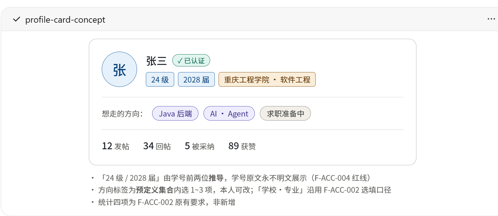

# Campus-Link 增量需求 PRD：个人中心与账号设置（F-ACC-007）

| 文档信息 | 内容 |
|---------|------|
| 文档版本 | v0.2（草案） |
| 状态 | 草案 |
| 维护人 | 产品负责人（发起人兼任；本文由 AI 协作会话起草） |
| 关联阶段 | 需求（阶段二）增量 · 开发（阶段四，**第一轮仅后端**） |
| 关联文档 | [主 PRD](产品需求文档.md) · [增量 PRD：个人主页身份卡与方向标签](产品需求文档-个人主页身份卡与方向标签.md) · [增量 PRD：账号类型与身份体系](产品需求文档-账号类型与身份体系.md) · [技术方案](../设计/技术方案.md) · [变更台账](../变更日志/变更台账.md) · [项目现有问题清单](../项目现有问题清单.md) |
| 最后更新 | 2026-09-19 |

> 版本号以 [docs/README.md](../README.md) 第 2 节为单一登记处，交叉引用不写版本号（手册 4.5）。
>
> **文档定位**：本文是主 PRD 之外的**增量需求文档**，把主 PRD §5.1 页面清单第 6 行那一格——「用户 ｜ **个人主页 / 我的（帖子 / 收藏 / 设置 / 注销）**」——首次展开为可验收的功能条目（新增 **F-ACC-007**）。发起人评审通过后，按"先登记后实施"以 **CR（编号待登记时确认，当前草稿记 CR-067）** 并入主 PRD（新增 F-ACC-007 行）；**评审通过前不得开工**。CR 影响评估草稿见第 8 节。
>
> ★ **两轮制声明**：本文写了完整 UI 与交互（§4.2），但**第一轮实施只交付后端**（`frontend/` 由并发会话占用，[CR-055](../变更日志/变更台账.md) 批次④⑤在途）。凡本轮无法取证的标准，§4.3 逐条标注「依赖前端不签 / 依赖 F-ACC-002 不签」——**不得把"接口能跑"读成"用户可见验收通过"**。

## 变更记录

- v0.2（2026-09-19）——发起人提供个人主页身份卡**概念图**并定展示口径：「展示可以参考它，但**不需要 `24 级`**」。据此新增 §4.2「展示参考」小节（含图的四条归属边界）、§9 **R-6**（点名 CR-036 的级/届徽章口径需按"只展示届"改判，**本文不代改**）、§7 **Q7**（`major` 在主页是否带"自报未核验"角标）、§3.2 徽章边界一条，并把 §4.2 结构图里的只读回显从「级·届」改为「届」。**同时登记一条反直觉事实**：砍掉「级」的展示**不降低**对 CR-036 Q1（学号编码规则核实）的依赖——届 = 前两位 + 4，比"级"多一层未核实假设。方向标签词表与状态标签优先级**一字不动**（图只作信息结构参考）；概念图归档于 [docs/设计/UI规范/概念图/](../设计/UI规范/概念图/profile-card-concept-2026-09-19.png)。
- v0.1（2026-09-19）——首次起草。发起人指令：「增加需求文档，增加个人中心设置，参考牛客的个人中心，先把文档做好再进行代码开发」；随后就四个口径作出选择（P0 范围＝最小闭环 / 资料编辑挂新立 F-ACC-007 / 注销只承接入口 / 实施分两轮先后端）。本文由 AI 协作会话按 [CR-034](../变更日志/变更台账.md) 流程起草，取证全部来自本仓代码与开发库实测（非文档转述）。

## 1. 问题陈述与目标

### 1.1 问题陈述

登录后想"管自己"，站内**无处可去**：顶栏用户菜单点不进任何设置页，`/u/:id` 至今是占位页（[问题清单 F-003](../项目现有问题清单.md)）。基线把这一格登记在 §5.1 已有 13 个月，**零功能编号、零接口、零验收标准**。

取证给出的三条硬事实决定了本文的形状：

| # | 实测事实 | 证据 | 对需求的影响 |
|---|---|---|---|
| ① | **资料是只读的**。`users` 表早有 `nickname / avatar_url / school / major / grade / bio` 六列，但注册链路只写昵称，开发库 53 个账号里**后五列非空数为 0**；`nickname` 在聚合里是 `final`、仓储只有 `insert`、account 侧唯一受保护端点是 `GET /users/me` | `V1__init_schema.sql:18-23` · `Account.java:18,54-57,74` · `AccountRepository.java:22-31` · `UserController.java:31-35` · 本机 `SELECT` 计数 | 基线 F-ACC-002 的"资料"六列**没有任何写入方**。本文是这些列的**第一个写入者**；好消息是**复用既有列 ⇒ 资料编辑零迁移** |
| ② | **"我的内容"只有收藏一个真交付**。我的帖子 / 我的回帖 / 我赞过的 / 足迹全无，且全仓没有任何按 `author_id` 的查询；`posts` 只有外键自动生成的单列 `fk_posts_author`，过滤 + 排序（`author_id + status + is_deleted + created_at`）不被覆盖 | `FavoriteController.java:36-43` · `PostRepository.java`（14 个方法无一按作者）· 本机 `SHOW INDEX FROM posts` | 列表要新写读路径 + 一条复合索引；收藏页那次"total 含不可见行"的取舍**不该在新列表重演**（§4.3 007b 定口径） |
| ③ | **账号安全与注销是空壳**。本系统**没有密码列**（登录 = 邮箱 + 6 位验证码）、无 `logout` 端点；JWT 7 天**绝对过期、无任何续期代码**，`JwtAuthenticationFilter` 只验签名不查库；`status=DEACTIVATED` / `anonymized` / `delete_at`（列名不带 `d`）三列全仓**零写零读** | `V1__init_schema.sql:25,29-30` · `JwtAuthenticationFilter.java:33-44` · `application.yml:76` · `security/` 与 `common/jwt/` grep `续期\|refresh\|renew` 零命中 | 牛客式"改密码 / 设备管理 / 即时登出"在这里**无对应物**。本文只做「入口 + 二次确认」，并把 token 吊销登记为前置依赖（§6），不在本轮设计 |

竞品对照（**仅到信息结构层**）：牛客个人中心普遍是"身份卡 + 我的内容分区 + 资料设置"三段式。**须如实声明：本轮未从公开渠道取到牛客官方对个人中心模块与可编辑字段的权威说明**（检索命中多为无关站点，唯一相关的社区帖只有"去个人主页完善简历"一句），因此本文只借鉴仓内既有的一份二手描述——[CR-036 草案 §1.1](产品需求文档-个人主页身份卡与方向标签.md)「牛客个人中心的**身份卡结构**（身份徽章 + 方向/意向标签 + 创作数据一行）」——**不声称逐屏比对过**，据此排出的字段清单以本仓数据模型为准、不以竞品为准。

### 1.2 目标（本期结束时如何判定成功）

| # | 目标 | 度量方式 |
|---|------|---------|
| G1 | 用户可以自助修改昵称 / 专业 / 签名，**全站展示随即生效**（无需任何人工介入或回填任务） | `PUT` 成功 + 列表读接口 `authorNickname` 即新值（§4.3 007a 可签断言） |
| G2 | 用户能看到"自己发了什么、答了什么"，且**被平台下架的内容对自己有标记、对他人不可见** | `GET /posts/mine`、`GET /replies/mine` 两接口的可见性口径逐条取证（§4.3 007b/c） |
| G3 | 账号侧写入口**不新增任何越权面与敏感字段外泄** | 三个新接口 URL 与请求体**不含身份参数**、`UserVo` 键名清单不含 `email/phone/studentId/anonymized/deleteAt/accountType`（负向断言可签） |
| G4 | 无机审期间，资料写入有**唯一两道可查证的缓解**：限流 + 审计 | 第 11 次/小时提交被拒；每次真改动 1 行 `PROFILE_UPDATE`、`detail` 不含用户输入正文 |

**用户目标**：登录后能改掉自己那个默认昵称、能找回自己写过的东西、能看见"这条是被平台下架的、不是系统吞了我的帖"。
**业务目标**：把基线 §5.1 那一格从"登记过"变成"可验收"，并**为 F-ACC-003 注销打通它唯一缺的前置**（见 §9 的"正向解锁"）。

## 2. 非目标（Non-goals）

| # | 不做什么 | 为什么 |
|---|---------|--------|
| N1 | **不做改密码 / 找回密码 / 二次验证** | 系统**没有密码**（`users` 25 列无 `password`，全仓 `password` 只出现在数据库口令与 Spring 类名）。引入密码 = 引入第二套认证体系，远超本 PRD 范畴 |
| N2 | **不做通知偏好设置**（007f 降级） | 三条门槛未齐（§4.1）：`notifications` 连 `read_at` 与"单条已读"都没有（只有 `is_read` 布尔 + `read-all`），偏好无处可落 |
| N3 | **不做头像上传 / 外链头像**（007h 降级） | 全仓零 `multipart`、零对象存储、零静态托管配置；`avatar_url VARCHAR(512)` 是零消费列。上传方案属 ADR 级决策（涉生产部署），不塞进设置页 |
| N4 | **不做 token 吊销 / 即时登出** | `JwtAuthenticationFilter.java:33-44` 只验签名不查库、无吊销名单，实测**也没有续期机制**。最坏敞口 = 令牌剩余 TTL，**最长 7 天且第 7 天必然掉线**。封禁 / 注销后旧令牌继续可用是**架构级独立一轮**（与 [CR-066 §2 不做第 2 条](../变更日志/变更台账.md)同一判据），本文只登记为共同前置依赖 |
| N5 | **不做注销细则**（冷静期 / 撤销 / 匿名化定时任务 / 内容处理） | 全部留在基线 **F-ACC-003**（该条已基线化、至今零实现）。基线 §8 **Q2「注销后内容处理细则」至今开放、标注需"产品 + 法务意见"**，本文不代答。本文只交付入口与二次确认交互 |
| N6 | **不做邮箱 / 手机号换绑** | 换绑要"新邮箱验证 + 旧邮箱确认"两段式，且牵动 `uk_users_email_hash`（登录唯一入口）。`phone_enc/phone_hash` 两列全仓零读写=死列，**激活它本身就是一次独立决策** |
| N7 | **不做他人视角的"我的内容"** | 归 F-ACC-002 本体的时间线。本文三个新接口**一律不接受身份参数**，作者 id 只能从令牌取（§6 写死为技术约束） |
| N8 | **不做获赞数 / 被采纳数统计**（007i 相关） | 归 F-ACC-002 本体——[CR-036 §9](产品需求文档-个人主页身份卡与方向标签.md) 已明文"统计四项仍是本体范围，本文不重复定义"，本文继续不认领。且被采纳数语义有坑：楼层后来被下架/删除时 `is_accepted` 不回滚，计数会虚高 |
| N9 | **不开放 `school` 编辑；`grade` 本期不开放** | 详见 §4.3「字段可信度三分表」。一句话：`school` 在单校部署下是**部署事实而非用户属性**（名册表根本没有学校列，"填什么、跟什么比对、错了谁负责"三问全无答案）；`grade` 若可填会与 CR-036 的"级/届由学号推导、读时计算不落库"长成**两个事实源** |
| N10 | **不做已删内容的回收站 / 恢复**（007j 降级） | 本仓**没有恢复能力**（[CR-065 §2](../变更日志/变更台账.md) 明确不做恢复入口）。列出已删行 = 给用户一个"看得见、点不进、找不回"的死列表 |
| N11 | **不做昵称全局唯一 / 资料变更历史 / 资料审核流** | 唯一性收益低于成本（站内区分度靠主页 id 与级/届，不靠字符串）；变更历史需新表（唯一一次真正的建模扩张，本期不值）；"审核"在 F-SAFE-001 词表未定时没有可执行判据。⚠️ 一条实测事实供将来参考：`utf8mb4_0900_ai_ci` 会把大小写 / 全角 / 重音折叠（本机实证 `'ABC'='abc'`、`'ａbc'='abc'`、`'café'='cafe'` 均为真），**但零宽字符不折叠**（`'a'+U+200B+'a' <> 'aa'`）→ 折叠是白拿的，零宽仿冒不是 |
| N12 | **不碰 `frontend/` 任何文件** | 并发会话占用（CR-055 在途）。照 CR-065 / CR-066 先例**如实登记后果**：第一轮页面无入口、**用户可见验收不签** |
| N13 | **不新建限界上下文** | 三个端点全落既有 `account` / `forum` 上下文；A3-11 复评的"照抄四层范式"留给真正的第三个上下文（[CR-066 §2 不做第 6 条](../变更日志/变更台账.md)同判据） |

**四处交代（不改他人草案，只在 §9 点名，由发起人裁决）**：

1. **CR-036 N2（不做完整求职意向表单）结论继续成立**——本文 007g 只在设置页给一个入口位，**不重开该决策**；若将来要做，期望城市 / 薪资另需一份隐私评估。
2. **CR-036 N4（不展示学号、不做任何可逆展示）继承为本文红线**——设置页与接口不得出现学号原文及其可逆形态，也**不提供"用学号定位账号"的能力**。
3. **CR-042 N3（本期不开放任何账号类型切换）**——本文 007d 的设置页**不得出现 `account_type`**。该列本身尚未落地（V1 无此列），天然满足，但需求要先钉住一条契约级负向断言。
4. **[CR-039 §5.3](产品需求文档-站内RAG问答.md) 的"检索范围…排除已删除 / 机审拦截 / **用户设置**"是一处空引用**——它预设了"用户可设置内容可见性"这一从未立号的能力。**本文不认领这处引用**（"范围可见性"与"个人中心设置"不是一回事），请发起人决定：改 CR-039 那行措辞，或另立一条"内容可见性设置"口径项。

## 3. 用户与场景

### 3.1 用户故事

- 作为一名**刚注册的新生**，我想把系统默认给的"模拟学生01"式昵称改成我自己的，并写一句话签名，以便回帖时别人认得出我；
- 作为一名**大三准备找实习的学生**，我想在"我的帖子"里看到自己发过的所有提问（包括被系统标记的），以便挨个检查哪些还没人答；
- 作为一名**曾被管理员下架内容的作者**，我想知道"我少了哪一帖"，以便判断是内容问题还是可以等待恢复——**而不是以为系统吞了我的帖**；
- 作为一名**要注销的学生**，我在设置页找得到注销入口，并清楚它会要求我手输"注销"二字确认；
- 作为一名**运营（未来的 SUPERADMIN）**，我要能查到"谁在什么时候改过资料的哪几个字段"，以便事后追责——但**不需要**也**看不到**改前的旧值。

### 3.2 边界场景（必须覆盖）

- **`status=BANNED` 的账号持未过期令牌**：拒绝资料编辑（`403 / 2006`，零副作用）；⚠️ 但**本期不存在任何把账号置为 BANNED 的代码路径**，故本条只在单测层取证（§4.3 已标注）；
- **`status=DEACTIVATED`（注销冷静期）**：**允许**编辑——冷静期语义本就包含"可登录并正常使用，以便撤销"（细则归 F-ACC-003）；
- **无内容账号**（新注册、零帖零层）：两个"我的"列表返回 `total=0`、`list=[]`，不是 404；
- **自己删过的帖子**：不出现在"我的帖子"（N10 的展示面推论）；
- **被平台下架的帖子**：出现在"我的帖子"并带 `status=REMOVED`，但**不下发正文、不给可点跳转、不给下架原因**；
- **父帖已不可见的回帖**：整条不出现（父帖 `is_deleted=1` 或 `status=REMOVED` 都算不可见）；
- **`size=999`**：归一为 100 且不报错（沿用既有分页口径）；
- **三字段与库中完全相同**：幂等 200、`updated_at` 不推进、**不记审计**；
- **`bio` 含 `<script>` / 尖括号 / 零宽字符**：服务端字符集白名单拒绝（`400 / 1001`）——因基线 §4 的 CSP **实测全仓零实现**，这是**唯一防线**，不是第二道；
- **请求携带 `authorId` / `id` / `email` / `role` / `status` / `accountType`**：一律不生效（§4.3 负向断言）；
- **身份卡徽章的展示边界**（⚠️ **推导规则与边界定义权在 [CR-036 草案](产品需求文档-个人主页身份卡与方向标签.md)，本文只登记发起人的展示口径**）：无学号账号（如 dev 管理员 `admin@campuslink.local`）与学号前两位不在 20~31 区间的账号 → **不显示届徽章**、页面无错误；**「级」按发起人 2026-09-19 口径不展示**，但推导链路**仍需先算出入学年**（届由它 +4），故"级不展示"≠"级的边界不再适用"；推导错误个体（专升本 / 留级）的兜底仍走 CR-036 N5「本期不建纠偏流程」。

## 4. 功能需求

### 4.1 功能列表与优先级

| 编号 | 功能 | 优先级 | 模块 | 依赖 |
|------|------|:------:|------|------|
| F-ACC-007a | 资料编辑（昵称 / 专业 / 签名） | **P0** | 账号 | 无（三列 V1 已就位，**零迁移**） |
| F-ACC-007b | 我的帖子列表 | **P0** | 论坛 | 建议同批 `V3` 复合索引 |
| F-ACC-007c | 我的回帖列表（只读） | **P0** | 论坛 | `V3` 索引 + 父帖可见性 JOIN |
| F-ACC-007d | 设置页结构与账号状态回显 | **P0** | 账号 | 注销**细则**归 F-ACC-003（零实现）→ 入口本身无后端量 |
| F-ACC-007e | 资料变更限流 + 审计（随 007a，不独立排期） | **P0** | 账号 | `RateLimitGateway` / `AuditService` 既有端口 |
| — | **口径项：字段可信度三分表**（只读 / 派生 / 自填） | 口径项 | 产品 | 零实施量，**本文最高价值的一页**（§4.3 表） |
| F-ACC-007f | 通知偏好设置 | P1（**门槛制**） | 通知 | 三条门槛见下表 |
| F-ACC-007g | 方向标签 / 求职意向**入口位** | P1（**指针项**） | 账号 | 能力与优先级归 F-ACC-005b（CR-036），本文不重复定义 |
| F-ACC-007h | 头像上传 / 外链 | P2（门槛制） | 账号 + 基础设施 | 存储选型（A3-6）+ `https` 协议白名单 |
| F-ACC-007i | 我赞过的 / 足迹 | P2（门槛制） | 论坛 | 与收藏页合并为一次"我的互动"设计 |
| F-ACC-007j | 已删内容回收站 / 恢复 | P2（不做清单） | 论坛 | 必须先有帖子与楼层的自助恢复端点 |

**P1/P2 门槛写法**（机制照 [F-AI-004 门槛型](产品需求文档-站内RAG问答.md)与 [CR-042 §4.3](产品需求文档-账号类型与身份体系.md)先例：**门槛不同时满足则排期为 0**）：

| 项 | 排期门槛 |
|---|---|
| 007f 通知偏好 | ① `NotificationType` 词表收口（现 4 值，前端 `NotificationsView.vue:63` 是 `if (n.type === …)` 硬编码链，CR-066 已登记此敞口）；② 出现 ≥3 例真实"通知打扰"反馈；③ `notifications` 补 `read_at` 且提供单条已读端点——**三条不齐不排** |
| 007g 方向标签入口 | F-ACC-005b 实施且 CR-036 Q3（标签集终稿）定稿之后，本文只负责让设置页有它的入口位 |
| 007h 头像 | ① 部署与文件存储选型定稿（A3-6 之后）；② 若走外链，先复用 `MarkdownRenderer` 既有口径「`img.src` 仅 `https`」（`MarkdownRenderer.java:18,45`）做协议白名单并评估数据外带；③ 出现"辨识度不够"的真实反馈 |
| 007i 我赞过的 / 足迹 | 至少两项有真实点击数据支撑（`likes` 主键前缀可按 user 扫，但零"我的互动"读路径，且 `likes` 无 `is_deleted` 列） |
| 007j 回收站 | **自助恢复端点先落地**（帖子 + 楼层），否则本项永不上线 |

### 4.2 交互说明（目标态；**第一轮不实施**）

```
/settings                    设置（本人唯一可见，非个人主页的一部分）
  ├─ 区块 1「我的资料」       昵称 / 专业 / 签名 三个可编辑项 + 只读回显（学校·届·已认证；**「级」不展示**，见下方展示参考）
  ├─ 区块 2「我的内容」       我的帖子（含"共 N 条"）· 我的回帖（含"共 N 条"）· 我的收藏（入口收编既有 /favorites）
  └─ 区块 3「账号」           账号状态回显（正常 / 已封禁）· 退出登录（仅清本地令牌）· 注销账号（二次确认）
/me/posts   /me/replies      两个列表页（分页 size=20）
```

- **只读项绝不出现输入框**：学校、年级（**只回显「届」**，「级」不展示）、邮箱、学号、角色——按 §4.3 三分表，它们不是"用户没填"，是"平台不给填"；
- **后端不存在的行一律不占位**：通知偏好、头像、求职意向**本期不进设置页**（"点了没反应"就是文档在撒谎）；
- 注销二次确认：要求**手输"注销"二字**才解锁提交按钮（不引入新依赖的最低成本防误触）；
- 视觉与组件遵循 [界面规范](../设计/UI规范/界面规范.md) 令牌，不新增设计令牌；⚠️ 界面规范 §2 已把"个人中心落地后需要常驻二级导航"列为**左侧栏重新评估的触发条件**，本 PRD 正是那个触发方——但**第二轮实施时再去该行加注**，本轮不改判。

#### 4.2.1 展示参考（发起人 2026-09-19 提供的概念图）



图已归档于 [`docs/设计/UI规范/概念图/`](../设计/UI规范/概念图/profile-card-concept-2026-09-19.png)（125,302 字节，与发起人提供件 sha256 逐字节相等 `3d4bdd6a…eb3050`），并在界面规范 §8.4 登记为**参考性视觉稿**。发起人原话：**「个人中心展示可以参考这个图片，但是不需要 `24 级`」**。

**采纳的部分（信息结构层，三行）**：① 身份卡徽章行 `已认证` → `2028 届` → `学校 · 专业`；② 方向标签独立一行、胶囊样式；③ 内容统计一行四项收尾。

**⚠️ 归属边界（逐元素，防止把这张图读成需求）**：

| 图上的元素 | 定义权在谁 | 本文的立场 |
|---|---|---|
| `24 级` 徽章 | **CR-036 草案 F-ACC-005a**（级/届推导） | **发起人已定：不展示**——但本文**不代改该草案**，改判请求点名在 §9 **R-6** |
| `2028 届` 徽章 | 同上 | 展示；⚠️ **砍掉「级」不降低对 CR-036 Q1 的依赖**（届 = 前两位 + 4，比"级"多一层"本科 4 年制、无专升本 / 留级"的未核实假设）。发起人裁决：**现在就上，Q1 核实后据实调整**；缓解事实是推导读时计算、**不落库** ⇒ 改一处即全站生效、零迁移，错的届不会沉淀成脏数据 |
| `Java 后端` / `AI · Agent` 胶囊 | **CR-036 草案 F-ACC-005b** 的词表（其 Q3 至今开放） | **词表一字不动**——图里的 `AI · Agent` 与提案 `AI·算法` 的差异**只如实记为"待 Q3 评审时定"**，本文不据图改词表；本文只拥有**编辑入口位**（007g） |
| `求职准备中` 胶囊 | **CR-036 草案 F-ACC-005d**，**P2 状态标签** | 图把它与方向标签放在同一行，**本文不承诺同行展示**（P2 仍是 P2）；同行与否属视觉稿细节，随该草案评审一并定 |
| `12 发帖 / 34 回帖 / 5 被采纳 / 89 获赞` | 发帖·回帖数**可由 007b / 007c 的 `total` 供给**；被采纳·获赞归 **F-ACC-002 本体** | 本文只对前两项负责（§2 N8、§9 R-2）；⚠️ 图上四项**不等于本文范围** |
| `重庆工程学院 · 软件工程` | 学校＝部署事实不采集、专业＝自报未核验（§4.3 三分表） | 图上**没有任何"未核验"标注**，与三分表口径存在一处展示层缺口 → 登记 **Q7** 请发起人裁决 |

### 4.3 功能详情与验收标准

#### 口径项 · 字段可信度三分表

| 字段 | 处置 | 上限（依据） | 为什么 |
|---|---|---|---|
| `nickname` | 自填、**可编辑**、全站唯一展示位 | **2~32**（与注册侧同一处常量，`RegisterCommand` 现挂 `@Size(min=2,max=32)`；列 `VARCHAR(64)` 留余量） | 基线 F-ACC-002 已列为展示项且注册时唯一被真实赋值的字段 |
| `major`（专业） | 自填、可编辑、**不加"已核验"字样**、不提供按专业筛选 | ≤**64**（本仓名称类惯例：`boards.name` / `tags.name` / `student_roster.name` 全 64；列 `VARCHAR(128)`） | 名册确有对应物（`department`，实测 51 行中 48 行有值）但注册**不搬运**（`StudentRecord.department` → `Account.registered()` 不接它）→ 本期诚实的上限就是"用户自报" |
| `bio`（签名） | 自填、可编辑、**纯文本** | ≤**200**（列 `VARCHAR(512)` 是容量不是产品上限；200 对齐 [CR-066](../变更日志/变更台账.md) 处置 `reason ≤200` 的档位） | 基线用词"个人签名"= 一句话，不是简介正文 |
| `school`（学校） | **只读、本期不显示、无写入口** | — | 单校部署（"限本校"由 F-ACC-004 保证）+ 名册表**无学校列** → 该字段今天**没有任何事实源** |
| `grade`（年级） | **只读（本期无值）、语义走 CR-036 推导** | — | 名册 `grade` 有 48 行值但未搬运；若开放填写 → 与"级/届读时推导"成双事实源，主页同时出现二者时用户不知信谁。B2 若确认可搬运，走"核验时一次性写入、写后只读"，**另立 CR**，本文不预先占字段 |
| `avatar_url` | 本期不开放 | — | 见 N3 |
| `verified` / `role` / `status` | 只读回显（`status` 仅回本人） | — | 分属 F-ACC-004 / F-ADMIN-001 / F-SAFE |
| `email_*` / `phone_*` / `student_id_*` | **不进编辑契约，连读都不出** | — | 敏感列 + 换绑是独立一批（N6）；现状 `UserVo` 已履行不外泄，本文以负向断言钉住 |

---

**F-ACC-007a 资料编辑（P0）**

- 描述：已登录用户可修改**昵称、专业、个性签名**三个字段，走站内第一个"修改用户信息"写入口 `PUT /api/v1/users/me`（受保护；身份取自令牌，不接受任何身份参数）。成功返回与 `GET /api/v1/users/me` **同形状的 `UserVo`**（全量回显，前端不必二次拉取）。学校、年级、邮箱、手机号、学号、角色、状态、头像**一律不在本期开放**（理由见上方三分表与 N3 / N6 / N9）。
- 业务规则：
  - **校验单点化**（本条真正的工程量所在，不在 UPDATE 本身）：长度与字符集规则必须与注册侧**共用同一处定义**——现状 `2~32` 长在 `RegisterCommand` 的注解上，编辑侧若另抄一份，**第一次放宽上限就必然漂移**。落地形态二选一（设计阶段定）：`Nickname` 值对象（`EmailAddress` / `StudentId` 是现成范式）或抽一处共享常量被两侧引用；
  - **语义取 PUT 全量提交**（不选 PATCH：PATCH 的"字段缺省 vs 清空"要在两份契约各解释一遍，而本仓 3 个 PUT 先例都是全量幂等）。某字段传 `null` = 不改，传空串 = 清空 `bio`/`major`，`nickname` **不允许清空**；
  - **定向单列 UPDATE，且只 SET 与库中值不同的列**（照 `markDeleted` / `updateStatus` 范式）。⚠️ **禁止把 `AccountRepository.save()` 扩成 upsert 或整行回写**——整行写会把 `role` / `status` / `email_*` 一起盖回去；
  - **不做乐观锁**：同一账号改自己的资料，并发概率≈0，真丢一次不产生资金或权限后果。"最后写入者胜"作为已知取舍登记在此；
  - **幂等**：三值全等 → `200`、0 行受影响、`updated_at` **不推进**（MySQL `ON UPDATE CURRENT_TIMESTAMP` 的自然行为）、**不记审计**；
  - **状态门**：`BANNED` 拒绝（`403 / 2006`）、`DEACTIVATED` 允许。⚠️ `UserController#me` 与 `accountOf` 今天**完全不看 `isActive()`**，本条是这条判据第一次进 account 侧；
  - 领域侧：`Account.java:18` 的 `nickname` 现为 `final`，须放开并**以领域方法承载校验**（`updateProfile(...)` 之类），**不加公开 setter**——保持该聚合"生命周期规则收敛在聚合内"的既有口径；
  - 改昵称**即时全站生效**：`nicknamesOf → findByIds → selectBatchIds` 每次请求实时查库（`AccountApplicationService.java:129-135`，forum 三处调用点 `ForumQueryApplicationService.java:114,135,213`），帖子表**无昵称快照列** → **不需要回填任务**，这是一条能签的断言而非待办。
- 验收标准：

```gherkin
# 本期可签
Given 已登录账号昵称"模拟学生01"、major 与 bio 均为 NULL
When  PUT /api/v1/users/me 提交 {nickname:"新昵称", major:"计算机科学与技术", bio:"想走 Java 后端"}
Then  200 且 data 三字段为新值；SQL 复核该行 nickname/major/bio 三列同步、updated_at 推进，
      且 role、status、email_hash 未变（证明未整行回写）

# 本期可签 —— 全站昵称无快照
Given 上一步成功且该账号存在已发布帖子
When  GET /api/v1/posts?page=1&size=20
Then  该帖条目 authorNickname 即为"新昵称"（实时查库，无需回填）

# 本期可签
Given 已登录用户提交 nickname 长度为 1 或 33
Then  400 / code=1001，message 指明昵称长度 2~32，且 users.updated_at 不变（零副作用）

# 本期可签 —— bio 的服务端唯一防线（CSP 实测零实现）
Given 已登录用户提交 bio 为 "<script>alert(1)</script>"
Then  400 / code=1001 且指明该字段含不允许字符；users.bio 仍为原值；
      且全仓不存在 bio 的 HTML 形态列、MarkdownRenderer 不为 bio 被调用

# 本期可签 —— 幂等零审计
Given 用户以与库中完全相同的三值再次 PUT /api/v1/users/me
Then  200、users.updated_at 不推进、audit_logs 不新增 PROFILE_UPDATE 行

# 本期可签（仅单测层）/ 真机不可签 —— 封禁写入口本期不存在
Given status=BANNED 的账号携带未过期令牌
When  PUT /api/v1/users/me
Then  403 / code=2006，零副作用

# 本期可签 —— 负向断言：不存在越权面与字段外泄
Given 已登录用户在 PUT 请求体中携带 id / email / role / status / accountType，或访问 GET /api/v1/users/{他人id}/profile
Then  请求体这些字段一律不生效且不出现在 openapi.json 的 schema 中；后者 404 / code=1004（本期无他人视角资料端点）

# 依赖 F-ACC-002 不签
Given 未通过学籍核验或已匿名化的账号访问设置页
Then  不出现"编辑资料"入口 —— 属主页 / 注销侧口径，本 PRD 不签
```

- 数据要求：**零迁移**（三列 V1 已存在；实测开发库 53 行中 `school/major/grade/bio/avatar_url` 非空数为 **0** ⇒ 本期是这些列的第一个写入方）。错误码新增 **`PROFILE_UPDATE_TOO_FREQUENT(2008, 429, "资料修改过于频繁，请稍后再试")`**（已 grep `ResultCode.java` 确认 2008 为空号；**不复用 2002 / 2103**——二者文案绑死验证码与学籍，复用等于写脏语义字典）。⚠️ 新增 `ResultCode` + `UserVo` 加字段 + 新端点 ⇒ **必须重生成 `openapi.json`**。

---

**F-ACC-007b 我的帖子列表（P0）**

- 描述：`GET /api/v1/posts/mine?page&size`（受保护，挂 forum 上下文 `PostController`，照 `GET /favorites/mine` 先例），返回本人发帖时间倒序分页；出参复用帖子摘要并**新增一个仅本场景出现的 `status` 字段**。
- 业务规则：
  - **不接受 `authorId` / `userId` 参数**，作者身份唯一来源是 `CurrentUser.requireId`——**只要没有身份参数，越权面就是零**。他人视角时间线留给 F-ACC-002 本体另立端点；
  - **可见性口径（本文最硬的一格）**：`is_deleted=1`（作者自助删除）**对作者本人也不出现**；`status=REMOVED`（平台下架）**出现且带标记，且仅本人视角可见**。立由：① 自删——全站已有 11 处读路径把 `is_deleted=1` 定义为"不存在"（CR-065 §7.3 实测），"我的"单开特例就是第 12 处例外，而 CR-065 D-1 的教训恰是"'读侧已一致'这类断言必须逐条打开适配器看"；且**本仓无恢复能力**（N10），列出来即死列表；② 下架——它与自删在**可逆性**上根本不同（CR-066 提供 RESTORE、热榜下轮回候选），用户不知道自己的内容少了什么，就既无法等待也无法申诉；
  - ⚠️ **必须如实登记的后果**：本条让 `status=REMOVED` 的内容**第一次在前台露出**。CR-066 之后 REMOVED 在十二处读位置全部不可见，"我的帖子"是**第十三位、且唯一面向作者本人**的一位。因此"接口无身份参数"不是省事，而是这条口径**能成立的唯一前提**（已写成可签负向断言）；
  - 折中落法：只给「标题 + `status=REMOVED` + 时间」，**不给正文、不给可点跳转、不给下架原因**（原因在 `audit_logs.detail`，属运营侧；给用户等于给申诉开无底洞）；
  - **`total` = 满足可见条件的行数、与 SQL 查询条件同源**（判据直接来自 `PostRepository.java:21` javadoc：「列表的 total 必须与查询条件同源」）。**不重演收藏页那次"total 含不可见行"**——那处是结构性偏差（分页驱动是 `favorites` 行，剔除必然致偏），而这里驱动分页的就是 `posts` 本身，没有理由不做同源；
  - 排序 `created_at DESC, id DESC`（同值兜底防翻页错位，同 `findPage` 先例）；`page`/`size` 归一沿用 `normalizePage/normalizeSize`（`size` 上限 100 且**不报错**）；条目不下发正文，只下发既有 120 字摘要出口；不下发 `hot_score`。
- 验收标准：

```gherkin
# 本期可签 —— 两列两义在"我的"视角的落法
Given 账号 A 有 3 篇帖：1 篇 PUBLISHED、1 篇 status=REMOVED、1 篇 is_deleted=1
When  GET /api/v1/posts/mine?page=1&size=20
Then  list 恰 2 项（PUBLISHED 与 REMOVED 各 1）、total=2；自删那篇既不出现也不计入 total

# 本期可签 —— 匿名与身份参数
Given 匿名请求 GET /api/v1/posts/mine
Then  401 / code=4001（框架层拦截，未进业务代码）
Given 已登录用户在 query 携带 authorId=<他人id>
Then  返回的仍是本人内容，该参数不生效

# 本期可签 —— total 与翻页一致性
Given 账号 A 有 45 篇可见帖
When  以 size=20 逐页取到空页
Then  total=45、三页为 20/20/5，三页并集无重复无遗漏（等价于断言 total 与 SQL 条件同源）

# 本期可签 —— 与自助删除同源的即时性
Given 账号 A 记录 total=N 后成功 DELETE 自己一篇帖
When  再次 GET /api/v1/posts/mine
Then  total=N-1，被删帖 id 不出现在任何页

# 本期可签 —— 不因"我的可见"而漏内容
Given 某帖被 REMOVED、作者为 A
When  账号 B 或匿名访问 GET /api/v1/posts/{id}
Then  404 / code=3001（CR-066 的十二处不可见行为不得被本条破坏）

# 依赖前端不签
Given A 打开"我的帖子"列表
Then  REMOVED 条目展示"已下架"标记且不可点击跳转
```

- 数据要求：建议同批新增 **`V3__my_content_indexes.sql`**（`db/migration` 现只有 V1/V2）：

```sql
ALTER TABLE posts   ADD KEY idx_posts_author_list   (author_id, status, is_deleted, created_at);
ALTER TABLE replies ADD KEY idx_replies_author_list (author_id, status, is_deleted, created_at);
```

列序与命名刻意照抄 `idx_posts_board_list (board_id, status, is_deleted, created_at)`（只把 `board_id` 换成 `author_id`）。新索引以 `author_id` 打头后 `fk_posts_author` 变冗余但**不删**（DROP 需再一次迁移，且 MySQL 会为外键再建回来）。⚠️ **诚实定位**：试点期量级（基线 §4：注册 ≥1 万、帖 ≥10 万）下单用户最多几百帖，**不建索引也不会出事**——本条的正确定位是"一次迁移顺带、不给未来留慢查询"，**不是阻塞项**；若发起人要求本批零迁移，则登记为可后补缺口而非缺陷。另：`mvn verify` 不校验迁移可执行性 → **加了 V3 必须真机启动一次**。

---

**F-ACC-007c 我的回帖列表（只读）（P0）**

- 描述：`GET /api/v1/replies/mine?page&size`（**新建映射类**——`ReplyController` 的类级前缀是 `/api/v1/posts/{postId}/replies`，挂不进去），返回本人楼层，条目带父帖定位信息。
- 业务规则：
  - **父帖不可见 ⇒ 整条不出现**（父帖 `is_deleted=1` 或 `status=REMOVED` 都算）。这与 `requireVisiblePost` 及 CR-066 收口的通知侧完全同构——"标题回落了、链接还是可点的"是本仓刚抓过两次的缺陷模式（CR-065 D-1 / CR-066 §2 6b），"我的回帖"若列出父帖已消失的楼层就是它的第三次；
  - 楼层**自身** `status=REMOVED` 而父帖仍可见 → **出现 + 带标记**（同 007b 的可逆性判据）；
  - **只读，不提供删除动作**：`replies.is_deleted` 全仓**零写入口**（F-FORUM-006 只覆盖帖子）。这是本条最容易被误认为"已具备"的地方，必须写明；
  - 条目下发 `postId` / 父帖标题 / `floorNo` / 120 字摘要 / `status` / `createdAt`，**不下发 `contentMd` 原文**（无编辑能力时下发原文只是扩大出口）。
- 验收标准：

```gherkin
# 本期可签
Given 账号 A 在帖 P1（PUBLISHED）下有 2 层、在帖 P2（作者已自删）下有 1 层
When  GET /api/v1/replies/mine?page=1&size=20
Then  list 恰 2 项且 postTitle 均为 P1 标题；P2 下那条不出现，total=2

# 本期可签 —— 父帖下架
Given 帖 P3 被 SUPERADMIN 下架（status=REMOVED），A 在其下有 1 层
When  GET /api/v1/replies/mine
Then  该层不出现（父帖不可见即整条不出现，与 requireVisiblePost 同源）

# 本期可签 —— 楼层自身下架可逆
Given A 的一条楼层被单独下架（REPLY_REMOVE）而父帖仍 PUBLISHED
When  GET /api/v1/replies/mine
Then  该条出现且 status="REMOVED"；用 CR-066 端点恢复后 status 变回 "PUBLISHED"

# 本期可签（负向）
Given 任意请求向 GET /api/v1/replies/mine 携带 authorId
Then  不生效；匿名请求 401 / 4001

# 依赖后续 CR 不签
Given A 想在"我的回帖"里删掉自己的一层
Then  本期无任何删除入口与端点 —— 敞口登记于 §7 Q2，本 PRD 不声称已具备
```

- 数据要求：`V3` 第二条索引；`ReplyRepository` 新增 `findPageByAuthor` 端口方法，实现走 `ReplyMapper` 手写 `JOIN posts`（照 `PostMapper.search` 先例，**不用两次查询在内存拼**——那样 total 与条件必然不同源）。

---

**F-ACC-007d 设置页结构与账号状态回显（P0）**

- 描述：把基线 §5.1 第 6 行那一格落成结构（路由见 §4.2）。**本轮后端唯一交付是 `GET /api/v1/users/me` 响应补一个 `status` 字段**（现 `UserVo` 十个字段里没有 status），供前端判断"正常 / 已封禁"，注销入口的可见性由此驱动。
- 业务规则：
  - 注销本期**只承接入口 + 二次确认**（手输"注销"二字），**不动 `anonymized` / `delete_at` 两列**、不做冷静期定时任务（细则归 F-ACC-003）；
  - **不加 `deleteAt` 到 `UserVo`**：那属 F-ACC-003 的语义，本期"为不存在的状态预先扩契约"= 制造一个恒为 null 的对外字段（与 CR-042 §5「字段不进契约」同判据）；
  - 设置页不出现任何后端不存在的行（§4.2）；
  - 隐私：`status` 只回本人；响应继续不出现 `email` / `phone` / `studentId` / `anonymized` / `accountType`（现状 `UserVo` 已履行，本条以负向断言钉住）。
- 验收标准：

```gherkin
# 本期可签
Given 已登录用户
When  GET /api/v1/users/me
Then  data 含 status="ACTIVE"，且不含 email / phone / studentId / anonymized / deleteAt / accountType 任一字段
      （openapi.json 的 UserVo schema 键名清单 + 真机响应体键名清单双向取证）

# 本期可签 —— 契约增量必须逐项判定
Given 重生成 openapi.json
Then  路径 21 → 22、操作 24 → 27、受保护 15 → 18、UserVo schema +status、ResultCode +2008；
      既有 operation 零 diff（删除行必须逐行归因，照 CR-066 §7.4 的口径——"−0 才算纯新增"的旧判据已失效）

# 依赖前端不签
Given 已登录用户进入 /settings
Then  只出现"编辑资料 / 我的帖子 / 我的回帖 / 我的收藏 / 注销账号"五项，无任何"通知偏好""头像"占位

# 依赖 F-ACC-003 不签
Given 用户在注销入口未勾选确认即提交
Then  前端不发任何请求（本期无注销端点，后端无从验收 —— 如实登记）
```

- 数据要求：零迁移。⚠️ `UserVo` +1 字段会牵动 `UserVo.from` 与既有 account 侧单测断言（record 位序）。

---

**F-ACC-007e 资料变更限流与审计（P0，随 007a 不独立排期）**

- 描述：007a 的配套规则。单独列号只为让"无机审期间的缓解措施"在验收里能被单独勾验。
- 业务规则：
  - 限流键 `profile:edit:{userId}`，**10 次 / 小时**（口径对齐基线 §4 学籍核验"IP 维度限流 10 次/小时"的既有档位），走 `RateLimitGateway.hitAndCount`，超限 `429 / 2008`；
  - 审计 `AuditService.record(userId, "PROFILE_UPDATE", "users", userId, detail)`，与 UPDATE **同事务**（照 `deletePost` / `ContentModerationApplicationService` 先例）；`detail` 只记**字段名集合**（如 `fields=major,bio`），**不落新值也不落旧值**——新值已在 `users` 行内，落两份就是敏感信息放大；
  - 审计行 append-only，回滚代码不删审计。
- 验收标准：

```gherkin
# 本期可签
Given 同一账号 1 小时内的第 11 次资料编辑提交
Then  429 / code=2008，且第 11 次请求未触达 UPDATE（users.updated_at 不变）

# 本期可签
Given 一次成功的资料编辑
When  SELECT action, detail FROM audit_logs WHERE action='PROFILE_UPDATE' ORDER BY id DESC LIMIT 1
Then  detail 形如 "fields=major,bio"，不含任何用户输入正文、不含邮箱 / 学号形态字符串
```

- 数据要求：零迁移（`audit_logs` 与 Redis 键均现成；新键须走 `RedisKeys.of(...)` 保持 `campuslink:` 前缀约定）。

### 4.4 非功能需求（可测）

| 类别 | 指标 | 要求 |
|------|------|------|
| 性能 | `GET /posts/mine`、`GET /replies/mine` | P95 ≤ 500ms（与基线普通读接口同口径）；`PUT /users/me` P95 ≤ 800ms（含审计同事务） |
| 安全 | 越权面 | 三个新接口的 URL、query、body **均无身份参数**；`UserVo` 键名清单不含敏感列（负向断言验收） |
| 安全 | 写入防线 | 昵称与签名是**纯文本**，不经 `MarkdownRenderer`、不落任何 HTML 形态；服务端字符集白名单为**唯一防线**（基线 §4:268 的 CSP **实测全仓零实现**，不得当作第二道） |
| 安全 | 留痕 | 每次真改动 1 行 `PROFILE_UPDATE`；幂等调用 0 行 |
| 可观测 | 一致性 | **任何"我的 X 数"一律 COUNT 行事实，禁止复用 `posts.*_count` / `replies.like_count`**——实测 `posts.reply_count` 与楼层实际行数**已漂移 3 行**，计数列不可信 |
| 兼容 | 端与浏览器 | 与主站一致；本文第一轮无前端，此项第二轮兑现 |

## 5. 成功指标

| 指标 | 定义 | 目标 | 评估时点 |
|------|------|------|---------|
| 资料填写率 | `major` 或 `bio` 非空的注册账号 / 全部账号 | 观察项（不设 KPI） | 上线 ≥ 2 周 |
| 昵称自助率 | 注册后自主改过昵称的账号占比 | 观察项 | 上线 ≥ 2 周 |
| 设置页渗透 | 访问 `/settings` 的登录用户 / 周活 | **第二轮（有前端时）才度量** | — |

> ⚠️ **度量手段的诚实说明**：本仓**没有埋点体系**（全仓无任何统计上报代码）。上表前两项只能靠 `audit_logs` 与列值在库内查，第三项在第一轮根本无法度量——**不要把这些指标当作验收依据**，它们的作用是第二轮复盘时判断"007f~007j 该不该排期"。

## 6. 技术约束与依赖（供设计阶段输入）

1. **四层落点**：007a/d/e 归 `module/account`；007b/c 归 `module/forum`（新增按作者的读路径）。跨上下文只允许调用对方 `application`（G4）——⚠️ 个人中心若要一次展示"资料 + 三个计数"，**必须由前端分别调三接口**，或在设计阶段论证是否引入聚合层；**不得让 forum 直接注入 account 的端口**。
2. **`nicknamesOf` 不要改签名**：它是跨上下文取用户信息的唯一出口（`AccountApplicationService.java:129`），被 forum 与 notification 两处调用。个人主页将来要头像 / `verified`，应**新增**批量资料方法而非改老签名。
3. **N-4 两条声明齐**：新端点必须显式 `@SecurityRequirement` 且方法体真的调用 `CurrentUser.requireId`（`ArchitectureGuardTest` G7 拦）；每个受保护端点补一个"匿名 → 401"用例。
4. ⚠️ **"仅本人"这类线没有机器强制**：[问题清单 E-011](../项目现有问题清单.md)（CR-066 反证时实测）已登记——G7 的判据是"有没有调 `CurrentUser`"，把 `requireId` 写错也不红。因此本 PRD 的越权防护靠的是**结构性理由：接口不存在身份参数**，而不是靠测试兜住。这条必须写进实施方案。
5. **迁移**：只有 007b/c 的索引（V3，两条）；资料编辑**零迁移**。纯数据不改。
6. **前置依赖清单**（本文不设计、只登记）：token 吊销（N4）· F-ACC-003 注销细则含基线 §8 Q2（N5）· F-SAFE-001 机审词表（昵称与签名今天无内容审查，唯一缓解是 007e）· A3-6 文件存储（007h）· B2 真实名册字段（`grade`/`major` 能否搬运）。

## 7. 开放问题

| # | 问题 | 责任人 | 截止 | 阻塞性 |
|---|------|--------|------|--------|
| Q1 | `school` 口径（§4.3 三分表）与基线 §4:272「学校 / 专业为选填」**正面冲突**，是否照本文改判为"学校不采集 / 专业自报未核验 / 年级不采集"？ | 发起人（产品） | 评审时 | 阻塞 007a 定稿（决定放哪三个字段） |
| Q2 | 楼层自助删除要不要做？（`replies.is_deleted` 零写入口，F-FORUM-006 只覆盖帖子；007c 因此只读） | 发起人 | 评审时 | 不阻塞本文（登记敞口） |
| Q3 | `V3` 两条索引本轮建还是不建？（本文建议建，定位为"顺带、非阻塞"；坚持零迁移则登记为可后补缺口） | 发起人 + 开发 | 实施方案评审 | 不阻塞 |
| Q4 | `major` 要不要在个人主页当身份信号用？若要，必须先补名册搬运，否则它是"用户自报且可能与名册不符"的值 | 产品 | F-ACC-002 本体设计前 | 不阻塞本文 |
| Q5 | 昵称是否要求全局唯一？（本文默认不做；见 N11 的实测折叠事实） | 产品 | 出现真实仿冒案例时 | 不阻塞 |
| Q6 | CR-039 §5.3「用户设置」空引用怎么处置：改措辞，还是另立"内容可见性设置"口径项？（§2 交代项 4） | 发起人 | 与 CR-039 草案同批评审 | 不阻塞 |
| Q7 | **`major` 在他人可见的个人主页上要不要带"自报未核验"角标？**（概念图里 `重庆工程学院 · 软件工程` **没有任何标注**，而 §4.3 三分表把 `major` 定为"自填、自报未核验"）——**本文推荐**：设置页内明示"自报未核验"（编辑处该由谁负责说得清），主页他人视角**不加角标**（读者无处置信度、加了只是视觉噪声）。⚠️ 与 Q4 相邻但不同：Q4 问"要不要拿专业当身份信号"，本问是"既然展示了，要不要标可信度" | 发起人 | 评审时 | **不阻塞第一轮后端**（纯展示层，且第一轮不做前端） |

## 8. CR 影响评估草稿（CR-067，编号待登记时确认——已 grep 实证台账 §1 与 §4 明写"下一个自由编号 CR-067"，且全仓无 `CR-067` 小节或方案文件）

> 按"先登记后实施"：本节为草稿，发起人评审通过本文后方可正式登记入变更台账并实施。

| 评估维度 | 影响 |
|---------|------|
| **范围** | 主 PRD 功能表新增 **F-ACC-007**（1 行，P0 = a+b+c+d+e）；新增 3 个受保护端点（`PUT /users/me`、`GET /posts/mine`、`GET /replies/mine`）+ `GET /users/me` 出参 +1 字段；`ResultCode` +1（2008/429）；**account 侧首次出现写入口**（`Account` 去 `final` + 领域方法 + 仓储定向 UPDATE）；forum 侧 `PostRepository` / `ReplyRepository` 各 +1 读方法 + 1 个新映射类；**1 个迁移 V3（两条索引，可谈判）**；零依赖、零配置项（限流阈值先常量）；**不触碰 `frontend/`** |
| **排期** | 第一轮纯后端 ≈ **2.5 天**：007a+007e ≈ 1 天（校验单点化 + 值对象 + 审计 + 限流 + 鉴权）· 007b+007c ≈ 1 天（含 V3 与真机启动一次）· 007d 的 status 回显 ≈ 0.1 天 · 契约与五处文档联动 ≈ 0.5 天（对照 CR-065 / CR-066 各约 1.5 天的实测）。第二轮（设置页 + 两列表页 + 编辑表单 + 注销确认）≈ 1.5~2 天，**待 CR-055 批次④⑤收尾后另立 CR** |
| **质量** | 单测 248 → 约 **275**（007a 用例层 6~8 + 校验单点 3 + 适配器 2~3 + 控制器鉴权 5；007b/c 各 4~6 + JOIN 3；`UserVo` 补 1）；`ArchitectureGuardTest` 11 例须继续全绿；**反证三组**（摘 `isActive()` 判定 / 摘 total 的 SQL 侧过滤 / 摘 `author_id` 绑定，对应用例必须红）；真机断言按"本期可签"清单逐条取证，**不重复 CR-065 只测一半的错误** |
| **关联文档联动** | ① 主 PRD v1.2 → v1.3（F-ACC-007 一行 + §5.1 第 6 行加注）；② `docs/README.md` §2（本 PRD 行 + 台账格）；③ 技术方案 §2.4（`:192` 已把"资料编辑"列为 account 职责，本次给它功能号）+ §5 端点与错误码表；④ 接口契约 README §3 端点清单 / §5 错误码 / §7 快照版本 + `openapi.json` 重生成；⑤ 问题清单（F-003 只回置 🟡，本文不认领主页本体；新登记"昵称与签名无机审覆盖"敞口）；⑥ 下一步行动 Sprint 拆解补行；⑦ 台账 §1/§2/§4 + 驾驶舱；⑧ 界面规范 §2 左侧栏行（第二轮加注，本轮不动） |
| **回滚方案** | 代码：007a / 007b / 007c 各一 commit，无新依赖无配置项，`git revert` 即完全回退。数据：**V3 两条索引不可 revert**（已执行迁移不可修改），须新增前向迁移 `V4__drop_…`，或在文档判定"索引留着无害、无回滚需求"。业务：⚠️ **改过的昵称与签名没有历史表，回滚代码不能把资料改回去**（这是 N11 不做变更历史的直接后果，写进回滚栏而非留白）。审计 `PROFILE_UPDATE` 行 append-only 不回删 |

**最可能被低估的三处（按危险程度排序）**

1. **007a 的"校验单点化"，不是 UPDATE 语句本身。** 昵称 `2~32` 现长在 `RegisterCommand` 注解上、`Account.nickname` 是 `final`、还有 16 参构造 + `rehydrate` + `AccountConverter` 三处连动。任何"编辑侧再写一份 `@Size`"的省事做法都会在第一次放宽上限时漂移。实测量级 **0.8~1.2 天含测试**（CR-036 同类项估 0.5 天属偏低）。
2. **007c 的父帖可见性 JOIN。** 本仓现有三种读法（全过滤 / 只排墓碑 / 内存剔），007c 要求"楼层按两列判、父帖再判一次"，**第一处必须在同一条 SQL 里对两个聚合的 `status` 与墓碑做联合判定**；还要保证它与 CR-066 收口的通知侧不互相破坏、total 同源可反证。估 0.4 天，实测量级 **0.8 天**。
3. **两轮制的"验收不签"标注与需求侧联动。** 20 条可签 / 5 条不签的分层（实测计数：25 条 gherkin 逐条带标签）、`openapi.json` diff 逐行归因（`ApiResponseVoid` 换位的旧坑会重演）、五份治理文档同步 ≈ 0.5 天；且**这次比纯代码 CR 多一处需求侧基线变更**（主 PRD v1.3）——按手册 4.2 应走变更评审，而本项目"经正式变更评审 **0 次**"的历史逐条写在台账里。本文选择**主动在 §9 认领这条偏离**，比被评审时抓出来好。

## 9. 与既有功能的关系速查

| 既有功能 / 文档 | 关系 |
|---|---|
| **F-ACC-002 个人主页**（未做，问题清单 F-003） | 本文交付其**私有子集**（本人视角的编辑与列表）；主页本体、他人视角时间线、获赞/被采纳统计**不认领**，F-003 只回置 🟡 |
| **F-ACC-003 注销**（基线 P0，零实现） | 本文只承接**入口 + 二次确认**。⚠️ **一处正向解锁值得写清**：技术方案 §匿名化要把昵称置为"已注销用户"，而**全仓现在没有任何能写 `users.nickname` 的代码**（`final` + 只有 `insert`）→ **007a 交付的定向 UPDATE 链路是 F-ACC-003 可实施的前置**。本 PRD 的价值不止"多一个设置页" |
| **F-ACC-004 学籍核验**（P0 红线） | `verified` 是核验派生事实、**不可编辑**；隐私红线（不展示学号）继承；N9 的 `school` 不开放正是为守住"限本校"的语义 |
| **F-ACC-005 身份卡与方向标签**（CR-036 草案） | 方向标签**入口位**归本文（007g）、**能力与优先级归该草案**；级/届推导由该草案承担，因此本文 `grade` 列继续不写不显示（N9）。⚠️ 发起人 2026-09-19 定展示口径为**只展示届、不展示级**——该改判**点名在 R-6、本文不代改**，展示位与边界见 §4.2.1 |
| **F-ACC-006 账号类型**（CR-042 草案） | 设置页不得出现 `account_type`（其 N3），已写成契约级负向断言 |
| **F-FORUM-006 帖子删除**（CR-065 后端已交付） | 007b"自删不出现"是其墓碑语义的展示面推论；**楼层自助删除未覆盖** → §7 Q2 |
| **F-SAFE-003 内容处置**（CR-066 后端已交付） | 007b/c 让 `REMOVED` **首次在前台露出**（第十三位读位置、唯一面向作者）；恢复动作仍只属 SUPERADMIN 端点 |
| **F-SOC-001 / 通知中心**（CR-050 已交付） | 007f 的门槛挂在通知词表与 `read_at` 补齐上 |
| **[CR-039 §5.3](产品需求文档-站内RAG问答.md)「用户设置」空引用** | 本文**不认领**，请发起人决定（§2 交代项 4 / §7 Q6） |
| **界面规范 §2 左侧栏行** | 其"个人中心落地后再评估常驻二级导航"的触发条件由本文兑现，**第二轮加注** |
| **技术方案 §2.4:192 / §5** | "资料编辑"自本文起**有功能号**，不再是无主的职责列表项 |

### ⚠️ 待发起人改判（本文只点名，不代改他人草案与基线）

| # | 冲突点 | 位置 | 本文建议 |
|---|---|---|---|
| **R-1** | **编辑接口归属**：CR-036 §6 写「编辑接口归 F-ACC-002 本体…**不单独造接口**」，与发起人口径（挂 F-ACC-007）正面冲突 | `产品需求文档-个人主页身份卡与方向标签.md:174`（§9 首行 `:202` 配套） | 改判为**分层归属**：资料编辑（用户自己改自己）归 F-ACC-007；主页资料展示与聚合归 F-ACC-002；"不单独造接口"改述为"不重复造**第二个**编辑接口"。可引用的支撑：技术方案 `:192` 把"个人主页 / 资料编辑 / 注销"并列为 account 职责而**未绑定功能号**；基线 §5.1 第 6 行把"设置"归在**「我的」页**而非个人主页 |
| **R-2** | 统计四项与方向标签的排期归属（CR-036 §9 推给本体、§4.1 又把 005b 定 P0 并"随本体排期"，而设置页恰是二者共同落点） | 同上 `:202` / `:78` / `:174` | ① 007g 只做入口位、不改 F-ACC-005b 优先级；② CR-036 §9 补一句"发帖 / 回帖数可由 F-ACC-007b/c 的 `total` 供给，获赞 / 被采纳仍归本体"，否则将来两处各算一遍 |
| **R-3** | 基线 §4:281 建议把登录态补为「7 天**滑动续期**」 | `产品需求文档.md:281` | ⚠️ **不要照那句补**。实测 `JwtService` 只有 7 天绝对过期、全仓无续期端点或拦截器 → 现网是"**7 天后必然重新登录、期间不续期**"。二选一：据实写"有效期 7 天、无续期"，或把滑动续期单立为待排期需求（并连带解决 token 吊销）。技术方案 §5 那句"滑动续期"**只点名不改** |
| **R-4** | 基线 §4:272 合规行「**学校 / 专业为选填**」 | `产品需求文档.md:272` | 改判为「学校不采集（由部署决定）；专业为自报未核验；年级不采集（由学号推导）」。**"选填"二字正是这三列既无写入方又无口径的根因** |
| **R-5** | 基线 §4:268「叠加 CSP 策略」 | `产品需求文档.md:268` | 实测全仓零实现（`Content-Security-Policy` 在 `backend/src` 与 `frontend/src` 均 0 命中）。要么把 CSP 立为待排期需求，要么接受"服务端字符集白名单是唯一防线"——本文按后者写 |
| **R-6** | **级/届徽章的展示口径**：发起人 2026-09-19 定「展示可参考概念图，但**不需要 `24 级`**」，而 CR-036 全篇把「级」当 P0 展示项，⚠️ **且其 `:98` 与 `:214` 写明的降级方向正好相反**——「若 Q1 确认混合编码，则**降级为仅展示"级"**」（即"留级砍届"），与本轮决定（留届砍级）**是同一处规则被反向取代**，不是措辞差异 | `产品需求文档-个人主页身份卡与方向标签.md` 的 **21 行**（grep 实测该草案 29 行含「级」字，逐行判定后 21 行属展示口径：`:26 :35 :49 :57 :60 :64 :65 :77 :84 :90 :92 :98 :103 :107 :111 :172 :175 :181 :203 :214 :224`；另 8 行是"等级 / 优先级 / 年级字段"等无关用法，`:18` 是变更记录按纪律不改写） | **本文不代改**（该草案由并发会话起草，与 R-1 同处理）。建议改判要点三条：① 徽章行改为 `已认证` → `2028 届` → `学校 · 专业`，「级」不再出现；② `:98` / `:214` 的降级规则**反转为**「若 Q1 证实存在 +2 年制等混合编码，则**届徽章整体不显示**（而不是退回展示级）」；③ `:181` Q1 的阻塞性表述随之改写——**"不阻塞级徽章"这半句失去意义**，因为级不再展示，Q1 从此**直接阻塞该徽章唯一的那一格**。⚠️ 同时须如实登记：砍掉「级」的展示**不降低**对 Q1 的依赖（届 = 前两位 + 4，假设更多而非更少），本文 §4.2.1 已按发起人口径记为"现在就上、Q1 后据实调整"，其成立条件是**推导不落库**（改一处即全站生效） |

---

## 评审检查清单（发起人评审用，通过后随 CR 归档）

**产品**
- [ ] 确认 P0 只做 a/b/c/d/e 五格，007f~007j 按门槛降级（不是"以后一定做"）；
- [ ] 裁决 §4.3 三分表：`school` 与 `grade` **不给用户编辑**（连带 R-4 改判基线 §4:272）；
- [ ] 裁决 §2 N10 / T2 口径：**自删对作者自己也不可见、下架对作者可见带标记**（并知悉这让 `REMOVED` 首次在前台露出）；
- [ ] 裁决 R-1（编辑接口挂 F-ACC-007）与 R-2（统计数由列表 `total` 供给）——**这两条要改 CR-036 草案，本文不代改**；
- [ ] 裁决 **R-6**（级/届徽章改为**只展示届**，并把 CR-036 `:98` / `:214` 那条"混合编码则退回展示级"的降级规则**反向改写**为"整体不显示"）——同样**要改 CR-036 草案，本文不代改**；
- [ ] 裁决 **Q7**（`major` 在他人可见的主页是否带"自报未核验"角标；本文推荐"设置页标注、主页不加"）；
- [ ] 确认 §4.2.1 的概念图**只作信息结构参考**：方向标签词表（CR-036 Q3）与状态标签 `F-ACC-005d` 的 P2 优先级**一字未动**；
- [ ] 确认非目标 13 条 + 交代项 4 条全部接受，特别是 N4（不做 token 吊销）与 N5（注销只到入口）。

**开发**
- [ ] 确认 007a 的"校验单点化"按本文口径做（值对象或共享常量二选一，**不接受编辑侧另写一份 `@Size`**）；
- [ ] 确认 V3 两条索引建 / 不建（Q3）；
- [ ] 确认三个新接口**一律无身份参数**这一结构性约束（§6.4：因为"仅本人"无机器强制，只能靠形状保证）。

**测试**
- [ ] §4.3 的 **25 条** gherkin 逐条可转写用例，且**标注为"本期可签"的 20 条不需要浏览器**；
- [ ] 接受 1 条"仅单测层可签、真机不可签"（BANNED 分支，因本期无写 `status` 的路径）；
- [ ] 确认错误码 2008 新增、`openapi.json` 须重生成并逐行归因 diff。

**合规 / 隐私**
- [ ] 确认 `PROFILE_UPDATE` 审计**只记字段名、不记新旧值**（避免敏感信息双份留存）；
- [ ] 确认昵称与签名走**纯文本 + 服务端白名单**，并知悉**CSP 实测零实现**（R-5）与**机审未实现**（F-SAFE-001）期间，写入内容只有 007e 两道缓解；
- [ ] 确认基线 §8 Q2（注销后内容处理，需产品 + 法务）**保持开放**，本文不代答。

---

## 自审记录（v0.1 起草 + v0.2 展示口径增补，2026-09-19）

1. **取证先于形状**：§1.1 三条事实全部来自本仓代码与开发库实测（含 `SHOW INDEX FROM posts/replies`、53 账号列值计数、`reply_count` 漂移 3 行、昵称折叠四组 `SELECT`），**没有一条来自文档转述**。
2. **纠正了两处会写进文档的错误**：① 初稿曾写"`posts` 无 `author_id` 索引"——实测**有** `fk_posts_author`（外键自动建），真实缺口是复合过滤+排序未覆盖，措辞已改；② 曾采纳"零宽字符在 UCA 下权重为零、天然折叠"的说法——实测 `concat('a',U+200B,'a') = 'aa'` 为 **0（不折叠）**，故白名单必须显式拒零宽，N11 的表述按实测写。
3. **没有照抄基线的错处**：基线 §4:281 说 JWT"滑动续期"、:268 说"叠加 CSP"、:272 说"学校为选填"——三处与实测或本文口径冲突，一律进 R-3/R-5/R-4 改判清单，**不在本文悄悄采信**。
4. **编号**：功能号取 **F-ACC-007**（001~004 基线已占、005=CR-036、006=CR-042，grep 实证 007 零命中）；CR 草稿号 **067**，照 CR-036 / CR-042 先例写"编号待登记时确认"**不硬占号**，且**不建 `#cr-067` 锚点**（问题清单 E-010 就是四处悬空锚点）。
5. **未越界**：不改写 CR-036 / CR-039 / CR-042 三份他人草案（只引用其原文行号）；不碰 `frontend/`；不动基线 PRD（评审通过后才以 CR 并入 v1.3）；本轮零代码、零契约。
6. **主动认领一条流程偏离**：本 PRD 评审通过后并入主 PRD 属**需求基线变更**，按手册 4.2 应走变更评审并同步四方，而本项目实际是"单人 + AI、经正式变更评审 0 次"（逐条记在台账）。本轮按既有先例处理（发起人书面批复），**登记该偏离在台账而非掩盖**。
7. **牛客参考的诚实处置**：未取到权威公开资料，故只借鉴仓内既有的二手结构描述并在 §1.1 显式声明；若发起人需要逐屏对照，请提供截图，届时单独加一节附录，**不凭印象补**。
8. **一处已知的不自洽**：§5 成功指标列了"设置页渗透"，但第一轮无前端、无埋点，该指标**当下不可度量**。保留它是为了第二轮排期判断，已就地标注不要当验收依据——若发起人认为这属于"文档里的空话"，评审时可整行删除。
9. **（v0.2）概念图的诚实处置**：图来自**并发会话生成的 artifact**、仓库内原本无副本（`find` 实测零命中），已按发起人选择归档进 `docs/设计/UI规范/概念图/` 并在界面规范 §8.4 标为**参考性视觉稿、非验收依据**。本文**只取信息结构（三行排布），不取词表、不取优先级**——图里 `AI · Agent` 与 CR-036 提案 `AI·算法` 不一致、`求职准备中` 是 P2 状态标签却与方向标签同行，两处都**如实登记为"待评审时定"而未据图改动任何既有口径**。
10. **（v0.2）没有顺着发起人的话掩盖不利事实**：「不需要级」听起来是"少展示一个徽章 ⇒ 更简单更安全"，实测**恰恰相反**——届 = 前两位 + 4，比级多一层未核实假设，"只展示届"是三种展示里最依赖 CR-036 Q1 的一种；且 CR-036 `:98` / `:214` 原本写明的降级方向是"留级砍届"，与本轮决定**正好相反**。两条都写进 §4.2.1 与 R-6，**不粉饰成"口径已明确"**；本文按发起人裁决照写"现在就上"，但把它成立的条件（推导读时计算、不落库 ⇒ 改一处即全站生效）一并写明。
