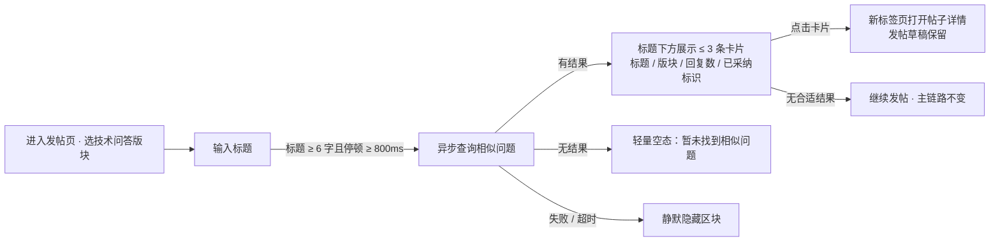

# Campus-Link 增量需求 PRD：发帖时相似问题推荐（F-AI-001）

| 文档信息 | 内容 |
|---------|------|
| 文档版本 | v0.1（草案） |
| 状态 | 🟡 **评审部分通过（2026-09-19）**——**只有 F-AI-001a 纯检索版**可脱离外部 AI 落地（既有 `FULLTEXT ft_posts_title … WITH PARSER ngram` 与 `MATCH … AGAINST` 链路已在，见[纪要](../评审/增量PRD评审纪要.md) §1）；语义版（P1）**阻塞在未登记的"embedding / LLM 服务商"决策上**（该决策不属 A3-8，纪要 §6）；验收中"标签"一条签不了（发帖链路从未建模标签）。本轮不排期，列为**下一功能候选** |
| 维护人 | 产品负责人（发起人兼任；本文由 AI 协作会话起草） |
| 关联阶段 | 需求（阶段二）增量 · 开发（阶段四，Sprint 3 增量候选） |
| 关联文档 | [主 PRD](产品需求文档.md) · [BRD](../立项/商业需求文档.md) · [技术方案](../设计/技术方案.md) · [变更台账](../变更日志/变更台账.md) · [下一步行动](../下一步行动.md) |
| 最后更新 | 2026-09-13 |

> 版本号以 [docs/README.md](../README.md) 第 2 节为单一登记处，交叉引用不写版本号（手册 4.5）。
>
> **文档定位**：本文是主 PRD 之外的**增量需求文档**。发起人评审通过后，按"先登记后实施"以 **CR-033（编号待登记时确认）** 并入主 PRD（v1.2 → v1.3，功能表新增 F-AI-001 行）并排入 Sprint 3；**评审通过前不得开工**。CR 影响评估草稿见第 9 节。

## 变更记录

- v0.1（2026-09-13）——首次起草，AI 协作会话（产品通）基于主 PRD 基线与 Sprint 3 计划撰写，待发起人评审。

## 1. 问题陈述与目标

### 1.1 问题陈述

技术问答是本产品的核心场景（BRD 目标"问有所答"，成功指标之一为技术问答 48h 回复率 ≥ 70%）。当前发帖流程（F-FORUM-002）中，提问者在提交前**看不到站内是否已有同类问题**，导致：

1. **重复提问稀释回答供给**：回答者精力分散在同类问题上，单个问题的回答质量与速度下降——这在种子用户 100~200 人的内测期伤害尤其大；
2. **提问者等待更久**：旧帖下已有的可用答案未被复用，48h 回复率承压；
3. **内容沉淀打折**：同题多帖分散了点赞与采纳信号，"最佳答案"机制（F-QA-001）的筛选效果被削弱。

主 PRD 已有站内搜索（F-FORUM-008，Sprint 3 计划内），但搜索是**用户主动行为**——重复提问的根因恰恰是提问者**没有意识到要搜**。本功能把"找到已有答案"从主动行为变为发帖路径上的**被动提示**。

### 1.2 目标（本期结束时如何判定成功）

| # | 目标 | 度量方式（见第 7 节） |
|---|------|-------------------|
| G1 | 提问者在提交前能看到站内已有的相似问题，并可直达 | 推荐点击率 ≥ 15%（点击数 / 展示数，内测期评估） |
| G2 | 减少重复提问 | 点击推荐后放弃发帖的比例 ≥ 20%（重复被拦截的代理指标） |
| G3 | 推荐绝不拖慢、绝不阻断发帖主链路 | 推荐接口 P95 ≤ 300ms；降级演练下发帖成功率 100% |
| G4 | AI 成本可控、可预测 | 单月 API 成本 ≤ 10 元（语义版上线后） |

**用户目标**：提问更快拿到答案（哪怕答案是"看这条旧帖"）。
**业务目标**：同样多的回答者，支撑更高质量的内容沉淀，保住 48h 回复率这条 BRD 指标。

## 2. 非目标（Non-goals）

| # | 不做什么 | 为什么 |
|---|---------|--------|
| N1 | **不做 AI 回答草稿 / AI 自动回答** | 冷启动期（种子用户百人级）AI 抢答会抑制真人回答意愿，伤社区氛围；等真人回答供给稳定后另行评审 |
| N2 | **不做个性化推荐流** | 与主 PRD F-FORUM-003 的既有边界一致（"热门为简单权重，不做个性化推荐"）；本功能是查询触发式，不是 Feed |
| N3 | **不对帖子正文做向量分析** | 只用标题（≤ 100 字）做相似匹配：成本与隐私最小化，且标题是提问者意图最浓缩的表达；正文语义属 P2 预留 |
| N4 | **不引入向量数据库 / MeiliSearch / Elasticsearch** | 内测期帖子量为百到千级，MySQL 8 ngram 全文 + 内存余弦足够；向量库是过早优化，待数据量证明需要再评审 |
| N5 | **不做内容审核能力增强** | 机审归 F-SAFE-001（云服务商方案，P3 并行项选型中），本功能不重复造轮子 |
| N6 | **本期仅覆盖"技术问答"版块** | 该版块重复提问痛点最强、且问答结构（提问类型帖）清晰；其他版块是否扩展看内测数据（见第 8 节开放问题 Q5） |

## 3. 用户与场景

### 3.1 用户故事

- 作为一名**大一学生（画像 A）**，我在技术问答版块输入标题提问时，希望系统自动告诉我"站内已有 3 条相似问题"，以便直接点开看答案、不用等回复；
- 作为一名**大一学生**，如果相似问题没有解决我的情况，我希望一键回到编辑器继续发帖（已输入的内容不丢失），以便不被推荐打断提问；
- 作为一名**准备找实习的大三学生（画像 B）**，我提问前希望看到相似问题已有多少人回复、是否已被采纳最佳答案，以便快速判断哪条更值得点开；
- 作为一名**回答者（画像 C）**，我希望同类问题收敛到少数几帖下，以便我的回答被更多人看到、被采纳记录更集中。

### 3.2 边界场景（必须覆盖）

- 标题输入过短（< 6 个汉字或等效字符）→ **不触发**推荐查询（避免噪声结果与无谓调用）；
- 站内无相似问题（相似度低于阈值）→ 显示轻量空态"暂未找到相似问题"，不占视觉重心；
- 推荐服务超时 / 失败 / 开关关闭 → **静默隐藏**整个推荐区块，发帖流程零感知；
- 相似列表**排除**：已删除帖、机审拦截帖、本人自己的帖子；
- 用户点击推荐帖 → 新标签页打开详情页；返回发帖页时，**标题与正文草稿原样保留**；
- 发帖页在弱网下 → 推荐查询静默失败即止，不做重试风暴（单次输入会话最多触发 2 次查询）。

## 4. 功能需求

### 4.1 功能列表与优先级

| 编号 | 功能 | 优先级 | 模块 |
|------|------|:------:|------|
| F-AI-001a | 发帖时相似问题推荐——**检索版**（MySQL 8 ngram 全文匹配标题） | **P0** | AI 辅助（新上下文 `module/ai`） |
| F-AI-001b | 发帖时相似问题推荐——**语义版**（标题 embedding + 余弦相似） | **P1** | AI 辅助 |
| F-AI-001c | 相似推荐效果埋点 | P0 | 数据 |

**分档理由**：P0 检索版**零 API 成本、零新增外部依赖**，复用 Sprint 3 计划内 F-FORUM-008 的 ngram 索引与基础设施，先验证"提示位置 + 交互"是否成立；P1 语义版补齐**同义改写匹配**（如"IDEA 启动报端口被占用" ↔ "8080 端口被占用怎么办"——全文检索匹配不了的），是本功能的 AI 增量价值所在。P1 在 P0 上线并跑通埋点基线后启动。

### 4.2 交互流程



**推荐卡片内容**（每条）：帖子标题、所属版块、回复数、`[已采纳]` 标识（如适用）、发布时间（相对时间，与 ui-guideline §5.5 口径一致）。**不展示**：正文摘要（P2 预留）、作者昵称（减少视觉噪声，且避免"点名重复提问"的尴尬）。

### 4.3 功能详情与验收标准

**F-AI-001a 检索版（P0）**

- 描述：发帖页标题满足触发条件后，前端调用推荐接口；后端用 MySQL 8 ngram 全文索引对**提问类型帖**（技术问答版块）标题做相关性检索，按相关度 + 时间衰减排序取 Top 3 返回。
- 业务规则：
  - 排除已删除 / 机审拦截 / 本人帖子；
  - 单次输入会话最多触发 2 次查询（800ms 防抖 + 次数上限，防止输入过程打爆接口）；
  - 相似度为 0 或低于阈值 → 返回空列表（前端展示空态）；
  - 接口为**受保护端点**（发帖本身需登录，推荐跟随同一登录态），按 N-4 后的机制走 `CurrentUser` 统一入口并显式声明鉴权注解。

```gherkin
Given 已登录用户在技术问答版块发帖页，且站内存在标题含"MySQL 索引失效"的他人提问帖
When 用户输入标题"为什么我的 MySQL 索引失效了"并停顿 800ms
Then 标题下方展示 ≤ 3 条相似问题卡片，含标题、回复数与已采纳标识

Given 用户输入标题"好"（1 个字）
When 输入停顿
Then 不触发推荐查询，无网络请求发出

Given 推荐服务异常或功能开关关闭
When 用户正常发帖
Then 推荐区块不显示，发帖流程与响应时间与无此功能时一致，发帖成功率 100%

Given 相似列表命中了一条用户本人发布的帖子
When 返回推荐结果
Then 该帖不出现在列表中

Given 用户点击某条推荐卡片
When 详情页在新标签页打开后返回发帖页
Then 已输入的标题、正文、标签原样保留，可继续提交发帖
```

**F-AI-001b 语义版（P1）**

- 描述：帖子**发布成功后**，异步对标题生成 embedding 向量并落库缓存（每帖仅生成一次，永不重算）；推荐查询时对输入标题实时生成查询向量，与库内向量化余弦相似后取 Top 3。检索版结果与语义版结果**合并去重**后返回。
- 业务规则：
  - embedding 只含**帖子标题文本**，不含正文、作者信息、任何个人数据；调用 LLM 服务**不携带用户身份**；
  - 新增 `module/ai` 限界上下文：LLM 网关端口定义在 domain、适配器（HTTP 调外部 API）在 infrastructure，**照抄 `module/{account,forum}` 四层结构**，ArchUnit 守护测试自动覆盖；
  - 语义调用失败 → 自动降级为纯检索版结果（对用户无感）；
  - 成本护栏：embedding 只对**提问类型帖**生成；单月 API 花费超上限（G4）→ 自动切回检索版并告警（配置项，无需改代码）；
  - 功能开关：`campuslink.ai.similar.enabled`（整体开关）与 `campuslink.ai.similar.semantic-enabled`（语义档开关），关掉即回退纯检索。

```gherkin
Given 语义版开关开启且站内已有带向量的提问帖"IDEA 启动报端口被占用"
When 用户输入标题"8080 端口被占用怎么办"
Then 推荐结果包含该帖（全文检索无法命中的同义改写场景）

Given 外部 embedding API 调用失败
When 用户查询相似推荐
Then 降级返回检索版结果，接口不出错、耗时满足 P95 ≤ 300ms

Given 某提问帖已生成过 embedding
When 该帖被编辑标题（F-FORUM-007 编辑功能上线后）
Then 异步重算该帖向量，旧向量被替换（每帖至多存一份最新向量）
```

**F-AI-001c 埋点（P0）**

| 事件 | 触发时机 | 关键属性 | 支撑指标 |
|------|---------|---------|---------|
| sim_query | 发起一次相似推荐查询 | board_id、结果数、来源档位（检索/语义） | 触发率、空结果率 |
| sim_show | 推荐卡片展示 | 展示条数 | 展示率 |
| sim_click | 点击推荐卡片 | 卡片序号、目标帖 ID | **推荐点击率（G1）** |
| sim_abandon | 点击推荐后本次会话未发帖（会话结束判定） | 点击的帖子 ID | **重复拦截代理率（G2）** |

> `sim_abandon` 的判定口径：点击推荐到会话结束（关闭页 / 超时 30 分钟）之间未发生 `post_publish`。这是**代理指标**（可能高估），重复提问率的真值靠内测期人工抽检标注建立基线（见第 7 节）。

### 4.4 非功能需求（可测）

| 类别 | 指标 | 要求 |
|------|------|------|
| 性能 | 推荐接口（从触发到卡片渲染） | P95 ≤ 300ms（主 PRD 普通读接口 P95 ≤ 500ms 的收紧版——它在发帖路径上，必须比普通读更快） |
| 可用性 | 降级行为 | 推荐链路任何故障下，发帖主链路成功率与响应时间不受影响（降级演练用例验收） |
| 成本 | LLM API 月花费 | ≤ 10 元 / 月（语义版）；超限自动切回检索版 |
| 隐私 | 外发数据 | 仅帖子标题文本；不携带用户 ID / IP / 邮箱等任何身份信息；在隐私政策中如实披露"标题将发送至第三方模型服务用于相似度计算" |
| 兼容 | 端与浏览器 | 与主站一致（桌面 + 移动响应式，发帖页已有断点） |

## 5. 成功指标体系

**领先指标**（上线后 1~2 周可观测）：

| 指标 | 定义 | 基线 | 目标 | 评估时点 |
|------|------|------|------|---------|
| 推荐点击率 | sim_click / sim_show | 无（新功能） | ≥ 15%（达标）/ ≥ 25%（冲刺） | 内测 ≥ 1 周后首评 |
| 空结果率 | 结果数为 0 的 sim_query 占比 | 无 | ≤ 40%（内测期内容少，允许偏高；持续走高说明触发阈值有问题） | 内测期 |
| 重复拦截代理率 | sim_abandon / sim_click | 无 | ≥ 20% | 开放注册 2 周后 |

**滞后指标**（内测期建立基线，开放期对比）：

| 指标 | 定义 | 目标 |
|------|------|------|
| 重复提问率 | 技术问答版块新帖中，与 30 天内已有帖语义重复的比例（人工抽检 50 帖标注） | 相对基线下降 ≥ 30% |
| 48h 回复率（BRD 指标） | 不倒退（≥ 70%），并观察因重复收敛带来的提升 | ≥ 70% |

> 内测期帖子基数小，**不追求滞后指标达标**，只建立基线；语义版（P1）的启动决策恰恰取决于内测期"全文检索版 + 空结果率"的数据。

## 6. 技术约束与依赖（供设计阶段输入，非本文评审重点）

- **新上下文 `module/ai`**：按 ADR-012 四层落地；跨上下文只经 `forum.application` 只读方法取候选帖（**不注入对方 Mapper**），ArchUnit 守护测试自动校验；
- **索引复用**：P0 检索版依赖 Sprint 3 的 F-FORUM-008 建立的 ngram 全文索引——**建议同 Sprint 内先做搜索、再做推荐**，避免重复建设；
- **向量存储**：千级帖量用内存 / Redis 存标题向量 + 暴力余弦即可，**不引入向量库**（N4）；
- **契约**：新增 1 个受保护端点（查询推荐），须重生成 OpenAPI 快照（12 → 13 端点）；
- **Flyway**：预计新增 1 张 `post_embedding`（或 `ai_title_vector`）表，走 `V<n>__` 迁移，不改已执行的迁移；
- **LLM 供应商**：OpenAI 兼容接口即可（候选：deepseek 低价档 / 中转站），API key 走配置注入，**不入库、不进前端**。

## 7. 发布计划

- **范围**：F-AI-001a + F-AI-001c 随 Sprint 3 发布（增量约 0.5~1 天，见第 9 节排期评估）；F-AI-001b 待内测数据评审后另行排期；
- **分批**：与主站内测（S1）同步灰度——功能开关默认**开**（内测用户即验证对象）；出现成本或体验问题随时开关回退；
- **前置条件**：F-FORUM-008 站内搜索已交付（P0 依赖）；隐私政策文本已包含本功能披露条目（P1 前置，P0 检索版不外发数据、无此依赖）。

## 8. 开放问题

| # | 问题 | 责任人 | 截止 | 阻塞性 |
|---|------|--------|------|--------|
| Q1 | 触发阈值定稿：最短标题长度（暂定 6 字）、防抖时长（暂定 800ms）、会话查询上限（暂定 2 次） | 产品 + 开发 | Sprint 3 设计评审 | 阻塞开发 |
| Q2 | 相似度排序权重与"已采纳加权"是否引入（已采纳的旧帖是否排前） | 开发 | 实施中 | 不阻塞 |
| Q3 | embedding 供应商与 API key 来源 | 发起人 | F-AI-001b 开工前 | 仅阻塞 P1 |
| Q4 | 埋点落地方式（自建事件表 vs 结构化日志） | 技术负责人 | Sprint 3 设计阶段 | 阻塞 F-AI-001c |
| Q5 | 其他版块（学习资源 / 课程交流）是否扩展推荐 | 产品（发起人） | 内测数据评审时 | 不阻塞 |

## 9. CR 影响评估草稿（CR-033，编号待登记时确认）

> 按"先登记后实施"（AGENTS.md 治理约定）：**本节是草稿**，发起人评审通过本文后，将本节内容正式登记入变更台账方可在代码中实施。

| 评估维度 | 影响 |
|---------|------|
| **范围** | 主 PRD 功能表新增 **F-AI-001**（1 行，P0 = a + c，P1 = b）；Sprint 3 范围新增 1 项增量（IN），不改 13 项不做清单；后端新增 `module/ai` 限界上下文 + 1 个受保护端点；前端发帖页新增推荐区块（1 个组件）；**不触碰** `module/{account,forum}` 现有代码（跨上下文经 `forum.application` 新增只读方法，契约零改动——沿用异步化框架"契约零改动"的既有偏好） |
| **排期** | Sprint 3 增量约 **0.5~1 天**（检索版 + 埋点 + 降级用例；语义版另行排期约 1 天）；与 F-FORUM-008 同 Sprint 可复用 ngram 索引建设；**8 周 / 4 Sprint 总节奏不变**（风险缓冲：若 Sprint 3 超期，本功能第一个被裁——它是增量不是 P0 主链路） |
| **质量** | 新增单测预计 10~15 个（含：触发阈值边界、空结果、本人帖排除、降级静默、鉴权 401 各 1 组）；ArchUnit 守护测试对新上下文自动生效（CR-028 机制红利）；OpenAPI 快照须再生成（13 端点）；**新增维护面如实登记**：LLM 网关适配器是新的外部依赖点（供应商 API 变更风险），降级开关是兜底 |
| **关联文档联动** | ① 主 PRD v1.2 → v1.3（+F-AI-001 行 + RTM 附录补行）；② 技术方案 §2.4 上下文清单 + §5 端点表（+1 行）+ 视需要新增 **ADR-013（LLM 网关与降级策略）**；③ API 契约快照再生成；④ 下一步行动 §3 Sprint 3 拆解补行；⑤ 隐私政策补披露条目（P1 前） |
| **回滚方案** | 配置开关整体关闭（`campuslink.ai.similar.enabled=false`）→ 前端区块消失、后端短路返回空；不涉及数据回滚（embedding 表冗余无害）。**回滚成本：零代码改动** |

## 10. 与既有功能的关系速查

| 既有功能 | 关系 |
|---------|------|
| F-FORUM-002 发帖 | 本功能是其**增强**，不改变发帖主链路任何行为 |
| F-FORUM-008 站内搜索 | P0 复用其 ngram 索引；交互上互不影响（搜索是主动、推荐是被动） |
| F-FORUM-009 全文搜索（P1，MeiliSearch） | 独立演进线；若未来引入，本功能的检索档可平滑切换其索引（设计阶段留意即可） |
| F-QA-001 采纳最佳答案 | 推荐卡片展示 `[已采纳]` 标识，反哺其价值 |
| F-SAFE-001 机审 | 无交互；被机审拦截的帖子天然不进候选（发布即审） |

---

## 评审检查清单（发起人评审用，通过后随 CR-033 归档）

**产品**
- [ ] 每条需求有编号、优先级、可测验收标准（§4.3 gherkin 可直接转测试用例）；
- [ ] Non-goals 六项（§2）确认接受，特别是 N1（不做 AI 抢答）与 N6（仅技术问答版块）；
- [ ] 成功指标与阈值（§5）认可，接受"内测期只建基线、不考核滞后指标"。

**开发**
- [ ] 技术约束（§6）无异议：`module/ai` 四层、不注入对方 Mapper、不上向量库、开关降级；
- [ ] 排期评估（§9：0.5~1 天）确认，接受"超期第一个裁"的优先级约定。

**测试**
- [ ] §3.2 边界场景 + §4.3 验收标准可直接转写用例（含降级演练与 401 用例）。

**合规**
- [ ] 接受 P1 前提：隐私政策须补"标题外发第三方模型服务"披露条目（P0 无外发、不受阻）。
