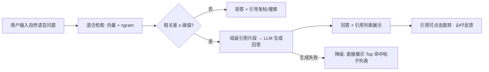

# Campus-Link 增量需求 PRD：站内 RAG 问答（F-AI-004）

| 文档信息 | 内容 |
|---------|------|
| 文档版本 | v0.1（草案） |
| 状态 | ✅ **评审通过其门槛判定 ⇒ 三条门槛全不满足、不得排期（2026-09-19）**——本文 §1.3 的自设禁排期条款生效并经实测确认：**G-1** 提问帖 ≥500 → 实测 `qna` 版块 **23 篇（可见 13）**，差约 40 倍；**G-2** 语义版上线 → `module/ai` 不存在、`application.yml` 无任何 `campuslink.ai.*` 键；**G-3** 评测集 → 无。逐条依据见[纪要](../评审/增量PRD评审纪要.md) §1 |
| 维护人 | 产品负责人（发起人兼任；本文由 AI 协作会话起草） |
| 关联阶段 | 需求（阶段二）增量 · **门槛型**（实施不在当前任何 Sprint 计划内） |
| 关联文档 | [主 PRD](产品需求文档.md) · [增量 PRD：发帖相似问题推荐](产品需求文档-发帖相似问题推荐.md) · [增量 PRD：面经 AI 追问练习](产品需求文档-面经AI追问练习.md) · [技术方案](../设计/技术方案.md) · [变更台账](../变更日志/变更台账.md) |
| 最后更新 | 2026-09-13 |

> 版本号以 [docs/README.md](../README.md) 第 2 节为单一登记处，交叉引用不写版本号（手册 4.5）。
>
> **文档定位与诚实定位（必读）**：本功能在 AI 优先级评估（2026-09-13 会话）中被明确判为 **Later——当前阶段做它不合理**。原因：RAG 的回答质量取决于站内内容量，**内测期帖子量级（百级）下检索不出足够好的素材，RAG 只会产出"一本正经的浅层回答"，伤害产品信任**。因此本文是**门槛型 PRD**：需求与验收标准现在定稿，但**第 1.3 节的上线门槛三条不同时满足，禁止进入任何 Sprint 排期**。评审通过后按"先登记后实施"以 **CR-039（编号待登记时确认）** 并入主 PRD；门槛达成前本文不产生任何实施动作。

## 变更记录

- v0.1（2026-09-13）——首次起草，AI 协作会话（产品通）撰写，含上线门槛机制，待发起人评审。

## 1. 问题陈述、定位与门槛

### 1.1 问题陈述

站内内容积累起来之后（复用"站内知识"的前提是**站内确实有知识**），会出现一个真实需求：新用户不想学会用搜索、也不想翻版块，希望**直接用一句自然语言问**——"Redis 缓存穿透怎么解决？站内有人聊过吗？"——然后拿到**基于站内真实帖子、带出处**的回答。这是搜索（F-FORUM-008，关键词匹配）与相似推荐（F-AI-001，发帖路径上的被动提示）都不覆盖的第三种内容入口：**问答式主动获取**。

### 1.2 与既有功能的关系（为什么它必须是"第三个入口"而不是替代品）

| 入口 | 触发 | 覆盖 |
|------|------|------|
| F-FORUM-008 搜索 | 用户主动、关键词 | 精确找帖 |
| F-AI-001 相似推荐 | 发帖路径、被动 | 防重复提问 |
| **F-AI-004 RAG 问答** | 用户主动、自然语言 | **综合多帖给出带出处的回答** |

### 1.3 上线门槛（三条同时满足，缺一不得排期）

| # | 门槛 | 为什么 |
|---|------|--------|
| G-1 | **站内提问帖 ≥ 500 篇**（技术问答版块为主） | 内容量是 RAG 质量的分母；低于此量级检索命中质量不达标（经验阈值，达阈值后仍须通过 G-3 评测验证） |
| G-2 | **F-AI-001b 语义版已上线**（标题 embedding 管道 + 网关就绪） | 向量检索基础设施直接复用，不从零建；语义版未上线说明连相似推荐都未验证 |
| G-3 | **离线评测通过**：用 30~50 条真实问题构造评测集，回答"有引用且引用相关"的比例 ≥ 80%、引用可点击率 100% | 主观感觉"能用"不算数；评测集是上线判据，也是上线后的回归基线 |

## 2. 目标

| # | 目标 | 度量方式（见第 6 节） |
|---|------|-------------------|
| G1 | 用户问得到带出处的回答 | 引用点击率 ≥ 25%（展示回答的回答中点击 ≥ 1 个引用） |
| G2 | 不编造是铁律 | 拒答场景误答率 = 0（评测集验收：应拒答样本中给出无引用回答即为缺陷） |
| G3 | 用户认可 | 👍 有用率 ≥ 60% |
| G4 | 成本可控 | 每用户每日 ≤ 10 次；月成本 ≤ 20 元（阈值随内容量修订） |

## 3. 非目标（Non-goals）

| # | 不做什么 | 为什么 |
|---|---------|--------|
| N1 | **不回答站外/通识问题**（"Java 是什么""今天天气"） | 产品定位是"站内知识问答"；通识问题引导用搜索引擎，硬答只会暴露模型浅薄并烧钱 |
| N2 | **不做无引用的裸生成** | 无引用 = 无从验证 = 不可信；"拒答优先于编造"是本功能第一产品原则 |
| N3 | **不做多轮对话 / 上下文追问** | P2；单轮问答先验证价值，多轮的上下文管理与成本是另一个量级 |
| N4 | **不做个人文档上传 / 私人知识库** | 与站内社区定位无关，属个人工具产品线 |
| N5 | **不做代码执行 / 沙箱运行** | 安全与成本双重不可控 |
| N6 | **不替代搜索与相似推荐** | 三入口并存（§1.2）；RAG 是最贵的一条，永远不该是默认路径 |

## 4. 用户与场景

### 4.1 用户故事

- 作为一名**遇到报错的大一学生**，我想用一句自然语言问"Redis 连不上怎么排查"，并得到基于站内帖子、附跳转出处的回答，以便不用学会搜索技巧就能找到学长们的经验；
- 作为一名**质疑 AI 的用户**，我希望每个回答都带可点击的帖子引用，以便自己验证 AI 说的对不对——没有出处的回答我默认不信；
- 作为一名**提问者**，当站内确实没有相关内容时，我希望系统明确告诉我"暂无足够内容"并引导我发帖，而不是得到一个看似完整的泛泛回答；
- 作为一名**运营者（发起人）**，我希望有用量与成本限额，以便这个功能不会在夜间被脚本刷爆 API 账单。

### 4.2 边界场景（必须覆盖）

- 检索相关度低于阈值 → **拒答**："站内暂无足够相关内容"，附"去发帖"与"去搜索"引导（拒绝时**不得**输出模型自由发挥的内容）；
- 检索命中但相关度中等 → 回答需**逐句可溯源**：只允许改写与汇总引用片段，不允许补充检索片段之外的事实；
- 引用的帖子在回答生成后被删除 → 前端渲染时校验引用可达性，失效引用标记"该帖已不可见"（不阻塞其他引用展示）；
- 用户问题包含敏感内容 → 走既有敏感词拦截，不计入当日次数；
- 同一问题（语义相似）短时间被重复问 → 命中**答案缓存**（问题 embedding 相似度 ≥ 0.95 视为同题），直接返回缓存回答与其引用；
- 当日次数用尽 → 明确提示额度，引导明日再问；
- 服务故障 → 入口隐藏或提示稍后再试，**绝不影响搜索与主链路**。

## 5. 功能需求

### 5.1 功能列表与优先级

| 编号 | 功能 | 优先级 | 模块 |
|------|------|:------:|------|
| F-AI-004a | 问一问入口 + 自然语言提问 | P0 | AI 辅助（`module/ai`） |
| F-AI-004b | 混合检索（向量 + ngram 全文）与引用组装 | P0 | AI 辅助 |
| F-AI-004c | 带引用回答生成与拒答策略 | P0 | AI 辅助 |
| F-AI-004d | 答案缓存 + 限流 + 埋点 | P0 | AI 辅助 / 数据 |
| F-AI-004e | 离线评测集与上线判据（= 门槛 G-3 的执行件） | P0 | 数据 |
| F-AI-004f | 多轮追问对话 | P2 | — |

### 5.2 核心流程



### 5.3 功能详情与验收标准

**F-AI-004b/c 检索与生成（P0）**

- 业务规则：
  - 检索范围：公开可见帖子（标题 + 正文），排除已删除 / 机审拦截 / 用户设置;
  - 回答 ≤ 300 字 + ≤ 5 条引用（帖子标题 + 楼层定位）；
  - **引用必须是真实检索命中的帖子**，模型不得生成引用之外的事实（提示词硬约束 + 评测验收）；
  - 拒答阈值与生成参数可配置。

```gherkin
Given 站内存在多篇讨论 Redis 缓存穿透的帖子且相关度达标
When 已登录用户提问"Redis 缓存穿透怎么解决？"
Then 返回 ≤ 300 字回答，附 ≤ 5 条可点击帖子引用

Given 用户提问"推荐一部电影"
When 检索相关度低于阈值
Then 返回拒答话术 + "去发帖 / 去搜索"引导，且不含任何模型自行生成的实质内容

Given 某问题的回答已缓存且新问题与其实义相似度 ≥ 0.95
When 用户提问该新问题
Then 直接返回缓存回答与引用，不调用生成（当日次数不扣减）

Given 生成服务不可用
When 用户提问且检索命中
Then 降级展示 Top 命中帖子列表（等同搜索结果），不显示错误堆栈
```

**F-AI-004d 限流与埋点（P0）**

- 限流：每用户每日 10 次生成调用（缓存命中不计次）；Redis 计数，与既有验证码/强刷限流同套基础设施；
- 埋点：`qa_ask`（提问，含是否拒答）、`qa_answer_shown`（回答/降级）、`qa_cite_click`（引用点击）、`qa_feedback`（👍👎）、`qa_gate_bypass`（拒答后去发帖/搜索的转化）。

**F-AI-004e 评测集（P0，门槛 G-3 的执行件）**

- 构成：30~50 条真实问题（内测期从搜索日志与 F-AI-001 相似推荐查询日志中抽取 + 人工补造），每条标注期望命中帖与期望拒答样本（≥ 10 条）；
- 判据：有引用且回答率 ≥ 80%、应拒答样本误答率 = 0、引用可点击率 100%——**评测不达标禁止上线，达标后作为回归基线**（每次提示词或检索参数变更后重跑）。

## 6. 成功指标

| 指标 | 定义 | 目标 | 评估时点 |
|------|------|------|---------|
| 引用点击率 | qa_cite_click / qa_answer_shown（回答态） | ≥ 25% | 上线 2 周 |
| 有用率 | 👍 /（👍 + 👎） | ≥ 60% | 上线 2 周 |
| 拒答率 | 拒答 / 总提问 | 观察项（过高 = 内容不足，过低 = 阈值失灵） | 持续 |
| 拒答转化 | 拒答后 30 分钟内发帖或搜索的比例 | 观察项 | 上线 1 月 |
| 月成本 | 生成调用费用 | ≤ 20 元（随内容量修订） | 持续 |

## 7. 技术约束与依赖

- **全部复用既有 AI 基础设施**：向量管道（F-AI-001b）、ngram 索引（F-FORUM-008）、LLM 网关（F-AI-002）、限流（验证码/强刷同套）、答案缓存（Redis）——本功能**不新建任何一类基础设施**，只新增用例编排与评测集；
- 正文检索需**正文向量**（F-AI-001b 只做标题）——门槛达成后需为存量提问帖补算正文向量（异步、可限速，工作量计入实施排期）；
- 隐私：检索片段（帖子正文节选）外发第三方模型；回答不携带提问者身份；隐私政策披露口径与 F-AI-002/003 合并声明；
- 新增端点 1 个（提问，受保护）+ 反馈端点（或复用通用反馈）；快照再生成。

## 8. 发布计划与开放问题

- **排期**：**门槛达成前不排期**（这是与前三份 PRD 的本质区别）；门槛达成后实施约 **1.5~2 天**（含评测集构建与正文向量回刷）；
- **建议节奏**：内测 → 开放期盯内容量 → 数据评审触发门槛判定 → 届时以本文 v0.x 修订版进入实施。

| # | 开放问题 | 责任人 | 阻塞性 |
|---|---------|--------|--------|
| Q1 | 拒答阈值初值（离线评测校准） | 开发 | 门槛达成后阻塞实施 |
| Q2 | 正文向量回刷的速度与成本预算 | 开发 + 发起人 | 同上 |
| Q3 | 答案缓存 TTL（内容会更新，缓存答案多久失效） | 开发 | 同上 |
| Q4 | 引用是否包含楼层定位（更精准但实现更重） | 产品 + 开发 | 同上 |
| Q5 | 门槛数值（500 篇 / 80%）本身随内测数据修订 | 产品（发起人） | 门槛判定时 |

## 9. CR 影响评估草稿（CR-039，编号待登记时确认；CR-033/036/037/038 已占用或预留，CR-034/035 已被台账占用）

| 评估维度 | 影响 |
|---------|------|
| **范围** | 主 PRD 功能表新增 **F-AI-004**（1 行，标注门槛型）；后端 `module/ai` 新增问答用例编排 + 混合检索 + 评测件；前端搜索区新增"问一问"入口与问答结果组件；新增端点 1~2 个（受保护）；存量正文向量回刷（数据脚本，走 `backend/scripts/data/D<序号>__` 规范 dry-run 先行） |
| **排期** | **门槛达成前为 0**；达成后约 **1.5~2 天**，独立排期评审（届时按实施方案约定另写 `CR-039-主题.md` 方案文档） |
| **质量** | 新增单测约 12~15 个（阈值边界 / 拒答不含实质内容 / 缓存命中不扣次 / 限流 / 失效引用 / 降级列表 / 鉴权）；**评测集作为独立验收物**（G-3 不达标不上线）；快照再生成 |
| **回滚** | 功能开关 + 双重限额（用户日次 / 全站日次）；拒答与降级路径天然兜底——**回滚零数据迁移** |

## 评审检查清单（发起人评审用）

**产品**
- [ ] 确认接受**门槛型定位**：G-1/G-2/G-3 三条不满足不排期，本文评审通过 ≠ 上承诺诺；
- [ ] 确认 N2"拒答优先于编造"为第一产品原则；
- [ ] 确认预算口径（月成本 ≤ 20 元、每用户日 10 次）。

**开发**
- [ ] 确认全部复用既有基础设施（不新建向量库 / 不新建限流设施）；评测集判据可执行。

**测试 / 合规**
- [ ] 边界场景（§4.2）可转写用例；评测集构成与判据（§5.3 F-AI-004e）可执行；
- [ ] 确认隐私披露合并口径（检索片段外发第三方模型）。

---

## 自审记录（v0.1，2026-09-13）

- [x] 头部四项齐备；状态"草案"；交叉引用无版本号；
- [x] 编号 F-AI-004 与 F-AI-001/002/003 无冲突；CR 草稿编号 CR-039 已按台账 grep 校准（033 预留 / 034、035 已占用 / 036~038 已预留）；
- [x] **定位如实**：文档头显式写明"当前阶段做它不合理"，与项目"客观真实"要求一致——本 PRD 的评审重点应是门槛本身而非功能细节；
- [x] 门槛（G-1/G-2/G-3）与排期章节自洽：门槛达成前排期为 0，不产生任何"写完 PRD 就要做"的暗示；
- [x] 与 F-AI-001b（正文向量 vs 标题向量的差异）与 F-FORUM-008（ngram 复用）的依赖关系已显式声明，无隐藏假设；
- [x] mermaid 流程图分支完整（拒答 / 成功 / 降级三路）；gherkin 覆盖拒答、缓存、降级、限流核心路径。
